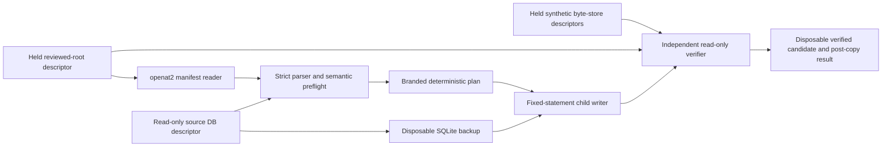

# D9.2 accepted-bundle verifier

Status: **approved at implementation commit `460547b7fe75a94f689dabc97fd91ee6f803934a` for the synthetic, unactivated D9.2 boundary only**. Approval covers its disposable accepted-evidence projection, no-op, rollback and reconstruction checks; it does not make the component operational or production-ready. An accepted evidence projection proves conformance to the quarantined evidence bundle and persisted representation—it does not verify legal identity, officiality, authority, currency, legal effect, or any legal proposition. This approval does not authorize real bootstrap, evidence import, canonical promotion, custody operations, credentials, legal verification, publication, API use, or frontend use. D9.3 local custody and recovery is the next separately reviewed implementation step.

## Frozen-contract audit

The implementation was preceded by a complete audit of the approved Decision 9 design, D9.0.1 catalog and runtime/handle-scope corrections, the approved Tranche 2A manifest and SQL contract, and migration 005. No hard conflict requiring a frozen-contract change was found. The implementation uses the following binding interpretations:

- The writer can insert only the exact sequence-1 four-principal bootstrap roster and rows in the nine Tranche 2A tables. It has no statement for a legacy, migration-ledger, other Tranche 1A, Tranche 2B, review, publication, API, search, export, or frontend table.
- The frozen pilot profile requires zero processing runs, outputs, and candidate occurrences. The accepted bootstrap and document flows therefore exercise the exact frozen pilot shapes. A separate component-level synthetic fixture proves typed planning and projection of all nine tables, parser version, lineage, candidate fields, and limitation reasons, while the profile gate correctly rejects that fixture as an accepted pilot bundle.
- The approved D9.0.1 handle contracts remain unchanged. This module consumes already opened, synthetic descriptor/capability seams; D9.1 remains responsible for control-plane selection and delivery, while D9.3 remains responsible for operational custody, promotion coordination, crash recovery, backups, and durable audit.
- An accepted-bundle no-op must securely reopen the exact accepted-manifest prefix through the target receipt, recompute each digest, resolve pinned dependencies, compare every persisted field and relationship in that prefix, and reverify each live custody object in that prefix. It is not a row-count shortcut. In particular, the bootstrap no-op remains custody-free even after a document receipt exists, matching the frozen D9.0.1 handle partition.
- From-zero reconstruction here means a disposable synthetic recovery database rebuilt from privately copied, hash-verified migrations and ordered accepted manifests while all required bytes remain available. Its comparison target must be an in-process branded accepted-database verification, not a caller-supplied digest. It makes no D9.3 durability or deletion-aware restore claim.
- Tranche 2A has no generic limitations field. This implementation preserves every contract field that can carry a bounded observation or limitation, including retrieval outcomes, failure codes, custody reasons, candidate reasons, and the distinction between unverified candidates and verified facts. Adding a new generic field would require a separately reviewed schema/manifest revision.

## Implemented boundary

### Secure manifest intake

`d9/data-plane/manifest.mjs` validates only the approved version-1 manifest schema whose SHA-256 is pinned in code. A small Linux helper opens a caller-supplied relative path beneath an already-held reviewed-root directory descriptor using nonblocking `openat2` with `RESOLVE_BENEATH`, `RESOLVE_NO_MAGICLINKS`, `RESOLVE_NO_SYMLINKS`, and `RESOLVE_NO_XDEV`. It rejects absolute paths, traversal, symlinks, mount escape, non-regular files (including FIFOs), multiple links, unstable inode identity, oversized input, unavailable kernel guarantees, and a manifest whose declared `manifest_path` differs from the opened path. The helper process is also time-bounded so a hostile special file cannot indefinitely hold the caller.

The parser rejects invalid UTF-8, BOMs, duplicate JSON keys, forbidden number forms, unknown fields, schema violations, and a canonical digest mismatch. It uses the approved UTF-16 code-unit key ordering, no Unicode normalization, preserved array order, and exclusion of only the top-level `bundle_digest_sha256` field.

### Complete semantic preflight

`d9/data-plane/preflight.mjs` runs against a read-only database before any candidate or transaction exists. It validates:

- trusted runtime bindings and the one-time bootstrap roster;
- contiguous bundle sequence, monotonic creation chronology, exact dependency code/digest pins, and replay collisions;
- stable codes, positive IDs, attribution, recorder chronology, and every parent/child reference;
- GET-only retrieval, redirect, conditional-request, HTTP 200/304/failure state matrices, representation metadata, and full-response rules;
- artifact identities and staged paths;
- custody roots, predecessor leaves, sequence-aware chronology, eligibility declarations, relocation, restriction, restoration, and tombstone combinations;
- processing method/output/configuration rules, ordinal order, exact lineage, acyclic retrieval grounding, and same-bundle derived-byte reuse;
- candidate assertions, correction/withdrawal chains, locators, spans, confidence metadata, and sequence-aware chronology; and
- every relevant SQL identity, natural-key, partial-key, manifest-path, attribution, chronology, and relationship collision.

The return value is an in-process branded, deeply frozen preflight result. A structured clone or caller-authored lookalike cannot enter the plan builder.

### Deterministic typed plan and fixed writer

`d9/data-plane/plan.mjs` converts only a branded preflight result into an immutable, canonical typed plan. Foreign-key relationships are represented by stable codes until the fixed writer resolves them. The canonical plan bytes and SHA-256 contain no local import time.

`d9/data-plane/writer.mjs` opens only a single-link, regular, non-symlink disposable candidate file and passes the already opened descriptor to an isolated child. The child receives a bounded canonical plan over stdin, opens `/proc/self/fd/3`, asserts `foreign_keys` and `recursive_triggers`, and exposes only fixed prepared `INSERT` statements for:

1. `atlas_principals`, limited to the exact first-bundle roster;
2. `atlas_evidence_bundle_receipts`;
3. `atlas_retrieval_locations`;
4. `atlas_artifacts`;
5. `atlas_retrieval_events`;
6. `atlas_retrieval_redirects`;
7. `atlas_artifact_custody_events`;
8. `atlas_processing_runs`;
9. `atlas_processing_outputs`; and
10. `atlas_unverified_candidate_occurrences`.

It has no generic SQL input. All inserts occur in one transaction. Before `COMMIT`, the child requires a clean SQLite integrity check and foreign-key check, then resolves every foreign key back to its stable code and compares every inserted column and relationship with the fixed plan. Test-only, branded faults prove rollback after rows for all nine evidence tables have been written, on deliberately injected database corruption, and when an extra valid row makes that inner projection differ. Migration-005 constraints and triggers remain the defensive database boundary.

### Candidate isolation and verification

`d9/data-plane/candidate.mjs` accepts a descriptor-bound, single-link, read-only source database and uses SQLite backup into a private disposable directory. It checks source file identity and logical state before and after cloning. The writer never receives the source descriptor or path. Manifest, source, candidate, staging, and custody handles reject symlink/hard-link substitution where that boundary requires exclusive identity; the synthetic byte adapter duplicates and owns its validated root descriptors so a caller cannot rebind its mutable descriptor map or reuse a closed descriptor number.

`d9/data-plane/projection.mjs` projects every persisted column in all nine tables back to canonical manifest values, resolving every foreign key to its stable code. It also verifies the exact bootstrap-principal roster. Nulls, child order, composite lineage, receipt provenance, timestamps, retrieval fields, custody fields, configurations, candidates, and all predecessor relationships are compared exactly.

`d9/data-plane/verifier.mjs` independently opens the candidate read-only, verifies SQLite integrity and foreign keys, requires exact and independently complete migration/checksum ledgers, securely reopens every accepted manifest in the requested receipt prefix, requires contiguous sequence and exact dependency pins, reruns complete semantic preflight and persisted projection, and rehashes each currently live custody object in scope. It then copies a new candidate to a second disposable generation and repeats independent verification. The candidate and post-copy boundary and logical-state digests must match. The verifier also computes the exact frozen logical-state payload at each receipt boundary; it does not issue an operational logical-state-seal envelope because the protected verifier identity and production timestamp belong to activation outside D9.2.

The source remains read-only and its complete logical digest must remain unchanged. A verified candidate is returned as a disposable artifact only; this implementation does not promote it into canonical state.

### Accepted no-op and reconstruction

For an already accepted bundle, `d9/data-plane/coordinator.mjs` rejects a stable bundle code paired with a different digest. For an exact replay it performs complete semantic, projection, dependency, and applicable-byte verification through that bundle's receipt sequence and proves the full source logical digest is unchanged before returning the internal outcome `no_op_verified`. Later receipts are deliberately outside an earlier receipt's no-op scope. Only a verification that reaches the database's actual receipt head is branded as eligible to serve as a reconstruction comparison; a bootstrap-prefix result from a later database cannot be reused as that oracle.

The bootstrap and document no-op paths are distinct only in their approved shape and byte requirements: bootstrap has no custody bytes, while the document path must reopen and verify its currently live restricted-store copy. Missing or changed bytes fail closed.

Synthetic reconstruction first requires a branded result produced by complete accepted-database verification. It reads exactly the migration inventory pinned by the verified runtime generation, rejects symlinks, hard links, extra/missing files and hash drift before executing SQL, copies the verified bytes into a private directory, and applies those copies to a new disposable database. It then replays the ordered bootstrap and document manifests into successive disposable candidates and compares the reconstructable-state digest, exact logical-state digest, and frozen-boundary digest with the branded accepted state. Only nondeterministic migration application timestamps are omitted from the reconstructable comparison. Manifest and receipt times, URLs, retrieval times, artifact hashes, collector versions, custody reasons, and every other canonical field remain included.

## Trust boundary

The diagram deliberately contains no operational promotion, canonical writer, network fetcher, credential store, authorization decision, legal authority model, reviewer, publisher, API, or frontend path.

## Evidence semantics

The implementation preserves source evidence without making legal conclusions:

- a retrieval URL is a reported retrieval location, not a verified issuer or legal identity;
- a retained byte hash identifies exact bytes, not officiality, currency, completeness, consolidation, or authenticity;
- a parser output and candidate occurrence are untrusted processing results, not verified metadata or legal propositions;
- attribution records the declared responsible principal after trusted runtime matching; it is not authentication, authorization, qualification, or approval; and
- no Tranche 2A row can establish jurisdiction, binding force, applicability, review, publication, or legal effect.

## Synthetic validation matrix

| Boundary | Positive coverage | Fail-closed coverage |
|---|---|---|
| Manifest opening | Descriptor-relative regular file, fixed approved schema, frozen golden bundles | Absolute/traversal/symlink paths, hard links, directories/FIFOs and other non-regular inputs, mismatched declaration, malformed UTF-8/JSON/schema/digest, oversized input, helper timeout, unavailable `openat2` guarantees |
| Runtime and bootstrap | Exact human submitter, service importer, collector, four-principal sequence-1 roster | Spoofed runtime binding, reserved-principal misuse, later bootstrap, identity/chronology collision |
| Retrieval and artifact | Exact synthetic HTTP 200 retained representation and immutable SHA-256/length identity | Partial/ambiguous HTTP states, bad redirects/304 basis, malformed metadata, unavailable or hash-mismatched bytes |
| Processing and candidates | Component fixture covers parser version, configuration, derived output, lineage, locator, confidence and limitation reason | Frozen pilot profile rejects processing/candidates; graph cycles, wrong methods/outputs, invalid corrections and locators fail preflight |
| Writer | Fixed statements apply a deterministic branded plan, then verify integrity, foreign keys, and the full inserted projection before commit | Unbranded plan, symlink DB, malformed child result, SQL rejection, injected late failure, injected corruption, and injected projection mismatch all roll back |
| Projection | Every column/relationship in every Tranche 2A table and exact bootstrap roster | Independent drift mutation in each of the nine tables fails projection |
| Replay | Bootstrap and document exact replays return read-only `no_op_verified`; an earlier replay verifies only its contiguous receipt prefix | Same bundle code with changed digest, semantic/projection/dependency drift, or unavailable in-scope current bytes fails closed |
| Candidate | Read-only clone, independent verification, second disposable generation with equal digest | Source identity/state change, integrity/FK failure, projection mismatch, or copy mismatch is rejected |
| Reconstruction | Ordered bootstrap plus document reproduces exact logical state while all bytes exist, using only a branded accepted-state oracle and privately copied hash-pinned migrations | Caller-authored oracle, caller-selected or changed migration bytes, missing source bytes, unexpected no-op, sequence/dependency mismatch, or final digest drift is rejected |

## Independent review reconciliation

The final read-only reviews found and the implementation accepted fixes for: caller-resealed legacy baselines; baseline seals orphaned from the selected verifier identity/time; mutable custody descriptor maps; caller-authored reconstruction digests; caller-selected migration execution; incomplete migration-ledger joins; post-commit-only projection checks; bootstrap no-op verification that incorrectly reached later document custody; and blocking FIFO opens at both reviewed-manifest and artifact-byte boundaries. The resulting boundaries pin the approved D9.0.1 synthetic legacy values, resolve the seal producer against the active independent-verifier binding, own validated descriptors, brand accepted verification results, require exact migration and checksum inventories, execute only private copies of hash-verified migrations, compare the fixed plan inside the write transaction, scope no-op verification to the target receipt prefix, and combine nonblocking special-file rejection with bounded helper execution. Suggestions that would require issuing operational seals, promoting a canonical generation, or weakening the exact D9.0.1 scope partitions were rejected as outside D9.2. Operational availability, durable custody, authentication, incident handling, and deletion-aware recovery remain unresolved prerequisites rather than test-harness claims.

## Deliberate limitations and prerequisites

This branch does not provide a production service or callable application feature. Before real evidence can be accepted, the project still requires separately approved work for:

- D9.3 custody prepare/finalize coordination, operational candidate promotion, journal durability, crash recovery, orphan reconciliation, backup/restore, and deletion-aware reconstruction;
- operational D9.1 activation with protected runtime generations, real OS identities, authenticated peer bindings, exact D9.0.1 handle delivery, credentials outside Git, and an approved bootstrap permit;
- real scanner, malware/archive-bomb, secret, privacy, rights, licensing, and repository-eligibility controls;
- a production artifact adapter and proven durable byte availability;
- supervised parser isolation if processing is later enabled;
- administrator-owned filesystem roots and deployment hardening; and
- explicit authorization of people, pilot document, ceremony window, and operational runbook.

The implementation emits internal synthetic outcomes rather than the frozen operational importer-result contract. Emitting an operational accepted result would falsely imply the unimplemented clearance, custody, backup, journal, and promotion guarantees. Any D9.3 durability-receipt extension remains separately versioned and reviewed.

The approved D9.2 implementation remains unactivated and synthetic. Its approval neither converts accepted evidence into verified legal authority nor authorizes any operational effect. D9.3 must separately design and implement local custody durability and recovery before this work can participate in a real evidence path.
