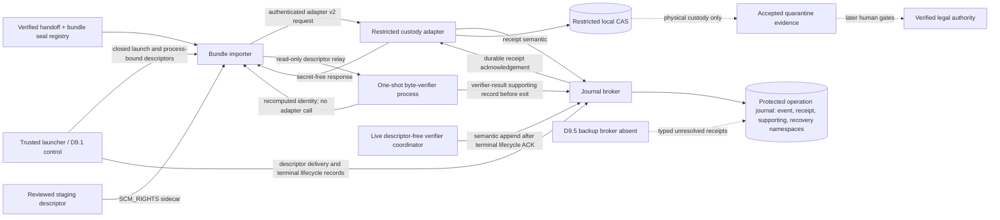

# D9.3.0 custody, durability, journal, and recovery contracts

Status: **approved corrected design-only contract freeze at reviewed commit `89433cf058ca8f52b658ea1ce2d0391aaf44f7fe`; not activated or authorized for runtime use**. D9.3.0 defines closed records and an offline consistency harness. It creates no executable adapter, broker, journal, recovery tool, custody object, backup, credential, principal, database write, evidence import, or public behavior. D9.0.1 remains the applicable approved base contract and is not modified. Physical custody does not establish evidence acceptance, officiality, legal authority, human review, or publication eligibility. The [synthetic, unactivated D9.3.1 implementation](d9-3-1-primary-custody-runtime.md) is approved at commit `d960a03f4b8ac8a78d3f6b40ba909eb24b5f3442`; it deliberately cannot invent recovery authority or treat sequential inventory reads as atomic. The separate [D9.4.0 restriction/deletion contract proposal](d9-4-restriction-deletion-contracts.md) is awaiting approval.

The fingerprinted catalog continues to use the permanent lifecycle-neutral value `design_only_contract_freeze`. This value describes the immutable design-only capability boundary; it does not encode a transient review state. Approval is recorded externally through this reviewed documentation and approval commit, not inside the fingerprinted contracts; approval must not modify the fingerprinted contract root. Contract approval does not activate implementation or authorize production use.

## Decision and authority boundary

D9.3.0 supplies the smallest separately versioned extension needed to describe a future primary-copy custody operation and its durable audit trail. It keeps three claims structurally distinct:

1. **Physical custody** is a bounded claim that a named adapter observed exact bytes at one content-addressed reference and completed the specified local durability steps.
2. **Accepted quarantine evidence** exists only after the separate D9.2 projection and promotion checks write migration-005 records under an authorized operational path.
3. **Verified legal authority** exists only after later source-backed drafting and mandatory human review and publication gates.

Neither physical custody nor accepted evidence establishes document identity, officiality, issuer, jurisdiction, currency, consolidation, binding force, legal effect, legal verification, or publication eligibility.

## Audit findings and resolved ambiguities

The design audit covered the approved D9.0.1 catalog and handle partitions, the synthetic D9.1 control plane, the synthetic D9.2 accepted-bundle verifier, migration 005, and Decision 9.

| Ambiguity or conflict | D9.3.0 resolution |
|---|---|
| D9.0.1 names exact custody durability receipt bytes but defines no payload or durable resolver. | Add a canonical primary receipt and an authenticated receipt-broker exchange. |
| Adapter message v1 cannot bind a bundle, copy, custody intent, broker acknowledgement, or exact current capability leaf. | Add adapter message v2; do not reinterpret v1. |
| Journal v1 cannot cite direct custody exchanges, primary receipts, typed backup receipts, or recovery evidence. | Add a semantic-assertion format, authenticated broker exchange, and journal event v2; journal versions cannot mix within one operation. |
| A separate recovery store would require a D9.0.1 handle-scope expansion. | Store classification-only recovery assessments in a dedicated namespace of the existing protected operation journal. The journal broker remains the only holder of `operation_journal`; no handle or grant is added. D9.3.0 grants no generic document-recovery execution authority. |
| The semantic actor and persistence actor were conflated. | The exact D9.0.1 stage-origin component originates and digest-commits the semantic assertion; the journal broker independently assigns sequence, predecessor, persistence time, and persisted envelope. |
| Canonical JSON appeared to carry bearer capabilities. | JSON carries only immutable issuance, current-leaf, and transition digest commitments. Bearer bytes and descriptors are ephemeral authenticated IPC sidecars and are never serialized, hashed, logged, or fixture data. |
| A transition that cites a response could be embedded in that response, producing a digest cycle. | A response echoes the current leaf claimed by its request. A response-triggered transition is created afterward. The later journal evidence cites the consumed transition. The final graph is acyclic. |
| The independent verifier appeared to receive direct adapter authority. | The `bundle_importer` is the adapter peer. The launcher supervises a one-shot verifier; the importer relays a read-only descriptor, then closes it and confirms verifier termination. |
| Receipt persistence did not pin the journal configuration. | Every receipt-broker request and response pins both the custody operational profile and the journal operational profile. |
| “Thirty seconds” could be read as an open-file lifetime. | It is only the maximum claim/acceptance window. Descriptor lifetime ends by close plus confirmed receiver termination, not by a wall-clock promise. |
| A durable receipt with no emitted response invited response reconstruction. | No response is fabricated. Recovery classifies that a later, separately authorized exact `reused_verified` operation is required; it never authorizes that operation. Both histories remain preserved. |
| Decision 9 requires backups before promotion, but no backup receipt payload is approved. | D9.3.0 defines typed, exact reference slots only. All backup-dependent success histories remain operationally unreachable until D9.5 defines and implements those receipts. |
| Restriction, relocation, tombstoning, deletion, and backup were grouped with primary custody. | D9.3.1 is primary custody and journal implementation; D9.4 owns restriction/deletion policy; D9.5 owns backup, restore, and deletion-aware reconstruction. |
| Semantic timestamps could rewrite what was known. | `event_at` records the actor’s claimed occurrence time; broker-controlled sequence and `persisted_at` define knowledge order. Later records never rewrite an earlier bounded view. Recovery additionally resolves a current launcher-owned lock projection from the existing `permit_control_store`; the projection is not a new handle. |

No hard conflict requires a change to a frozen D9.0.1 contract. D9.3.0 must be selected alongside the exact approved D9.0.1 catalog and fingerprints.

## Contract inventory and version strategy

The root `docs/schema/d9-3-0/` contains 16 JSON artifacts: nine schemas (one shared and eight top-level), three registries, one catalog, and three synthetic fixture files. The standalone validator is outside that fingerprinted root.

| File | Format/version | Purpose |
|---|---|---|
| `common-v1.schema.json` | shared definitions v1 | Placement-only custody intent; primary and typed future-backup references; exchange evidence; extended errors. |
| `operational-profile-v1.schema.json` | `jedi-atlas-d930-operational-profile` 1.0.0 | Unactivated custody or journal profile pinned to D9.0.1 and this exact D9.3.0 catalog. |
| `custody-adapter-message-v2.schema.json` | `jedi-atlas-custody-adapter-message` 2.0.0 | Copy-bound adapter request/response envelope for six closed operations. |
| `integrity-access-lifecycle-record-v1.schema.json` | `jedi-atlas-integrity-access-lifecycle-record` 1.0.0 | Secret-free descriptor delivery, verifier result, and confirmed close/receiver-termination records. |
| `primary-durability-receipt-v1.schema.json` | `jedi-atlas-primary-durability-receipt` 1.0.0 | Canonical, exact primary-copy durability receipt. |
| `durability-receipt-broker-message-v1.schema.json` | `jedi-atlas-durability-receipt-broker-message` 1.0.0 | Adapter-to-journal-broker receipt persistence and acknowledgement. |
| `operation-journal-semantic-v1.schema.json` | `jedi-atlas-operation-journal-semantic-assertion` 1.0.0 | Actor-originated D9.0.1-compatible semantics plus direct custody, typed receipt, and recovery references. |
| `operation-journal-broker-message-v1.schema.json` | `jedi-atlas-operation-journal-broker-message` 1.0.0 | Secret-free supporting-record persistence and semantic append requests/responses. |
| `operation-journal-event-v2.schema.json` | `jedi-atlas-operation-journal-event` 2.0.0 | Broker-persisted, append-only, hash-chained event. |
| `classifications-v1.json` | registry 1.0.0 | Total message, state, history, error, crash, orphan, and recovery matrices. |
| `digest-profiles-v1.json` | registry 1.0.0 | Canonical byte profiles and context-specific digest resolvers. |
| `field-registry-v1.json` | registry 1.0.0 | Trusted producer, consumer, storage, confidentiality, canonicality, and ephemeral-sidecar allocation. |
| `contract-catalog-v1.json` | catalog 1.0.0 | Exact raw hashes, predecessor fingerprints, migration hashes, and design-only boundary. |
| `fixtures/*.json` | synthetic fixture set 1.0.0 | Valid, invalid, mutation, and independent golden-vector inputs. |

Adapter and journal-event formats use major version 2 because their interpretation changes incompatibly. Newly introduced namespaces begin at 1.0.0. D9.0.1 machine-contract artifacts are neither edited nor aliased; existing prose may link forward to this approved design-only freeze. A later semantic change requires a new version, catalog, fingerprints, fixtures, review, and explicit activation decision.

### Pinned approved fingerprints

| Surface | SHA-256 |
|---|---|
| Exact catalog file | `cd91f67c25941a472b89fe2fa6f19b012714dec96661b65b76ecfacf7f48e87c` |
| Classification semantic record | `b61fff46a6094aeb23dfcfb0d02f808b9ac83d345a832a9d914d8de8b641a5e8` |
| Digest-profile semantic record | `c8532cd78032dba55add0b9d17d6d5625aaae887c4b2bbe3fea87c286b31e920` |
| Field-registry semantic record | `04293fb9885ed792516c04b11ef4608fd82cec9f4223be75b9fa8d9a93392a96` |
| Effective 1,198-property field mapping | `14616c2ff46109cf6eaed017f44bec066c6d9468b6650760fce67dc2f328aa46` |
| Exact schema-pointer resolver projection | `6276a2785d6693477755717dc27819a07b326a455b004b89a18d7a058cb276d7` |
| Synthetic custody-profile commitment | `9b1d68cf65887d9e88e3d6e37a47d1f471fe479fdbbd6232595ba89e3a9242e3` |
| Synthetic journal-profile commitment | `76278dd1ccc3216bc41269d2bc97d8b8067b6a195fc6c7b3dbf2952a7fbde97f` |
| Adapter request-stream matrix | `8ea4ae1feab8c4c068e08dbc7b70e093b6d189fa55bfb9aba53661274b5864b7` |
| Custody/message matrix | `7308d306667767d1df8f203754bfa4ac3814513873d4438a508c7b5f5e997127` |
| Custody state-transition matrix | `4c03c2110ff620ea1c2a67f522c59b46fe76734d90f97aa84e50c52d1ad1823e` |
| Journal/history matrix | `f70fa8e2b52ea38ae252fb08b15067030f9f832375521b840f44c5c1b32d46dd` |
| Recovery/crash/orphan matrix | `ae1a756bb7de72822aa472268ac45bbdd07e9826ecc3fcc4c9a3191931a92a0a` |
| Complete primary-receipt golden bytes | `b48325f9c6fb1fa68cd995f0a45d0a4e12e6edf200d87d5c035173df36b62c6f` |
| Sorted 16-file contract-root inventory | `cf073b571a70b347ba3ea8e0e851d5d44013fe701fd9f77a235673302b423ba3` |

Approval at reviewed commit `89433cf058ca8f52b658ea1ce2d0391aaf44f7fe` pins every exact value above. They are approved design-contract fingerprints, not active configuration. Runtime selection must pin both D9.0.1 and D9.3.0; it cannot regenerate or substitute either catalog.

## Trust and handle boundary



The approved design-only contract adds no D9.0.1 logical handle. The journal broker alone retains `operation_journal` with append-intended access. An authenticated IPC endpoint is not a backing-store handle. The adapter never writes SQLite; the journal broker cannot create evidence rows; the D9.2 writer never receives a raw CAS path or unrestricted custody access. Attribution is not authentication, authorization, qualification, or review.

The offline fixtures use a closed set of exact synthetic binding codes solely to exercise role separation; code prefixes are not trusted. Active-generation, executable, peer-credential, permit, bundle-seal, and binding-record resolution remain governed by the frozen D9.0.1 contracts and the approved synthetic D9.1 boundary. The one-shot `receiver_process` is a concrete byte-verifier process and must terminate; the stable independent-verifier binding is not itself a process and may also authorize a distinct live coordinator process. That coordinator must have a different process-instance code and kernel `(pid, start_time_ticks)`, hold no custody descriptor, authenticate exactly at semantic append, and act only after the verifier-result record and terminal lifecycle record have durable acknowledgements. D9.3.0 does not duplicate the base contracts or turn a supplied binding code into authority.

## Adapter and capability protocol

All adapter exchanges bind operation ID, 256-bit nonce, request ID and sequence, exact roles, active runtime and identity-binding digests, D9.3 profile digest, bundle/copy/artifact/backend facts, request digest, and canonical timestamps. Request and response role pairs, shared payload fields, and chronology are exact.

The only Tranche 2A custody intent is `placement` in `restricted_store`. The pilot reference is exactly:

```text
objects/sha256/<first-two-lowercase-hash-characters>/<full-lowercase-sha256>
```

The six D9.3 operations are `open_staged`, `prepare`, `verify_prepared`, `publish_no_replace`, `seal_custody_access`, and `open_custody`. Their 28 request/success/failure variants are closed by the classification registry. D9.3.0 deliberately does not add an `abandon_temp` operation: D9.4 owns restriction, tombstone, and destructive-policy execution.

`*_capability_record_digest_sha256` resolves the immutable issuance. `*_capability_leaf_record_digest_sha256` resolves the exact current leaf presented when the request is authenticated; the leaf may be the issuance or the latest transition. A successful response echoes that claimed leaf; failure and corrupt responses are request-digest-bound but carry only their closed outcome/error fields. If a successful response triggers a transition, the transition is produced after the response and therefore cannot appear inside it:

```text
open request
  -> source issuance/open response
  -> prepare request/source consumed transition/preparation issuance/prepare response
  -> verify request/verify response/preparation verified transition
  -> publish request/primary receipt/broker acknowledgement/publish response
  -> preparation consumed transition
  -> supporting-response persistence
  -> semantic assertion/journal append
```

The primary receipt cites the source-consumed and preparation-verified transitions. The custody-finalization journal evidence cites the later preparation-consumed transition. Integrity-access evidence similarly cites the sealed-capability consumed transition after `open_custody`. This removes all response/transition digest cycles while preserving every state change.

Bearer capability bytes are not JSON fields. They travel only as an ephemeral authenticated IPC sidecar tied to the digest commitments. A 30-second limit bounds claim acceptance only. Read-only descriptor access ends through close, confirmed receiver termination, and launcher supervision. Processing access remains forbidden.

The integrity graph persists three distinct secret-free lifecycle records: descriptor delivery by the launcher, the independent byte-verifier result, and confirmed sender-close plus receiver termination. The verifier-result supporting record must be acknowledged before the one-shot receiver terminates. After the terminal lifecycle record is acknowledged, a distinct live, descriptor-free verifier coordinator under the same stable independent-verifier binding authenticates at the semantic-append time and submits the integrity semantic assertion. A `completed_verified` terminal is valid only when this full ordering is resolved, the verifier result is `passed`, the recomputed artifact identity is exact, the sender is confirmed closed, and the supervised receiver is terminated and reaped. Failure or timeout remains auditable but cannot satisfy the integrity milestone.

## Primary receipt and broker durability

The future adapter must prepare a private temporary object, verify exact byte layer/hash/length, atomically publish without replacement, reopen and rehash the final object, synchronize file data, and synchronize its parent directory. Both `created_new` and `existing_exact` require the same final re-verification; a key collision alone is not success.

The adapter sends receipt semantics over authenticated IPC to the journal broker. The request pins custody and journal profiles. The broker writes canonical UTF-8 JSON with no BOM, normalization, insignificant whitespace, or trailing line ending, then returns an acknowledgement bound to the exact receipt code, raw SHA-256, and persistence time. Only then may the adapter emit its publish response. The secret-free response itself is persisted in the supporting-record namespace before the semantic journal event cites it.

The acyclic digest order is:

```text
requests and pre-response capability leaves
  -> primary receipt semantic
  -> receipt persistence request
  -> exact receipt bytes
  -> broker acknowledgement
  -> publish response
  -> consumed transition
  -> supporting-record acknowledgement
  -> semantic assertion
  -> journal append request
  -> journal event
  -> journal append response
```

The receipt’s four literal-true observations are file-data sync, parent-directory sync, no-replace enforcement, and final reopen/rehash. They are bounded component assertions, not proof of hardware or power-loss immunity. A future implementation must establish the actual filesystem and OS primitives through fault injection.

## Journal composition and histories

Journal v2 composes the frozen D9.0.1 actor, authorization, result, error, and state semantics. It supersedes only the D9.0.1 history templates for a selected D9.3.0 operation. One operation uses one journal version, one context, and a strictly increasing, gapless, unforked sequence.

- `event_at` is the semantic actor’s occurrence assertion.
- `persisted_at` and sequence are assigned by the journal broker.
- `event_at <= persisted_at`; persistence time increases strictly.
- Knowledge projections use both broker sequence and persistence time.
- A later record with an earlier event time does not change an earlier knowledge-bounded result.

The registry defines six complete success/recovery histories and seven complete failure histories:

| Class | Exact history codes |
|---|---|
| Success/recovery | `bootstrap_imported`, `document_imported`, `accepted_bootstrap_no_op`, `accepted_document_no_op`, `post_promotion_completion_bootstrap`, `post_promotion_completion_document` |
| Failure | `dry_run_manifest_rejected`, `bootstrap_promotion_ambiguous`, `document_promotion_ambiguous`, `bootstrap_final_backup_failed`, `document_final_backup_failed`, `bootstrap_completion_write_failed`, `document_completion_write_failed` |

Document import requires primary custody before artifact backup and candidate writing. Bootstrap remains custody-free. Document no-op requires exact copy-aware integrity seal/open evidence; bootstrap no-op does not. Bootstrap and document post-promotion completion are separate histories. Stage failures terminate under their exact error/effect/disposition tuple; a generic rejected path is forbidden.

D9.3.0 does not widen frozen promotion authority. Only the ordinary document `promotion_started` milestone carries the exact pre-promotion authorization; it is forbidden on other milestones. A classification-only recovery assessment cannot promote a candidate, mutate canonical state, complete a backup, delete an orphan, or manufacture a terminal result. Candidate construction and promotion remain D9.2/D9.0.1 concerns, while this extension only makes their custody and journal prerequisites referentially explicit.

## Typed backup references and deliberate unreachability

Journal v2 reserves three mutually exclusive typed references:

| Kind | Scope commitment | Required before | Payload owner |
|---|---|---|---|
| `artifact_copy` | bundle + artifact + copy + primary receipt + operation + nonce | candidate database write | D9.5 |
| `prior_database` | bundle + prior logical state + database generation + operation + nonce | promotion | D9.5 |
| `final_consistent_set` | bundle + resulting logical state + receipt head + inventory + operation + nonce | completion | D9.5 |

Each reference pins a future receipt format/version, raw receipt digest, scope profile/digest, backup-profile digest, producer binding, completion time, and persistence time. D9.3.0 does not define the receipt payload, producer, durable store, or resolver. Consequently, every history requiring one is intentionally unreachable. A placeholder hash cannot satisfy the gate.

## Recovery records, decisions, and knowledge time

Recovery classification uses the existing operation journal and handle. One assessment is one frozen `stage_succeeded@reconciliation` journal event whose extension payload is `classification_only_recovery_assessment`. Reassessment appends another adjacent event in the same operation and journal, with a gapless attempt number and an exact link to the prior assessment event. No assessment edits an earlier record.

An assessment binds the subject operation, nonce, exact subject bundle, optional document artifact/copy/backend, an externally resolved post-promotion source terminal, a launcher-owned current lock projection in `permit_control_store`, the pre-append journal head, a complete inventory-head snapshot, and closed observations. Classification selects exactly the first matching rule in the 19-rule priority order. Every rule returns `none_classification_only`: D9.3.0 records what a later authorized process would need to do but performs no recovery action. Missing scans, unavailable protected inventories, unknown state, active operations, noncurrent locks, holds, references, mismatches, and ambiguous promotion fail closed.

The 14 named crash boundaries cover: before prepare; partial and verified temporary objects; unknown publish result; exact final bytes without receipt; receipt without response; response without journal link; primary link without artifact backup; committed or sealed candidates; ambiguous promotion; promoted state without final backup; final backup without completion; and completed state. The outcome is only a deterministic classification such as no effect, retain/hold, a future exact operation required, or waiting for D9.4/D9.5. A generic document recovery run cannot append or execute under D9.3.0. Exact bootstrap reconstruction remains governed by frozen D9.0.1/D9.2, and the frozen `post_promotion_completion` permit may append this assessment without canonical writes.

Final CAS deletion, restriction, relocation, tombstoning, rights decisions, or backup creation cannot be emitted by D9.3.0 recovery. D9.4 and D9.5 retain those authorities.

## Field ownership and persistence

`field-registry-v1.json` is the machine-readable ownership map. Every schema property inherits its contract/variant rule; listed nested families override that rule. It distinguishes:

| Surface | Semantic producer | Persistence producer | Storage | Confidentiality/canonicality |
|---|---|---|---|---|
| Operational profiles | configuration authority | protected configuration store | outside Git and Atlas SQLite | protected, canonical, unactivated |
| Adapter requests/responses | importer or adapter according to direction | journal broker for secret-free supporting copies | supporting-record namespace | protected, canonical JSON; sidecars excluded |
| Primary receipt | custody adapter supplies semantics | journal broker assigns persistence facts and writes exact bytes | receipt namespace | protected, canonical |
| Receipt broker exchange | adapter request / broker response | journal broker | receipt-exchange namespace | protected, canonical |
| Journal semantic assertion | exact frozen stage-origin actor | copied exactly by broker | append request and event | protected, canonical |
| Journal event | semantic actor supplies embedded assertion | journal broker supplies envelope/head/time | operation journal | protected, append-only canonical |
| Integrity lifecycle record | launcher for delivery/termination; one-shot independent byte verifier for result; distinct descriptor-free verifier coordinator for later semantic append | journal broker stores secret-free supporting copies and the later semantic/event | supporting-record and operation-journal namespaces | protected, canonical; no raw descriptor or bearer |
| Recovery payload | independent verifier under recovery authorization | journal broker | recovery namespace in operation journal | protected, append-only canonical |
| Bearer bytes/descriptors | launcher or adapter | never persisted | ephemeral authenticated IPC only | secret/noncanonical |
| Future backup reference | D9.5 producer | future D9.5 broker | cited by journal | type-safe slot only; unresolved here |

No raw capability, credential, source byte, artifact, legal content, or personal data is present in the contracts or fixtures.

## Threat model and enforcement allocation

| Threat | Contract/validator response | Later runtime proof required |
|---|---|---|
| Overwrite, key collision, or cross-copy replay | Exact artifact/copy/backend binding, no-replace disposition, final reopen/rehash, replay matrices | real no-replace syscall and filesystem fault tests |
| Forged durability | exact build/profile/identity pins and brokered receipt | reproducible build, OS identity, sandbox, durable filesystem semantics |
| Lost or substituted receipt | exact canonical bytes, raw hash, broker acknowledgement, context-bound resolver | protected journal durability and backup |
| Digest cycle | claimed-leaf echo and post-response transition linkage | runtime graph resolver |
| Stolen capability or descriptor | digest commitment, single consume, exact process/operation, sidecar-only rule | peer credentials, process-bound descriptor delivery, close/kill/reap confirmation |
| Backdated audit fact | semantic/persistence time split and append sequence | trusted broker clock and append-store protection |
| Cleanup destroys referenced material | total scan, precedence rules, holds, no final-delete action | D9.4 privileged policy and worker |
| Fake backup receipt | unresolved D9.5 resolver makes histories unreachable | approved D9.5 payload, producer, second copy, restore drill |
| Custody presented as legal truth | explicit three-layer authority boundary and no public surface | later human legal review and publication implementation |

## Offline validation and adversarial matrix

`node docs/schema/validate-d9-3-0.mjs` is an offline design-consistency harness. It does not claim runtime guarantees. It:

- pins migrations 001–005 and all four approved D9.0.1 fingerprints;
- compiles eight top-level closed schemas plus the shared definitions and frozen capability schema;
- verifies every catalog raw hash, registry semantic digest, exact 16-file root inventory, and schema-pointer-aware field/digest resolver coverage;
- checks fixed canonicalization vectors and a complete literal primary-receipt vector, rejects reordered raw JSON and CRLF, and mutates every digest-covered fixture leaf;
- validates all 28 adapter variants, exact request/response pairs, all registered state transitions, and every unregistered tuple over the registered transition vocabulary;
- constructs and resolves the complete D9.3 extension portion of an acyclic open → prepare → verify → receipt → publish → consume → supporting-record → journal graph and a separate seal → integrity open → descriptor delivery → verifier result → close/termination graph using frozen D9.0.1 capability records;
- exercises receipt and journal brokers, exact-role separation, replay/collision rejection, chronology, backend fan-out, and semantic/persistence bindings;
- validates all 13 journal histories (six success/recovery and seven failure) and all 20 registered shapes after the seven optional failure events are included, plus deliberate unreachability of D9.5-dependent paths;
- evaluates all 23 predicate branches of the 19 recovery rules, all 37 registered fail-closed guard values, 14 crash boundaries, precedence, contradictory observations, exact source/lock resolution, and chained retry/fork rejection;
- tests unknown fields, malformed timestamps, schema weakening, catalog mutation, scope widening, secret markers, and forbidden restriction/deletion/backup/legal-authority outcomes.

The harness cannot prove authenticated IPC, kernel peer identity, active binding or permit resolution, process isolation, filesystem durability, real capability secrecy, OS clock trust, append-store durability, crash recovery, backup integrity, or legal review. The separately executed frozen D9.0.1 validator remains authoritative for its base schemas, identity/profile admission, authorization graphs, and matrices. The D9.3 synthetic resolver checks the extension's exact bindings to pre-admitted D9.0.1 records; it is not an independent general-purpose D9.0.1 certifier. D9.3.1 must obtain those inputs through a separately scoped, fixed-function D9.0.1 admission/resolution path and resolve their exact protected records as well as the D9.3 extension graph.

The nine inventory-head commitments in a recovery knowledge snapshot are typed design commitments, not a runtime inventory service. D9.3.1 therefore also needs a separately scoped fixed-function snapshot service or equivalent protected read path. It must not smuggle new backing-store access through IPC or widen the seven frozen D9.0.1 handle partitions. Until that consumer and its atomic snapshot semantics are separately reviewed, recovery remains classification-only and fail closed.

## Implementation sequence after contract approval

1. **D9.3.0 — approved design-only contract freeze:** exact schemas, registries, fixtures, fingerprints, and offline validator; no runtime.
2. **D9.3.1 — approved synthetic primary custody vertical slice:** the [synthetic implementation](d9-3-1-primary-custody-runtime.md), approved at commit `d960a03f4b8ac8a78d3f6b40ba909eb24b5f3442`, supplies the restricted local CAS, adapter IPC/descriptor mechanics, receipt and journal brokers, copy-aware integrity relay, D9.0.1 admission/resolution integration, protected inventory-snapshot consumer, and classification-only crash handling. It cannot execute a recovery action, remains unactivated, and is not authorized for real evidence or operational custody.
3. **D9.4.0 — design-only restriction/deletion contract proposal awaiting approval:** append-only controls, access shutdown, separation of duty, bounded primary-copy deletion receipts, classification-only recovery, and D9.5 directives; no runtime effect. **D9.4.1** is the later separately reviewed synthetic implementation.
4. **D9.5 — backup and restore slice:** define the reserved receipt payloads and resolver, independently protected copies, restore drills, and deletion-aware reconstruction.
5. **D9.6+ — later acceptance and pilot gates:** integrated fault/security acceptance, separately approved one-document run, then a hosted production profile.

## Approved boundary and non-goals

Approval pins this exact catalog and fingerprints, adapter-v2/journal-v2 incompatibility, capability-leaf semantics, receipt-broker ordering, integrity lifecycle graph, existing-handle journal namespaces, 13 histories, 19 classification-only recovery rules, 14 crash boundaries, and typed-but-unavailable D9.5 references. Any substantive edit creates a new reviewed version.

This approved design-only contract does not implement or authorize CAS storage, journal storage, recovery execution, backup, restore, restriction, deletion, credentials, operational profiles, runtime activation, bootstrap, evidence import, canonical promotion, API/search/export/frontend behavior, legal verification, or publication. It changes no migration and creates no source document, artifact bytes, Atlas row, legal fact, or legal proposition.
