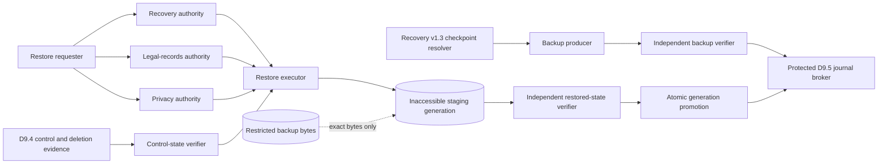

# D9.5.0 backup, restore, and deletion-aware reconstruction contracts

Status: **design-only proposal awaiting approval**. This contract root defines technical backup and restore evidence only. It creates no runtime component, credential, backup, restore action, deletion authority, evidence acceptance, legal verification, publication eligibility, Atlas write, API behavior, or frontend behavior.

## Decision boundary

D9.5.0 closes the contract gap left intentionally by D9.3 and D9.4. It defines how a later fixed-function system could prove that exact bytes and state were backed up, reconstruct a disposable candidate from those exact bytes, reapply current restriction and tombstone controls before exposure, atomically promote an independently verified candidate, and record drills and failures. It does not implement those actions.

The contract is additive. It does not edit or reinterpret D9.0.1, D9.3.0, D9.4.0, recovery-resolver v1–v1.3, migrations 001–005, or the approved synthetic D9.1–D9.4.1 implementations. Recovery-resolver v1.3 is the selected identity route: independently derived source-state identity remains distinct from journal-tip receipt identity and the relationship is authenticated by a correspondence record. V1.2 remains immutable historical/read-only compatibility.

The audit found no frozen-contract conflict. Three unresolved D9.3.0 typed receipt slots can be satisfied without mutation:

| D9.3.0 receipt kind | Exact scope profile | D9.5.0 meaning |
| --- | --- | --- |
| `artifact_copy` | `artifact_bundle_copy_primary_receipt_operation_nonce_v1` | exact artifact-copy durability evidence before candidate writing |
| `prior_database` | `prior_logical_state_database_generation_operation_nonce_v1` | exact prior-database durability evidence before promotion |
| `final_consistent_set` | `resulting_logical_state_receipt_head_inventory_operation_nonce_v1` | resulting logical-state, receipt-head, and inventory durability evidence before completion |

D9.4.0 coordination records remain immutable. Their null D9.5 receipt references are historical facts, not fields to fill in later. D9.5.0 creates separate satisfaction and reconstruction records referencing those records. It recognizes `apply_restriction_before_restore`, `apply_tombstone_before_restore`, `do_not_restore`, and `delete_backup_copy_after_d9_5_authorization`; the last directive still requires separate current deletion authority and is not executed by this design.

## Frozen dependencies

The catalog pins the approved D9.0.1, D9.1, D9.2, D9.3.0, D9.3.1, D9.4.0, recovery-resolver v1–v1.3, and D9.4.1 commits. It also pins exact hashes for migrations 001–005, the frozen validators, the shared canonicalization module, the frozen contract verifier, and the synthetic runtime fixture. Any change fails closed.

## Contract inventory

The versioned root is `docs/schema/d9-5-0/`.

| Artifact | Purpose |
| --- | --- |
| `common-v1.schema.json` | Closed identifiers, hashes, timestamps, actors, checkpoint, copy, control, target, and non-authority definitions. |
| `operational-profile-v1.schema.json` | Unactivated profile pinning exact dependencies, roles, routes, limits, and authority exclusions. |
| `backup-manifest-v1.schema.json` | Complete source checkpoint, ordered source inventory, exact source-to-copy coverage, unique copy identities, chain predecessor, retention state, and producer/persistence attribution. |
| `backup-durability-receipt-v1.schema.json` | D9.5 source-copy receipts plus D9.3-compatible discriminated scopes binding an exactly matched artifact/primary receipt, prior database, or final-state/journal/inventory commitment; all carry profile, operation, nonce, independent rehash, durability observations, and separated actors. |
| `restore-authorization-v1.schema.json` | Exact restore scope plus three distinct current human approvals. |
| `restore-plan-v1.schema.json` | Deterministic plan binding receipts, checkpoint, target, controls, ordered stages, actors, and expiry. |
| `restore-lifecycle-record-v1.schema.json` | Gapless append-only stage record with separate semantic and persistence attribution. |
| `deletion-aware-reconstruction-v1.schema.json` | Knowledge-bounded D9.4 control projection and complete seven-class copy inventory before exposure. |
| `retention-control-record-v1.schema.json` | Append-only retention and hold decisions; expiry remains non-authoritative for deletion. |
| `retention-head-attestation-v1.schema.json` | Fresh broker-produced proof of the protected retention ledger's exact current record and receipt head. |
| `restore-drill-record-v1.schema.json` | Append-only drill, freshness, chain-currentness, comparison, and escalation result. |
| `ipc-message-v1.schema.json` | Closed request/response envelope binding route, process identities, payload digest, nonce, sequence, expiry, outcome, and error. |
| `journal-append-receipt-v1.schema.json` | Separate gapless D9.5 knowledge-order receipt binding target, operation, semantic time, and persistence time. |
| `classifications-v1.json` | Closed roles, modes, gates, stages, failure classes, copy classes, retention, errors, and authority limits. |
| `digest-profiles-v1.json` | Canonical payload definitions for every record and scope hash. |
| `field-source-registry-v1.json` | Trusted producer, consumer, storage, confidentiality, and canonicality for every field family. |
| `storage-profiles-v1.json` | Append-only namespaces, byte identity, staging, reconstruction, and retention invariants. |
| `contract-catalog-v1.json` | Exact artifact and dependency hash catalog. |
| `root-inventory-v1.json` | Exact no-extra/no-missing inventory of the contract root. |
| `fixtures/*.json` | Synthetic valid, invalid, and independently fixed canonical/hash vectors. |
| `../validate-d9-5-0.mjs` | Offline schema, semantic, mutation, frozen-boundary, database, and inventory validator. |

The current proposal fingerprints are listed in the validator output and must be reviewed and pinned at approval. They are lifecycle-neutral design fingerprints; approval is external and must not mutate the contract root.

## Trust boundary and roles

Actors resolve field-for-field through the pinned D9.0.1 identity generation and adopted D9.4 roster. Every actor pins the runtime-profile, identity-generation, and authority-roster digests; a code in a caller payload is not authentication. The backup producer, backup verifier, and persistence broker are distinct services. Restore requires three pairwise-distinct humans—recovery, legal-records, and privacy authorities—and the requester cannot be any approver. The executor is distinct from restored-state verification and persistence. Control-state and restored-state checks may use the same frozen verifier binding only as distinct authenticated process instances. The launcher cannot be the executor.

Ephemeral capabilities are runtime-only, process-bound, and prohibited from serialized records and logs. This proposal does not create them.

## Backup creation and durability

A backup manifest pins one recovery-v1.3 checkpoint, its independent source-state identity, journal-tip receipt identity, authenticated correspondence, logical-state seal, schema and migration identities, a complete ordered source inventory, exact copy identities, and retention facts. Every source entry has exactly one coverage record and at least one exact byte-layer/hash/length-matching backup copy. Copy codes and copy-identity digests are unique within the manifest. Copy identity includes the backend and generation; content deduplication cannot merge access rights.

Backup manifests form one gapless, unforked, append-only chain beginning at sequence 1. A changed payload under an existing stable identity or operation/nonce is rejected; only exact replay is a no-op. Rollback, fork, gap, missing predecessor, or substituted manifest fails closed.

Every required copy has one exact durability receipt. A D9.5 `source_copy` receipt covers copy bytes for which no D9.3 primary-custody receipt exists. A D9.3-compatible `artifact_copy` receipt is permitted only when the referenced immutable D9.3 primary receipt resolves to the same bundle, artifact byte layer/hash/length, operation, and nonce; it cannot be repurposed for database or protected-control bytes. The `prior_database` scope carries the logical-state seal and database generation. The `final_consistent_set` scope carries the resulting logical state, journal-tip receipt, inventory digest, and the complete constituent copy/prior receipt set. Generic placeholder scopes are invalid. A successful receipt requires exact reopen/re-hash and byte-length verification plus bounded observations that no-replace, object-data synchronization, parent-namespace synchronization, and final reopen verification succeeded. These are component observations, not a universal power-loss guarantee.

Retention expiry is not deletion authority. Retention and hold changes are separate append-only records with semantic and persistence attribution; a manifest snapshot is never treated as the current retention decision. Planning and every promotion-sensitive revalidation require a fresh, authenticated persistence-broker attestation of the protected retention namespace's exact record head and receipt head. Supplying a history prefix without that current-head proof fails closed. A hold, unknown state, live reference, incomplete inventory, or missing current authorization blocks byte removal. Manifests, receipts, journal history, authorizations, lifecycle records, and drills remain append-only. A later operational design must preserve tombstones after authorized byte removal.

## Recovery objectives, administration, and loss semantics

The contract records measurements; it does not promise service levels. Recovery point objective (RPO) means the maximum accepted gap between the selected durable checkpoint and the latest state whose loss the operator is willing to tolerate. Recovery time objective (RTO) means the maximum accepted elapsed time from a valid, current restore authorization and available inputs to independently verified completion. The 86,400-second synthetic drill threshold is a fixture freshness limit, not an approved RPO or RTO. Operational objectives, owners, alerting, and escalation require separate approval.

Backup production, independent verification, protected receipt persistence, and restore execution are separate roles. A production profile must also place at least one qualifying backup copy and its control/journal history under independently administered credentials and failure boundaries; the design contract alone does not create that independence.

From-zero reconstruction requires all exact source-inventory bytes, the selected database/checkpoint, evidence artifacts, protected control and journal records, manifests, typed durability receipts, current D9.4 control evidence, frozen schemas/contracts, and verified identities. Partial-loss handling is closed:

| Observed loss | Result |
| --- | --- |
| Primary unavailable; every required independently administered backup copy and control record verifies | reconstruction may proceed to inaccessible staging |
| Database present but any evidence/control/journal inventory entry lacks exact copy coverage | withhold as `inventory_incomplete` |
| Bytes unavailable, corrupt, substituted, or only hash-described | withhold as `bytes_unavailable` or `corrupt_bytes` |
| Journal tip, correspondence, checkpoint, or receipt prefix missing/forked/gapped | reconciliation required; no promotion |
| Retention/hold leaf unavailable or contradictory | reconciliation required; no deletion and no exposure |
| A deletion/tombstone is discovered after backup | reconstruct the control first; withhold or reapply before exposure |
| Any candidate generation is partial or promotion cannot be independently verified | keep inaccessible; classify recovery required; never partially promote |

## Restore authorization and reconstruction

The restore authorization scope binds the operation and nonce, backup set, exact manifest, source checkpoint, and target environment identity. Three distinct eligible humans approve that exact scope over one common validity interval. Each approval binds its canonical decision payload to an exact authenticated human-to-broker IPC request and broker response on the role-specific route. Services cannot approve. Missing, replayed, route-substituted, expired, self-issued, role-substituted, or differently scoped decisions fail closed.

The deterministic plan binds every required receipt, the exact recovery-v1.3 checkpoint, the authorization, target, D9.4 knowledge boundary, D9.4 directives, deletion-aware assessment, actor set, and ordered lifecycle. It may execute only in the `recovery` operation mode.

The exact lifecycle is:

1. `authorized`
2. `staging_started`
3. `bytes_reconstructed_inaccessible`
4. `controls_revalidated`
5. `controls_applied`
6. `staged_state_verified`
7. `promotion_started`
8. `promoted`
9. `post_promotion_verified`
10. `completed`

Reconstructed bytes remain inaccessible through stage 7. Current restriction/tombstone state is resolved, compared, and applied before exposure. Typed D9.4 evidence binds the same subject, exact current record leaf, and journal receipt. Mapping is reverse-complete: every current blocking restriction, hold, or tombstone must resolve to exactly one required directive and disposition, so supplying an unreferenced blocking record cannot make it disappear. Resolver request/response digests, stable before/after D9.4 boundaries, and fresh protected-retention-head attestations are recorded at control verification and each promotion-sensitive stage; source-head or retention-head movement cancels promotion. `do_not_restore` withholds the restore. Missing, stale, contradictory, unknown, or changing control state cancels promotion. Promotion is one atomic generation switch; partial promotion is forbidden. Independent verification binds the complete restored inventory before and after promotion.

## Deletion-aware reconstruction

The assessment always records all seven bounded classes in canonical order: `primary`, `backup`, `derived`, `temporary`, `replica`, `open_descriptor`, and `unknown`. Each observation carries a bounded count or explicit inability to count, an inventory digest, and evidence digests. `present` and `restricted` require positive counts, `absent_verified` requires zero, and eligibility requires `bounded_copy_classes_complete=true`. Unknown or unverifiable state requires reconciliation; absence is only an observation within the registered inventory.

A later deletion discovered after backup does not disappear. The restore uses a current, knowledge-bounded D9.4 projection and the source head is revalidated at append/promotion boundaries. A tombstone is applied before exposure or the restore is withheld. A restriction remains effective after reconstruction. A current `do_not_restore` directive wins. Backup deletion is a separate future operation requiring its own current authorization, safety snapshot, and receipt; it is not implied by retention expiry or primary-name deletion.

Every record fixes `complete_erasure_claimed=false`. The protocol cannot establish the absence of hidden copies, remanent media, unknown systems, or unregistered descriptors.

## Failure, replay, and crash semantics

All stable records are append-only and no-replace. Operation IDs and nonces are immutably paired. One restore may target a candidate generation at a time. Exact replay requires a full persisted projection match; response loss never authorizes a second effect.

| Boundary | Closed classification |
| --- | --- |
| Before staging | `safe_no_effect` |
| After staging, before controls | `retain_inaccessible_and_reconcile` |
| After controls, before verification | `retain_inaccessible_and_reconcile` |
| After verification, before promotion | `retain_inaccessible_and_reconcile` |
| After promotion, before post-verification | `recovery_required_no_automatic_rollback` |
| After verification, before append receipt | `recovery_required_exact_replay_only` |
| After receipt, before response | `exact_replay_no_op_after_full_revalidation` |

Recovery remains classification-only. It cannot retry, clean up, roll back, restore, delete, correct state, or promote without a separately authenticated current operation. Missing or ambiguous evidence returns a closed unavailable/reconciliation result.

## Restore drills and freshness

Drills use only disposable `synthetic_restore_drill` targets and never write canonical Atlas state. Comparison codes, outcome, and escalation are computed—not caller-labelled—through one total precedence matrix from the exact expected and observed checkpoint, state head, correspondence, backup-chain leaf digest and sequence, inventory digest, and `floor((started_at - checkpoint.captured_at)/1000)` age. Mismatch yields `failed`; an otherwise exact but stale or sequence-proven superseded backup yields `stale`; only an exact, current, fresh result passes. Unavailable, partial, forked, gapped, rollback, or unknown observations cannot be expressed as a completed drill result in v1 and fail before record creation. Each append-only result records scheduled, start, and completion times; checkpoint age and limit; backup-chain currentness; source-head and restored-state comparisons; outcome; escalation; and separated scheduler, verifier, and persistence actors.

The pilot limit is 86,400 seconds for the synthetic checkpoint-age fixture. A stale or superseded backup chain produces `stale`; a source/restored mismatch produces `failed`; either requires escalation. A passed drill is bounded technical evidence at its recorded time, not continuous availability or legal assurance.

## Canonicalization, hashing, and knowledge order

Records use the frozen canonical JSON rules and SHA-256 digest profiles. Unknown fields, invalid versions, unsafe controls, credentials, noncanonical timestamps, malformed hashes, and ambiguous numbers fail closed. Arrays retain their contract-defined order. Every record digest excludes only its own top-level digest field.

The D9.5 journal is a separate gapless, unforked namespace. Its receipt binds the exact target digest, operation, nonce, semantic actor/time, persistence actor/time, sequence, and predecessor. Semantic occurrence time and persistence knowledge time remain distinct. Historical projections are bounded by the receipt sequence and persistence time; later backdated observations do not rewrite an earlier bounded view.

## Threat model

| Threat | Required response |
| --- | --- |
| Manifest, checkpoint, receipt, build, profile, or identity substitution | exact fingerprint and digest comparison; reject |
| Missing/corrupt/unavailable bytes | independent length/hash verification; withhold |
| Fork, gap, rollback, replay drift, or nonce collision | reject and require reconciliation |
| Stale/future/mixed D9.4 state | fail closed before exposure |
| Restriction or deletion concurrent with restore | re-resolve and compare source heads; cancel promotion |
| Symlink, path escape, or root replacement | descriptor-relative no-follow access in a future runtime; reject |
| Partial reconstruction or promotion | inaccessible hold; no partial promotion |
| Response loss after durable effect | exact replay and full projection verification only |
| Credential or capability leakage | secret-free contract records; ephemeral process-bound capabilities only |
| Retention expiry treated as deletion permission | reject; require separate current authorization |
| Receipt presented as legal/evidence/publication conclusion | reject authority overclaim |

The contract does not provide OS isolation, authentication, protected storage, backup media, trusted clocks, anti-rollback hardware, key management, or operational monitoring. Those must exist and be independently tested before activation.

## Validation design

The standalone offline validator:

- verifies every pinned migration, frozen catalog, frozen validator, implementation commit, and the D9.4.1 tree;
- compiles all 13 strict schemas and verifies four self-digested registries;
- validates 66 synthetic contract records, 62 adversarial cases, four positive drill-matrix states, more than 3,600 digest-covered leaf mutations, and schema mutations;
- exercises wrong source heads; missing/conflicting source-copy coverage; duplicate copy identities; incomplete inventories; corrupt bytes; exact D9.3 primary-receipt incompatibility; replay, fork, rollback, reused operation identity, backdated successors, and missing predecessors; fake actor context; stale, wrong-subject, incomplete, contradictory, unmapped, or moving controls; authenticated retention-head omission/substitution/staleness; copy-state/count contradictions; approval-message substitution; authorization expiry; lifecycle backdating and stage actor/outcome substitution; IPC route substitution; partial restoration and response loss; erasure overclaims; and total drill comparison/outcome mutations, fabricated age, stale chain, and chain gaps;
- verifies deterministic canonical/hash golden vectors with an independent SHA-256 calculation;
- validates the exact catalog and no-extra/no-missing root inventory;
- runs every frozen validator;
- applies migrations 001–005 to a disposable database and requires clean integrity/foreign-key checks with all 13 Atlas tables empty.

The fixtures are entirely synthetic. The validator demonstrates contract consistency, not operational backup or restore guarantees.

## Independent review and bounded correction

Two independent read-only reviews were performed: one focused on security, identity reachability, least privilege, deletion boundaries, and human authorization; the other on determinism, typed receipt compatibility, source/copy coverage, lifecycle chronology, drill proof, and durability semantics. The bounded correction pass accepted every concrete finding: actors are derived from the frozen D9.0.1 generation and D9.4 roster; the sole D9.3 artifact receipt resolves to exactly matching frozen primary-custody evidence while other bytes use explicit D9.5 source-copy receipts; source inventory and unique copies have exact coverage; D9.4 blocking evidence is reverse-complete and subject-bound; human approvals carry authenticated role-specific IPC evidence; retention changes are fully validated append-only chains with fresh protected-head attestations; promotion-sensitive stages revalidate both D9.4 and retention heads; backup successors use fresh operation identities and strict chronology; and drill comparison, outcome, and escalation use a total deterministic matrix. No concrete review finding was rejected. The unresolved items are operational prerequisites rather than contract defects: protected clocks and stores, credentials, service isolation, independent backup administration, runtime adapters, external rollback resistance, tested atomic promotion, incident ownership, and explicit recovery authority.

## Preconditions for any implementation or real operation

Separate review and approval are required for:

- authenticated operational identity generations, credentials, role activation, and protected trusted clocks;
- a least-privilege backup producer, verifier, restore executor, journal broker, and independent restored-state verifier;
- restricted primary and backup storage, independently administered backup media, access control, durable journal storage, and external rollback resistance;
- real D9.1–D9.4 resolver/adapter integration rather than synthetic test doubles;
- tested atomic promotion, root-confined descriptor handling, crash recovery, retention/hold enforcement, deletion authorization, and tombstone propagation;
- operational drills, escalation ownership, monitoring, alerting, incident response, and documented restore objectives;
- explicit authority to run the evidence-empty bootstrap and later import controlled evidence.

Until then, no real backup, restore, deletion, evidence import, Atlas mutation, API exposure, or frontend use is permitted. Technical backup or restore evidence establishes neither evidence acceptance, officiality, legal identity, legal status, legal effect, human legal verification, publication eligibility, compliance, nor complete erasure.

## Approval decision

Approval would freeze this exact **design-only D9.5.0 contract root** and its reviewed fingerprints. It would approve only the technical contract for backup creation, deletion-aware reconstruction, restore lifecycle, and drills. It would not authorize implementation, activation, credentials, real storage, real backup or restore, deletion, evidence import, legal review, publication, API, or frontend changes.
