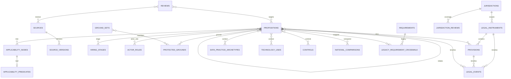

# Legal Atlas data model v2 — reconciled implementation specification

Status: all six architectural requirements and the implementation conventions are approved. Tranche 0 is implemented. The 45-table Tranche 1 proposal is rejected and superseded in Git history by the minimal [Tranche 1A authority-entry foundations](schema-v2-tranche-1.md), which remains pending migration approval. No `atlas_*` production migration is authorized.

The database is a reusable legal knowledge base, not a company compliance database. It stores source-backed propositions, contextual archetypes, control/evidence expectations, and editorial projections. Organization systems, candidates, named personnel, vendors, and evidence artifacts belong in a later bounded context.

The approved gated-review and continuous-freshness architecture is specified in [Review governance and freshness](review-governance-and-freshness.md).

## Six-layer ontology

| Layer | Question | Records |
|---|---|---|
| Authority | Where does it come from and is it binding? | jurisdictions, instruments, provisions, sources, versions, legal events |
| Rule | What must, must not, or may someone do? | propositions, normative actions, subjects |
| Hiring context | Where does it apply? | stages, lenses, technology uses, applicability |
| People and data | Who and what information? | actors/roles, grounds/ground sets, data practices |
| Operations | What control/evidence/owner/escalation? | controls, evidence expectations |
| Provenance | What supports and verifies it? | reviews, sources, translations, publication, verification |

## Logical cross-tranche schema catalog

This remains the cross-tranche logical catalog. It is not a claim that all structures belong in one migration. The Tranche 1A document and proposed executable DDL supersede the abbreviated foundation descriptions below.

SQLite uses `INTEGER` IDs/booleans (booleans constrained to 0/1), `TEXT` codes/enums/dates (`YYYY-MM-DD`) and JSON expressions, and `BLOB` hashes. Foreign keys are enabled. Published historical records are versioned or deprecated, not deleted. Derived values are labelled as derived.

### Foundation tables

`jurisdictions`: hierarchical territorial nodes (`id INTEGER PRIMARY KEY`, stable `code TEXT UNIQUE NOT NULL`, `name TEXT`, `level CHECK eu/eea/state/regional/devolved`, `parent_id FK`, `active`, `replaced_by_id`, `notes`). `jurisdiction_memberships` records time-bounded membership/association. Non-territorial `coverage_scopes` separately model sector, employer size/type, collective-agreement coverage, and personal scope. Parent deletion is restricted; indexes cover parent, level and intervals.

Separate controlled tables `hiring_stages`, `legal_lenses`, `actor_roles`, `protected_grounds`, and `data_categories` each have `id PK`, stable `code UNIQUE`, `label`, `definition`, lifecycle (`active/deprecated/replaced`), and governance timestamps. `taxonomy_labels` and `taxonomy_aliases` provide multilingual labels/aliases; `taxonomy_changes` is append-only (`old_value`, `new_value`, reviewer, reason). FKs/unique composites prevent duplicate assignments; historical values are never silently deleted. Optional interface ordering is editorial, not legal truth.

### Authority and provenance

`legal_instruments`: identity (`id PK`, `slug UNIQUE`, title, citation), separate `legal_layer` (`eu_primary_law/regulation/directive/national_law/case_law/guidance/collective_agreement/company_policy`), `instrument_type`, `binding_force` (`binding/persuasive/non_binding/internal`), `lifecycle_status` (`proposed/adopted/in_force/amended/repealed/withdrawn`), `jurisdiction_id FK`, notes. Index jurisdiction/layer/type. Applicability and current status are derived, never an unsupported universal field.

`provisions`: `id PK`, `instrument_id FK`, locator, heading, `UNIQUE(instrument_id,locator)`. `sources`: `id PK`, `authority_status` (`official/secondary`), issuing body, canonical URL, document/version identifier, language, publication/retrieval dates, provision locator, archive reference. `source_versions`: immutable `id PK`, source FK, representation (`original/translation/archive`), content, hash, captured date, translation status (`official/unofficial/machine_generated`), archive URI; unique source/version/representation. UPDATE/DELETE rejected.

`legal_events`: append-only event identity, typed event (`adopted/published/entered_into_force/applies_from/transposition_due/nationally_implemented/transitional_period_ends/amended/repealed`), event date, source-version FK, notes. Concrete `instrument_legal_events`, `provision_legal_events`, and `proposition_version_legal_events` junctions supply enforceable targets; no polymorphic target pair is used. Index target/date/type. `as_of` status is computed at query time; `status_projection` is disabled for Phase 2.

`instrument_relations`: from/to instrument FKs, typed `amends/repeals/transposes/implements/interprets/supplements/consolidates`, provision scope, source-version FK, unique composite; many-to-many, deletion restricted.

`reviews`: append-only reviewer type, scope, status, validation/next-review dates and limitations. Concrete target junctions (`proposition_version_reviews`, `source_version_reviews`, `translation_reviews`, `comparison_reviews`, `projection_reviews`) and `review_sources` make scope enforceable. `publication_decisions` targets an exact proposition version through a concrete FK and is append-only. `translations` links exact source versions. `verification_events` use concrete junctions for instruments, provisions, proposition versions, comparisons and projections; UPDATE/DELETE is rejected.

### Rules and semantic context

`normative_actions` and `subjects` are reusable structured concepts. `propositions`: `id PK`, slug unique, title, exactly one `normative_effect CHECK obligation/prohibition/permission/right/exception/defence`, action FK, subject FK, jurisdiction FK, separate legal interpretation/plain-language fields, review/publication state, timestamps. Conditions, exceptions, controls, evidence, owners, recommendations, and inclusion advice are linked entities, not proposition columns. Mutable with proposition version history.

`proposition_provisions`: proposition/provision FKs, `source_role CHECK authoritative_basis/implementation/interpretation/supporting_guidance/commentary`, locator override, unique composite. This supports multiple authoritative provisions. `proposition_relations`: from/to proposition FKs, typed `conditional_on/exception_to/qualifies/defines/implements/conflicts_with/supersedes/derogates_from/overlaps/limits/depends_on/compare_with`, source-version FK, unique pair/type, no self-link.

Dedicated junctions `proposition_stages`, `proposition_lenses`, `proposition_actors`, and `proposition_grounds` carry semantic metadata: actor role (`duty_bearer/rights_holder/beneficiary/decision_maker/provider/deployer/processor/enforcer/representative`), stage relevance (`direct/upstream_cause/downstream_consequence/audit_redress`), ground relevance (`expressly_protected/accommodation_related/comparator/proxy_risk/disparate_impact_concern/monitoring_category`), assignment basis, reviewer and verification date. Many-to-many, FKs and uniqueness enforced; published deletions restricted.

`ground_sets` plus `ground_set_members` model intersectionality explicitly (two or more grounds, jurisdiction, context, recognition status, supporting source, pattern `intersectional/multiple/additive`). Independent sex+disability links do not imply intersectionality; combinations are not pre-generated. `editorial_projections` and `inclusion_opportunities` are versioned, non-authoritative summaries/training/operational/inclusion content.

### Contextual operations

`applicability_nodes`: proposition FK, parent FK, node type `all/any/predicate`, ordinal, unique parent/ordinal; expression-tree roots are validated. `applicability_predicates`: one leaf per node, typed `scope/threshold/inclusion/exclusion/sector/jurisdictional/temporal`, operator/value JSON, plain explanation, source/reviewer/date. Normative exceptions remain propositions; predicates activate them.

`data_practice_archetypes`: reusable contextual operation, subject, data category, source, purpose, actor/controller role, jurisdiction, Article 6 basis, Article 9 condition, Article 10 authority where relevant, recipients/transfers, retention rule, automated-decision significance, provenance, uncertainty and counsel flag. `proposition_data_practices` is many-to-many. No candidate/company data.

`technology_archetypes`, `technology_uses`, and `deployment_context_archetypes` separate capability, intended hiring purpose/stage, and actor/jurisdiction/inputs/outputs/automation/human involvement. Claimed AI classification/significance records basis, source, reviewer, verification and uncertainty; not permanent product facts. `proposition_technology_uses` is many-to-many.

`controls`: reusable archetypes with authority classification (`expressly_required/reasonable_implementation/regulator_recommended/risk_management/beyond_compliance_inclusion`), controlled owner role, escalation trigger, version/review. `proposition_controls` many-to-many. `evidence_requirements` state what must/should be demonstrable; `control_evidence_types` identify templates (DPIA, notice, log, accommodation/decision record). Actual artifacts are out of scope.

### National comparisons and legacy

National rules are ordinary propositions with their own authority, applicability, dates, status, provenance and verification. `national_comparisons`: comparison id, time bounds, delta, typed comparison (`transposes/implements/supplements/broader_protection/stricter_obligation/additional_protected_ground/different_definition/different_threshold/different_procedure/different_remedy/sector_specific/regional_variation/partial_implementation/implementation_pending/potentially_inconsistent/relationship_uncertain`), review FK. `national_comparison_members`: comparison/proposition FKs and side `eu_baseline/national`; one comparison may contain many of each. Do not automate primacy, direct effect or conformity conclusions.

`jurisdiction_reviews`: jurisdiction/baseline scope, coverage (`not_researched/research_in_progress/no_material_difference_identified/material_difference_identified/local_validation_pending/locally_validated/stale_revalidation_required`), time bound, review FK, limitations. Absence of comparison never means equivalence. UK, Switzerland and non-EU EEA are distinct tracks.

`legacy_requirement_crosswalk`: legacy requirement ID, proposition ID nullable, mapping (`one_to_one/split/merged/unresolved`), rationale, review/source mapping status. `legacy_relation_crosswalk` maps each legacy relation to supported proposition pairs only; never all-to-all after a split. Preserve all 20 requirements, 12 instruments, 93 stage links, 48 lens links, 56 actor links, 12 relations and 12 source checks or create explicit unresolved records. Never invent effects for `country_review` or granular roles. Imports remain unpublished until review.

## ER diagram

## Normalized proposition bundles

These decompose existing seed meaning only; each has atomic effects, typed relations, provision/source-version links, applicability, controls, review state and editorial projection.

**Automated CV screening:** (A) candidate right against solely automated significant decision (GDPR Article 22); (B) safeguards/intervention/contest obligation, `qualifies` A; (C) in-scope recruitment-AI assessment obligation, `overlaps` A. Link contextual CV/profile data practice and CV-ranking deployment archetype; controls are meaningful review, notices and logs; source/review and training projection are separate.

**Disability accommodation:** (A) accommodation obligation (Directive 2000/78/EC Article 5); (B) disproportionate-burden defence, `qualifies` A, activated by applicability predicates. Link functional-needs data archetype, accessible-assessment use, controlled accessibility owner, accommodation evidence expectation, refusal escalation, and national review; keep editorial inclusion projection separate.

**Pay before interview:** (A) applicant pay/range right (Directive (EU) 2023/970 Article 5); (B) pay-history prohibition; (C) gender-neutral vacancy/non-discriminatory recruitment obligation. Link directive events, national thresholds as ALL/ANY predicates, pay/advertising archetype, range/version evidence expectation, review/publication decision and country comparison; no equivalence inferred.

## API contract

Add `GET /api/v2/propositions` and `/api/v2/propositions/:slug`; preserve `/api/requirements*` and current frontend behavior. List response: `{items,page,page_size,total,total_pages,as_of,filters}` with deterministic `(title,id)` ordering and bounded positive pagination. Detail includes proposition, derived `as_of` status, action/subject, provisions with source roles/immutable versions, typed relations, applicability tree, semantic taxonomies, data/technology contexts, controls/evidence expectations, reviews/publication, and national coverage/comparisons.

Filters support explicit `ANY`/`ALL` per dimension; dimensions combine with AND. Intersectionality only through `ground_set`. Unknown codes/modes, unsupported fields, or malformed strict `YYYY-MM-DD` `as_of` return HTTP 400 `{error:{code,message,field}}`. Public eligibility is version-scoped and fail-closed; ineligible list rows are omitted and details return 404. Status derives at query time from events using the request-wide `as_of`. No missing-overlay inference.

## Approved implementation decisions

1. All v2 tables will use plural `atlas_`-prefixed `snake_case` names, `id` PKs, `<entity>_id` FKs, `_code`, `_on`, `_at`, and `valid_from`/exclusive `valid_to`. Version tables are immutable; events/decisions append-only. Closed structural values may use CHECKs; evolving legal/editorial vocabularies use reference tables. No polymorphic targets, no v1 table overwrite, and no fixed table-count claim.
2. Tranches are: migration integrity/frozen-v1 harness; foundations; authority graph; proposition core; semantic context; operational context; governance/national comparison; auditable crosswalk/backfill; API v2/parity. Legacy retirement requires separate approval.
3. Public eligibility is version-scoped and fail-closed: explicit `publish_validated`/`publish_with_warning`, current qualifying review for the immutable version, official immutable authoritative support, resolved atomicity/source mapping/translation/local validation, and no later block. Warnings are machine- and human-readable; ineligible records are omitted/404; edits create unpublished versions.
4. `status_projection` is disabled for Phase 2. Status is derived at query time from indexed append-only events using one request-wide `as_of` date.

## Implementation tranches

0. **Completed:** migration integrity and frozen-v1 upgrade harness.

1. **Proposed 1A:** attribution principals, principal status history, standalone languages, stable jurisdictions, jurisdiction versions, and external identifiers.
2. Authority/source entry: sourced containment/membership, instruments, sources, immutable source observations/versions, provisions, translations, and instrument relations.
3. Proposition core and semantic context: propositions/versions, actions/subjects, citations/relations/events, plus stages, lenses, actors, roles, grounds, data-category vocabularies, ground sets, and legacy taxonomy crosswalk design.
4. Sourced applicability and national context: applicability trees, sectors, employer size/type, collective-agreement/personal coverage, jurisdiction coverage, and national comparisons.
5. Operational context: reusable data, technology, deployment, control, and evidence archetypes.
6. Review-governance vertical slice: review roles/grants, sealed qualifications and scope, versioned policies/gates/separation rules, actual exact-version reviews, publication decisions, and fail-closed evaluator. Before this slice, research remains quarantined and cannot be reviewed or published.
7. Freshness evidence and candidate-review workflow.
8. Crosswalk and separate auditable backfill.
9. API v2 and legacy parity.
10. Operational scheduler, durable storage, alerts, and missed-run heartbeat — separately approved.
11. Legacy retirement — separately approved.

## Acceptance criteria

Require migration checksums/edit detection; fresh install and upgrade from frozen 001–003; transactional rollback and no-op reruns; preservation or explicit unresolved mapping of every legacy row/link; UPDATE/DELETE rejection for events, source versions, verification and review history; clean integrity/foreign-key checks; tests for event boundary `as_of`, publication gates, stale reviews, translation warnings, coverage states, comparison cardinality, ANY/ALL/intersection behavior, compatibility/search parity, and passing `npm run check`. Atomicity is a legal/editorial assertion supported by workflow, not something SQLite alone proves.

## Approval boundary

The naming conventions, fail-closed publication policy, query-time status derivation, and review/freshness architecture are approved. The narrowed seven-table Tranche 1A physical proposal must be approved before any domain migration begins.
