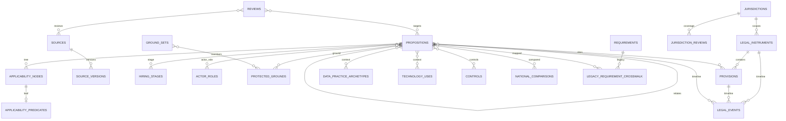

# Legal Atlas data model v2 — reconciled implementation specification

Status: all six architectural requirements and the implementation conventions are approved. Tranche 0, the empty four-table Tranche 1A foundation, and the empty nine-table Tranche 2A source-quarantine schema are implemented. Separately numbered implementation Decisions 6–8 approve the 2A/2B trust boundary, versioned-manifest and content-addressed-custody contract, and six logical evidence boundaries. [Decision 9](tranche-2a-importer-custody.md) is an unapproved design proposal for the fixed-function importer and controlled-pilot custody profile. Both earlier physical Tranche 1 proposals (45 tables and 7 tables) are rejected and superseded in Git history. Migration `004_tranche_1a_foundations.sql` is byte-identical to its retained [Tranche 1A proposal](schema/tranche-1-foundations.proposed.sql). Migration `005_tranche_2a_source_quarantine.sql` is byte-identical to the approved [Tranche 2A DDL](schema/tranche-2a-source-quarantine.proposed.sql). Migration 005 implements schema only: its nine tables are empty, no substantive evidence or legal data was imported by this milestone, and the importer, custody adapters, authentication/authorization bindings, operational controls, and Tranche 2A API/frontend integration remain unimplemented. Schema implementation is not authorization for public or production use.

The database is a reusable legal knowledge base, not a company compliance database. It stores source-backed propositions, contextual archetypes, control/evidence expectations, and editorial projections. Organization systems, candidates, named personnel, vendors, and organization-specific compliance evidence artifacts belong in a later bounded context. Captured legal-source artifacts instead belong to the source-evidence custody boundary described below.

The approved gated-review and continuous-freshness architecture is specified in [Review governance and freshness](review-governance-and-freshness.md).

## Six-layer ontology

| Layer | Question | Records |
|---|---|---|
| Authority | What human-attributed legal-authority draft is being asserted? | jurisdictions, instruments, provisions, representations, identifiers, legal events and relations |
| Rule | What must, must not, or may someone do? | propositions, normative actions, subjects |
| Hiring context | Where does it apply? | stages, lenses, technology uses, applicability |
| People and data | Who and what information? | actors/roles, grounds/ground sets, data practices |
| Operations | What control/evidence/owner/escalation? | controls, evidence expectations |
| Provenance | What was retrieved or derived, and what later supports and verifies a claim? | retrieval evidence, retained artifacts, processing runs, unverified candidates, reviews, publication and verification |

## Logical cross-tranche schema catalog

This remains the cross-tranche logical catalog. It is not a claim that all structures belong in one migration. The Tranche 1A document and executable DDL supersede the abbreviated foundation descriptions below. Decision 6 also supersedes any description below that conflates a retrieval location, retrieval evidence or captured artifact with legal-document identity, officiality, representation, translation, currency, consolidation, binding force or legal effect. The approved exact Tranche 2A design is documented in [Tranche 2A source-evidence quarantine](schema-v2-tranche-2a.md) and implemented as the empty migration-005 schema; its manifest/importer contract remains unimplemented. Tranche 2B physical names remain undecided.

SQLite uses `INTEGER` IDs/booleans and canonical `TEXT` codes, dates, and timestamps. Decision 7 fixes SHA-256 over the precisely identified stored byte sequence for raw artifacts; raw-byte hashing performs no Unicode, newline, markup or filename normalization. In the approved Tranche 2A contract, `retrieved_body` is the exact GET response-body octets after HTTP transfer framing and before content-coding decompression; decoding is a separate, pinned `content_decoding` processing run. Its version-1 manifest canonicalization is pinned by independently supplied micro-vectors, a complete-manifest canonical string/hash, and an every-leaf digest-sensitivity test. Later structured legal-content and policy hashes still require their own versioned field order, null representation, normalization and recomputation tests before implementation. Foreign keys and recursive triggers are enabled and asserted on writers. Historical records are versioned or deprecated, not silently deleted. Derived values are labelled as derived.

### Foundation tables

Tranche 1A contains immutable Atlas attribution principals, standalone canonical language tags, immutable jurisdiction identities, and correction-safe jurisdiction name/description versions. Jurisdiction hierarchy, lifecycle, membership, external identifier schemes, coverage, and general taxonomies are explicitly deferred to source-backed consumer tranches.

Separate controlled tables `hiring_stages`, `legal_lenses`, `actor_roles`, `protected_grounds`, and `data_categories` each have `id PK`, stable `code UNIQUE`, `label`, `definition`, lifecycle (`active/deprecated/replaced`), and governance timestamps. `taxonomy_labels` and `taxonomy_aliases` provide multilingual labels/aliases; `taxonomy_changes` is append-only (`old_value`, `new_value`, reviewer, reason). FKs/unique composites prevent duplicate assignments; historical values are never silently deleted. Optional interface ordering is editorial, not legal truth.

### Authority and provenance

Tranche 2B will model stable legal-instrument identities and human-attributed, evidence-linked assertions about titles, citations, legal layer, instrument type, issuing jurisdiction and binding character. These claims are not established by a URL or extraction candidate. Lifecycle and current status derive from dated, sourced legal-event assertions for a requested `as_of`; they are not unsupported universal instrument fields. Exact physical structures remain pending.

**Tranche 2A evidence substrate:** Decision 8 separates six logical records: `retrieval location -> retrieval event -> artifact identity -> artifact custody -> processing run -> unverified candidate`. This is the successful evidence path, not a requirement that every attempt reaches every stage. A retrieval event distinguishes its original requested location, terminal last-attempted location, and response-resolved location; redirected and conditional network failures retain the first two without inventing the third. Manifest v1 is GET-only: retained and observed-not-retained full representations are exactly HTTP 200; 206 and every other 2xx are rejected; redirects use only 301/302/303/307/308; and 304 reuse requires an exact earlier retained basis, validator, terminal location and supported Vary/negotiation profile. Request/response values reject C0 controls and DEL; ETags, IMF-fixdates, ordered Content-Encoding and sorted unique Vary values use pinned canonical profiles. A processing run may emit zero or more derived artifacts using the same exact-byte identity mechanism subject to a closed method/output matrix. `content_decoding` accepts a retrieved-body input, pins the observed content-coding in its configuration, and on success produces exactly one decoded-body output. Derivation lineage must be acyclic and ultimately grounded in a retained retrieval; within one bundle, a higher-ordinal run may reuse a byte-identical derived artifact only after an earlier grounded run has supplied its production edge. These are separate append-only or correction-safe records. Identical content may deduplicate stored bytes but never distinct retrieval events, processing runs or candidate occurrences. A successful retrieval remains successful when a separately recorded processing run fails. Custody occurrence time is distinct from receipt-sequence knowledge order, so later-discovered historical custody facts cannot retroactively change the evidence boundary used to accept an earlier run. Candidate projections likewise use both `recorded_as_of` and `known_through_bundle_sequence`: the raw chain leaf retains withdrawals for audit, while the active view excludes a withdrawal only after resolving the bounded leaf. A URL, retrieval metadata, or hostile extraction candidate establishes no authoritative issuer/jurisdiction, legal-document identity, officiality, currency, consolidation, binding force, legal status, or legal effect. “Retained artifact” is shorthand for an artifact identity with qualifying custody under an explicit event-time and knowledge-sequence projection. Versioned Git manifests form the approved pilot intake contract rather than a seventh legal-evidence concept, while exact content-addressed bytes require an approved interchangeable custody backend under Decision 7. Migration 005 implements the nine empty physical tables: the six core records, normalized redirect/output children, and one technical receipt needed for deterministic sequence, provenance and idempotency. The approved fixed-function importer contract binds the declared manifest path to the actual reviewed-root-relative input, completes all semantic preflight before `BEGIN`, compares every persisted field and relationship after import and before a no-op, and uses receipt sequence rather than local import time as its deterministic knowledge boundary; no importer or operational write path is implemented yet.

**Tranche 2B authority drafting:** human-attributed, evidence-linked, unpublished drafts later model instruments, provisions, representations, controlled identifiers, translations, dated legal events and authority relations. Creating a 2B draft references rather than moves, mutates, relabels or elevates 2A evidence. Evidence linkage supplies traceability, not proof or sufficiency; precise supporting and conflicting evidence must both be representable. Nothing in 2A or 2B is reviewed, verified or public before the review-governance gates exist and are satisfied. Detailed custody and trust rules are in [Review governance and freshness](review-governance-and-freshness.md).

`legal_events`: later append-only human-attributed legal-event assertions (`adopted/published/entered_into_force/applies_from/transposition_due/nationally_implemented/transitional_period_ends/amended/repealed`) carry an event date and link to precise evidence-backed authority representations. Concrete instrument, provision and proposition-version junctions supply enforceable targets; no polymorphic target pair is used. `as_of` status is computed at query time; `status_projection` is disabled for Phase 2.

`instrument_relations`: later human-attributed, evidence-linked assertions connect from/to instruments with typed `amends/repeals/transposes/implements/interprets/supplements/consolidates` relationships and provision scope. Exact physical fields and reviewed status remain pending; many-to-many support and restricted historical deletion remain required.

`reviews`: append-only reviewer type, scope, status, validation/next-review dates and limitations. Concrete target junctions for exact immutable proposition versions, evidence-linked authority representations, translations, comparisons and projections make scope enforceable; their physical names remain pending. `publication_decisions` target an exact proposition version through a concrete FK and are append-only. Translation and verification records must link exact evidence and authority representations rather than rely on a source-wide status. UPDATE/DELETE is rejected for review and verification history.

### Rules and semantic context

`normative_actions` and `subjects` are reusable structured concepts. `propositions`: `id PK`, slug unique, title, exactly one `normative_effect CHECK obligation/prohibition/permission/right/exception/defence`, action FK, subject FK, jurisdiction FK, separate legal interpretation/plain-language fields, review/publication state, timestamps. Conditions, exceptions, controls, evidence, owners, recommendations, and inclusion advice are linked entities, not proposition columns. Mutable with proposition version history.

`proposition_provisions`: proposition/provision FKs, `source_role CHECK authoritative_basis/implementation/interpretation/supporting_guidance/commentary`, locator override, unique composite. This supports multiple authoritative provisions. `proposition_relations`: from/to proposition FKs, typed `conditional_on/exception_to/qualifies/defines/implements/conflicts_with/supersedes/derogates_from/overlaps/limits/depends_on/compare_with`, precise evidence-linked authority support, unique pair/type, no self-link.

Dedicated junctions `proposition_stages`, `proposition_lenses`, `proposition_actors`, and `proposition_grounds` carry semantic metadata: actor role (`duty_bearer/rights_holder/beneficiary/decision_maker/provider/deployer/processor/enforcer/representative`), stage relevance (`direct/upstream_cause/downstream_consequence/audit_redress`), ground relevance (`expressly_protected/accommodation_related/comparator/proxy_risk/disparate_impact_concern/monitoring_category`), assignment basis, reviewer and verification date. Many-to-many, FKs and uniqueness enforced; published deletions restricted.

`ground_sets` plus `ground_set_members` model intersectionality explicitly (two or more grounds, jurisdiction, context, recognition status, supporting source, pattern `intersectional/multiple/additive`). Independent sex+disability links do not imply intersectionality; combinations are not pre-generated. `editorial_projections` and `inclusion_opportunities` are versioned, non-authoritative summaries/training/operational/inclusion content.

### Contextual operations

`applicability_nodes`: proposition FK, parent FK, node type `all/any/predicate`, ordinal, unique parent/ordinal; expression-tree roots are validated. `applicability_predicates`: one leaf per node, typed `scope/threshold/inclusion/exclusion/sector/jurisdictional/temporal`, operator/value JSON, plain explanation, source/reviewer/date. Normative exceptions remain propositions; predicates activate them.

`data_practice_archetypes`: reusable contextual operation, subject, data category, source, purpose, actor/controller role, jurisdiction, Article 6 basis, Article 9 condition, Article 10 authority where relevant, recipients/transfers, retention rule, automated-decision significance, provenance, uncertainty and counsel flag. `proposition_data_practices` is many-to-many. No candidate/company data.

`technology_archetypes`, `technology_uses`, and `deployment_context_archetypes` separate capability, intended hiring purpose/stage, and actor/jurisdiction/inputs/outputs/automation/human involvement. Claimed AI classification/significance records basis, source, reviewer, verification and uncertainty; not permanent product facts. `proposition_technology_uses` is many-to-many.

`controls`: reusable archetypes with authority classification (`expressly_required/reasonable_implementation/regulator_recommended/risk_management/beyond_compliance_inclusion`), controlled owner role, escalation trigger, version/review. `proposition_controls` many-to-many. `evidence_requirements` state what must/should be demonstrable; `control_evidence_types` identify templates (DPIA, notice, log, accommodation/decision record). Actual artifacts are out of scope.

### National comparisons and legacy

National rules are ordinary propositions with their own authority, applicability, dates, status, provenance and verification. `national_comparisons`: comparison id, time bounds, delta, typed comparison (`transposes/implements/supplements/broader_protection/stricter_obligation/additional_protected_ground/different_definition/different_threshold/different_procedure/different_remedy/sector_specific/regional_variation/partial_implementation/implementation_pending/potentially_inconsistent/relationship_uncertain`), review FK. `national_comparison_members`: comparison/proposition FKs and side `eu_baseline/national`; one comparison may contain many of each. Do not automate primacy, direct effect or conformity conclusions.

`jurisdiction_reviews`: jurisdiction/baseline scope, coverage (`not_researched/research_in_progress/no_material_difference_identified/material_difference_identified/local_validation_pending/locally_validated/stale_revalidation_required`), time bound, review FK, limitations. Absence of comparison never means equivalence. UK, Switzerland and non-EU EEA are distinct tracks.

`legacy_requirement_crosswalk`: legacy requirement ID, proposition ID nullable, mapping (`one_to_one/split/merged/unresolved`), rationale, review/source mapping status. `legacy_relation_crosswalk` maps each legacy relation to supported proposition pairs only; never all-to-all after a split. Preserve all 20 requirements, 12 instruments, 93 stage links, 48 lens links, 56 actor links, 12 relations and 12 source checks or create explicit unresolved records. Never invent effects for `country_review` or granular roles. Imports remain unpublished until review.

## ER diagram

The diagram is a conceptual post-2B authority view. Its simplified `SOURCES` and `SOURCE_VERSIONS` nodes do not replace the separate Tranche 2A evidence chain or establish the legal status of captured material.

## Normalized proposition bundles

These decompose existing seed meaning only; each has atomic effects, typed relations, provision links with precise evidence-linked authority support, applicability, controls, review state and editorial projection.

**Automated CV screening:** (A) candidate right against solely automated significant decision (GDPR Article 22); (B) safeguards/intervention/contest obligation, `qualifies` A; (C) in-scope recruitment-AI assessment obligation, `overlaps` A. Link contextual CV/profile data practice and CV-ranking deployment archetype; controls are meaningful review, notices and logs; source/review and training projection are separate.

**Disability accommodation:** (A) accommodation obligation (Directive 2000/78/EC Article 5); (B) disproportionate-burden defence, `qualifies` A, activated by applicability predicates. Link functional-needs data archetype, accessible-assessment use, controlled accessibility owner, accommodation evidence expectation, refusal escalation, and national review; keep editorial inclusion projection separate.

**Pay before interview:** (A) applicant pay/range right (Directive (EU) 2023/970 Article 5); (B) pay-history prohibition; (C) gender-neutral vacancy/non-discriminatory recruitment obligation. Link directive events, national thresholds as ALL/ANY predicates, pay/advertising archetype, range/version evidence expectation, review/publication decision and country comparison; no equivalence inferred.

## API contract

Add `GET /api/v2/propositions` and `/api/v2/propositions/:slug`; preserve `/api/requirements*` and current frontend behavior. List response: `{items,page,page_size,total,total_pages,as_of,filters}` with deterministic `(title,id)` ordering and bounded positive pagination. Detail includes proposition, derived `as_of` status, action/subject, provisions with source roles/immutable versions, typed relations, applicability tree, semantic taxonomies, data/technology contexts, controls/evidence expectations, reviews/publication, and national coverage/comparisons.

Filters support explicit `ANY`/`ALL` per dimension; dimensions combine with AND. Intersectionality only through `ground_set`. Unknown codes/modes, unsupported fields, or malformed strict `YYYY-MM-DD` `as_of` return HTTP 400 `{error:{code,message,field}}`. Public eligibility is version-scoped and fail-closed; ineligible list rows are omitted and details return 404. Status derives at query time from events using the request-wide `as_of`. No missing-overlay inference.

## Approved implementation decisions

1. All v2 tables use plural `atlas_`-prefixed `snake_case` names, `id` PKs, `<entity>_id` FKs, `_code`, `_on`, and `_at`. True intervals use inclusive `valid_from` and exclusive `valid_to`; correction-safe bitemporal assertions instead use a natural `effective_from` point plus immutable correction/withdrawal records. Version tables are immutable; events/decisions append-only. Closed structural values may use CHECKs; evolving legal/editorial vocabularies use reference tables. No polymorphic targets, no v1 overwrite, and no fixed cross-tranche table-count claim.
2. The detailed implementation order is authoritative: completed migration-integrity Tranche 0; minimal four-table Tranche 1A; Tranche 2A source-evidence quarantine; Tranche 2B source-backed authority drafting; proposition core and semantic context; sourced applicability and national context; operational context; review-governance vertical slice; freshness evidence; auditable crosswalk/backfill; API v2/parity; separately approved operational monitoring; and separately approved legacy retirement. Later-tranche concepts must not be pulled into Tranche 1A.
3. Public eligibility is version-scoped and fail-closed: explicit `publish_validated`/`publish_with_warning`, current qualifying review for the immutable version, a reviewed official-source determination covering exact evidence-linked authority support, resolved atomicity/source mapping/translation/local validation, and no later block. Warnings are machine- and human-readable; ineligible records are omitted/404; edits create unpublished versions.
4. `status_projection` is disabled for Phase 2. Status is derived at query time from indexed append-only events using one request-wide `as_of` date.
5. Implementation Decision 6 established source-evidence capture and legal-authority drafting as separate trust boundaries; by itself it approved no Tranche 2 tables, fields, state codes, storage backend, importer or substantive data. The later schema approval at commit `18455e66bae6a3569f657cfc12acb2a0257527bd` and migration 005 now fix and implement the empty 2A physical boundary only.
6. Implementation Decision 7 established that immutable, versioned Git manifests describe pilot intake; SHA-256 identifies precisely defined exact raw bytes held by an interchangeable approved custody backend; storage identity is independent of location; and SQLite is a reproducible projection. A Git-held artifact requires explicit redistribution, sensitivity, size and effectively-permanent-retention clearance. Otherwise use approved restricted durable storage or record `observed_not_retained`; however, manifest v1 rejects every personal-data-bearing artifact, and restricted custody is not a bypass. Deterministic import is network-free, transactional, idempotent and fail-closed. Decision 7 alone did not select a provider or implement an importer; the later approval fixes the exact manifest schema while those operational components and any corpus remain absent.
7. Implementation Decision 8 established six logical Tranche 2A evidence boundaries—retrieval location, retrieval event, artifact identity, artifact custody, processing run and unverified candidate occurrence—without itself approving exact fields or DDL. Artifact identity is separate from changing custody; derived outputs reuse exact-byte identity with explicit lineage; distinct events/runs/candidates are not deduplicated; and correction, withdrawal, relocation and tombstoning preserve history. The manifest is a transport/provenance envelope, and an import receipt is technical infrastructure. The later physical approval and migration 005 implement the exact nine-table empty schema.

## Implementation tranches

0. **Completed:** migration integrity and frozen-v1 upgrade harness.

1. **Implemented 1A (empty):** immutable attribution principals, standalone canonical languages, stable jurisdictions, and correction-safe jurisdiction versions only. It has no seeds or operational writer.
2A. **Physical schema implemented, empty:** migration 005 creates the six Decision 8 logical boundaries as nine `STRICT` tables, with 27 indexes and 27 triggers. The approved manifest/importer contract chooses a one-time sequence-1 bundle bootstrap tied to trusted runtime identity; this is not hidden seed data, and attribution remains distinct from authorization. The bootstrap, importer, custody adapter, and segregated automation surface are not implemented, so every 2A table remains empty. Authoritative issuer/jurisdiction, officiality, legal identity/status/effect, authority, review and publication remain unreachable even when a future hostile candidate merely suggests one of those concepts. Proposed Decision 9 would approve/specify an evidence-empty bootstrap bundle followed by a one-raw-document bundle, using a network-free importer, restricted local content-addressed custody outside Git, independent candidate-database verification, and no public/application path; implementation would remain gated by its numbered tranches.
2B. Source-backed authority drafting: human-attributed unpublished instruments, provisions, representations, identifiers, translations, legal events, relations, and jurisdiction authority claims linked to precise 2A evidence. Drafting does not verify or elevate that evidence.
3. Proposition core and semantic context: propositions/versions, actions/subjects, citations/relations/events, plus stages, lenses, actors, roles, grounds, data-category vocabularies, ground sets, and legacy taxonomy crosswalk design.
4. Sourced applicability and national context: applicability trees, sectors, employer size/type, collective-agreement/personal coverage, jurisdiction coverage, and national comparisons.
5. Operational context: reusable data, technology, deployment, control, and evidence archetypes.
6. Review-governance vertical slice: review roles/grants, sealed qualifications and scope, versioned policies/gates/separation rules, actual exact-version reviews, publication decisions, and fail-closed evaluator. Before this slice, research remains quarantined and cannot be reviewed or published.
7. Freshness evidence and candidate-review workflow.
8. Crosswalk and separate auditable backfill.
9. API v2 and legacy parity.
10. Operational scheduler, selection and implementation of production-scale durable storage, alerts, and missed-run heartbeat — separately approved. Decision 7 already fixes the smaller pilot custody/import contract and storage-independent artifact identity without selecting a production provider.
11. Legacy retirement — separately approved.

## Acceptance criteria

The implemented migration-005 milestone requires byte equality with the retained approved DDL; immutable checksums for migrations 001–004 and an exact checksum-ledger row for 005; fresh installation through 005; upgrade from a database frozen at 004; a no-op rerun; transactional rollback of all 005 DDL and ledger writes on deliberate failure; unchanged digests for all 13 legacy tables and unchanged definitions for every pre-005 schema object; exact 9-table/27-index/27-trigger inventory; nine empty tables; clean integrity/foreign-key checks; standalone adversarial validation; compatibility/search parity; and passing `npm run check`. Later tranches retain their own acceptance criteria for event-boundary `as_of`, publication gates, stale reviews, translation warnings, coverage states, comparison cardinality, ANY/ALL/intersection behavior, and lossless backfill. Atomicity is a legal/editorial assertion supported by workflow, not something SQLite alone proves.

## Approval boundary

The naming conventions, fail-closed publication policy, query-time status derivation, review/freshness architecture, empty four-table Tranche 1A foundation, exact Tranche 2A physical schema, and manifest contract are approved. Migration 005 implements only the empty 2A schema. Decision 9 now proposes—but does not approve or implement—the repository-eligibility procedure, local artifact adapter, trusted identity bindings, fixed importer/write-isolation boundary, recovery controls, and one-document pilot profile. Those controls, any pilot corpus, authority drafting, review/publication, API, frontend, and public or production use still require later implementation and explicit approval. No substantive evidence or legal data was imported by migration 005.
