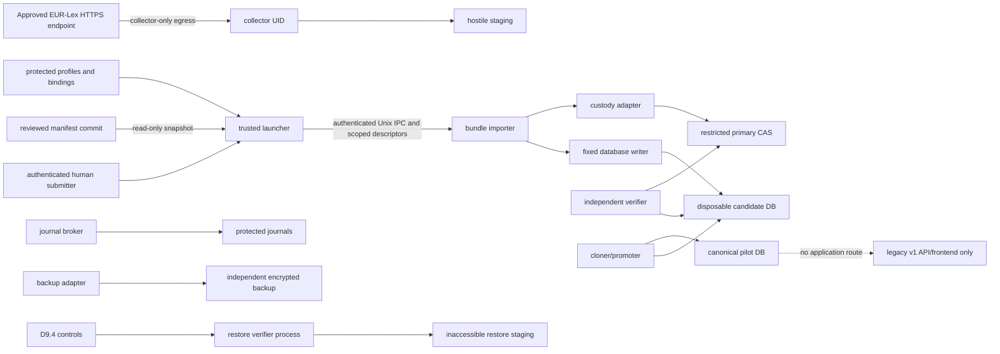

# First controlled evidence pilot — operational-readiness proposal

Status: **proposal awaiting human approval; current decision is NO-GO**. This document plans operationalization of the approved D9.0–D9.5 chain. It does not activate a runtime, approve a source, create a credential or identity, execute bootstrap, fetch or import evidence, create a backup, mutate Atlas, or authorize public use.

Approved baseline: `main` at `14544b6358a0881d2619cdfeb5c6a56ab0e2b6eb`.

Supporting artifacts:

- [Decision register](operations/first-evidence-pilot/decision-register.md)
- [Environment inventory template](operations/first-evidence-pilot/environment-inventory-template.md)
- [Evidence-empty bootstrap ceremony](operations/first-evidence-pilot/bootstrap-ceremony-runbook.md)
- [One-document pilot runbook](operations/first-evidence-pilot/document-pilot-runbook.md)
- [Go/no-go checklist](operations/first-evidence-pilot/go-no-go-checklist.md)
- [Incident and rollback runbook](operations/first-evidence-pilot/incident-rollback-runbook.md)
- [Verification report template](operations/first-evidence-pilot/verification-report-template.md)

## Decision boundary

The bounded pilot has three ordered outcomes:

1. execute the evidence-empty sequence-1 principal-bootstrap ceremony;
2. accept exactly one sequence-2 raw official-source retrieval into Tranche 2A quarantine; and
3. independently verify the accepted projection, create and verify the required prior and final independent backups, complete a disposable restore drill, and prove exact accepted-bundle no-op replay.

The pilot stops there. It creates no instrument, provision, legal event, proposition, review, publication decision, search result, export, API response, or frontend route. A URL, document title, CELEX/ELI string, institution name, retained artifact, successful import, backup, or restore drill establishes no officiality, legal identity, authority, binding force, currency, applicability, legal effect, legal verification, or publication eligibility.

## Audit of the approved D9 chain

The audit covered Decision 9; D9.0/D9.0.1; the approved synthetic D9.1, D9.2, D9.3.1, D9.4.1, and D9.5.1 implementations; the D9.3.0, D9.4.0, D9.5.0 and recovery-resolver v1–v1.3 contract roots; migrations 001–005; and their validators.

No frozen-contract change is required to describe or later execute the bounded pilot. The selected route is:

- D9.0.1 for runtime identity, bindings, limits and exact handle partitions;
- D9.1 for the control-plane shape, but with operational `AF_UNIX` services replacing synthetic private-pipe test doubles;
- D9.2 for reviewed manifest opening, semantic preflight, fixed statements, disposable candidates, projection verification and no-op verification;
- D9.3.0/D9.3.1 for restricted primary CAS, exact receipts, journal-v2 evidence and classification-only crash handling;
- D9.4.0/D9.4.1 for restrictions, access shutdown, bounded deletion controls and the adopted authority roster;
- recovery resolver v1.3 for distinct source-state and journal-tip identities; v1.2 remains historical/read-only;
- D9.5.0/D9.5.1 for backup manifests, independent copy verification, deletion-aware reconstruction, inaccessible staging, atomic promotion and restore-drill evidence.

The approved implementations cannot simply be pointed at real paths. They expressly use generated identities, disposable roots, synthetic peers or test doubles and are unactivated. Operational releases must consume the frozen contracts without changing them, pass the same adversarial suites, and undergo a separate activation review. This is implementation and deployment work, not a new synthetic D9 tranche.

## Current readiness verdict

**NO-GO for bootstrap and document import.** The repository proves contract and synthetic behavior, but it does not currently prove any of the following operational facts:

- production service UIDs, human bindings, authenticated endpoints, credentials or active generations;
- reproducibly built operational executables matching protected release records;
- a protected trusted clock or fail-closed clock-health gate;
- provisioned primary CAS, journals, canonical database, hostile staging, restore staging or independent backup roots;
- independently administered encryption keys, backup media or rollback-resistant receipt-head anchoring;
- operational D9.1–D9.5 adapters and brokers with least-privilege process isolation;
- approved RPO/RTO, retention, monitoring, alerting, on-call ownership or incident authority;
- an approved source representation, rights decision, or negative personal-data/malware/secret screening result;
- a completed operational backup/restore drill; or
- separate authorizations for the bootstrap ceremony, document pre-fetch envelope and exact post-capture import.

Every missing item is fail-closed in the [go/no-go checklist](operations/first-evidence-pilot/go-no-go-checklist.md).

## Recommended operational profile

### Host and supported environment

Use one dedicated, non-multitenant pilot host or VM running **Ubuntu Server 24.04 LTS, x86-64, kernel 6.8 or later**, with Secure Boot or an equivalently verified boot chain enabled. The selected kernel must support `openat2`, pidfds, `SO_PEERCRED`, `SCM_RIGHTS`, `SOCK_SEQPACKET`, `flock`, mount namespaces and cgroup v2. The runtime is Node.js 22 LTS, pinned to an exact binary SHA-256; the repository minimum `>=22.5.0` is not an operational pin. SQLite, the C compiler used for native helpers, OpenSSL and every dependency-lock file are also exact-build inputs.

Unsupported: macOS, Windows, WSL, containers without the required kernel primitives, network filesystems for atomic promotion, mutable shared CI runners, and hosts where root, clock, mounts or service identities cannot be independently administered. Absence of any required primitive blocks startup; there is no application-level fallback.

Minimum planning envelope, subject to inventory evidence:

- 4 GiB RAM; no swap containing unencrypted pilot material;
- 4 GiB free on the primary protected filesystem and 4 GiB on the independent backup filesystem;
- one filesystem for canonical/candidate atomic renames; local filesystem semantics with durable `fsync` and no copy-on-write snapshot rollback outside the audited process;
- primary and backup on different failure domains and different administrative credentials;
- one operation at a time, matching `concurrent_operations_max = 1`.

### Trust-boundary diagram

### Dedicated service identities

All twelve D9.0.1 service roles receive distinct non-login Unix users, primary groups and UIDs. Numeric UIDs are assigned by the administrator and recorded only in the protected environment inventory; examples and synthetic UIDs in frozen fixtures are never reused as production truth.

| Runtime role | Recommended account | Permitted durable surface | Explicit denials |
|---|---|---|---|
| `trusted_launcher` | `jedi-launcher` | protected control generation and launcher journal only | source network, artifact bytes, SQL, backup keys |
| `collector` | `jedi-collector` | hostile staging and handoff socket | canonical DB, CAS final namespace, journals, Git credentials |
| `handoff_broker` | `jedi-handoff` | handoff/seal registry | source network, SQL, CAS bytes |
| `bundle_importer` | `jedi-importer` | no durable write; scoped manifest/staging descriptors | network, generic SQL, canonical directory |
| `database_writer` | `jedi-writer` | one held disposable candidate descriptor | canonical directory, DDL, arbitrary paths/network |
| `cloner_promoter` | `jedi-cloner` | canonical generation directory and candidates under operation lock | source network, manifest interpretation, generic SQL |
| `independent_verifier` | `jedi-verifier` | read-only candidates/CAS and protected verification receipts | promotion, generic writes, source network |
| `custody_adapter` | `jedi-custody` | primary CAS and custody receipt namespace | canonical DB, source network, review/publication |
| `clearance_broker` | `jedi-clearance` | protected clearance/authorization register | artifact bytes, SQL, human decision creation |
| `journal_broker` | `jedi-journal` | append-only D9 journals and receipt chains | semantic decision making, artifact mutation |
| `scanner` | `jedi-scanner` | private scan scratch and bounded results | Internet, canonical DB, long-lived artifact custody |
| `backup_adapter` | `jedi-backup` | independent backup root and D9.5 backup records | primary CAS mutation, legal decisions, source network |

No service account has an interactive shell, password, home-directory secret, shared UID, or broad supplementary group. The D9.5 semantic restore executor maps to a fresh `cloner_promoter` process; backup producer maps to `backup_adapter`; backup and restored-state verification map to distinct `independent_verifier` process instances; persistence maps to `journal_broker`. Those mappings do not create new D9 roles.

Human roles are role names, not personal data in Git. Real people are bound outside the repository through the protected identity generation:

- `human_submitter` — prepares and submits the reviewed bundle;
- `operational_witness` — witnesses ceremonies and makes the D9.4 adoption decision required from that frozen role;
- `bootstrap_authority` — issues the one-use bootstrap permit;
- `clearance_decider` and `clearance_checker` — make and independently check artifact admission/rights decisions;
- `recovery_operator` — requests/operates a bounded recovery;
- `recovery_authority` — independently authorizes recovery;
- D9.4 `d940_roster_adopter` — makes the distinct second adoption decision for the exact extension/roster, remains outside every semantic authority assignment and receives no operational/deletion authority;
- D9.4/D9.5 mapped `legal_records_authority`, `privacy_authority`, and `deletion_authority` — exact scoped human decisions only.

The submitter cannot act as independent source-selection reviewer, clearance checker, recovery authority, legal-records authority, privacy authority or publisher for the same operation. The D9.0.1 operational witness and D9.4 `d940_roster_adopter` must be different eligible humans, separately bound, ordered and unrevoked, and both remain outside the semantic roster they adopt. Services cannot satisfy human gates. Named staff assignments and contact details stay in the access-controlled operational inventory, not Git.

### Builds and authenticated IPC

Every service release is built from one reviewed commit in an isolated builder using `npm ci`, a pinned Node binary, pinned compiler/OpenSSL/SQLite inputs, and a verified dependency lock. Store the immutable release below `/srv/jedi-atlas-pilot/releases/<release-sha256>/`; root owns it, service users have read/execute only, and startup rehashes the opened executable and dependency inventory.

Create sockets under `/run/jedi-atlas-pilot/` with one service-owned subdirectory per endpoint:

`ipc.launcher`, `ipc.handoff`, `ipc.importer`, `ipc.writer`, `ipc.cloner`, `ipc.verifier`, `ipc.custody`, `ipc.clearance`, `ipc.journal`, `ipc.scanner`, and `ipc.backup`.

Each endpoint uses `AF_UNIX`/`SOCK_SEQPACKET`, kernel peer credentials, a closed message version, canonical payload, 65,536-byte packet maximum, at most eight ancillary file descriptors, a 30-second request timeout, operation nonce, request sequence and exact sender/recipient/build allowlist. Filesystem permissions are necessary but not sufficient. Wrong peer, endpoint, build, role, generation, packet, nonce, sequence or expiry closes the connection and blocks the operation.

### Credentials and active generations

Local service authentication is kernel UID/process/build binding; caller-supplied principal IDs are never credentials. Human authentication uses administrator-approved OS accounts with phishing-resistant MFA at the host boundary. Runtime bindings, revocations, public verification material and secret handles live below `/etc/jedi-atlas-pilot/active/`, root-owned and unreadable by collector/importer roles.

Secret values are injected through the selected OS credential facility or hardware-backed keystore into only the process that needs them. They never enter Git, manifests, SQLite, environment dumps, command arguments, IPC payloads, logs or verification reports. The local pilot importer needs no network credential. Backup-encryption and external audit-anchor credentials belong to different administrators. Recovery material requires documented two-person access and an offline escrow test.

Rotation creates a new protected generation, validates it, atomically selects it, and append-only revokes the predecessor. It never edits an accepted record. Compromise revokes the affected generation, disables endpoints, terminates receivers, places writes on hold, preserves audit evidence, rotates credentials, and requires independent revalidation before restart.

### Trusted clock

Use `chrony` with authenticated NTS and at least two approved upstream sources, or a separately approved authenticated equivalent; unauthenticated fallback is NO-GO. The host time service owns and administers time. The launcher may consume a protected time attestation but cannot set or discipline the clock. Startup and every privileged boundary require synchronized state, monotonic-clock continuity and an absolute offset no greater than the human-approved threshold proposed as **2 seconds**. A backward step, unsynchronized state, stale source, excessive offset or disagreement blocks permits, retrieval, journal append, promotion, backup and restore. Clock recovery never backdates records; it creates a new incident and requires fresh authorizations.

### Protected roots and mounts

Recommended paths are fixed inputs, not caller arguments:

| Root | Owner/mode | Mount and behavior |
|---|---|---|
| `/srv/jedi-atlas-pilot/releases` | `root:root`, `0755`; children immutable/read-only | local verified filesystem, `nodev,nosuid`; executable only where required |
| `/srv/jedi-atlas-pilot/reviewed-manifests` | `root:root`, `0750` | immutable reviewed commit snapshots; hooks, LFS, filters, submodules and network disabled |
| `/etc/jedi-atlas-pilot/active` | `root:root`, `0700` | active profile/binding/endpoint records and secret handles; never artifact bytes |
| `/run/jedi-atlas-pilot` | `root:root`, `0755` with endpoint subdirectories | `tmpfs,nodev,nosuid,noexec`; sockets, pidfds and operation lock only |
| `/var/lib/jedi-atlas-pilot/canonical` | root-protected parent; no standing service traversal | local filesystem; operation-scoped `canonical_generation_directory` descriptor only; atomic same-filesystem generation rename |
| `/var/lib/jedi-atlas-pilot/candidates` | root-protected parent; no standing service traversal | operation-scoped candidate descriptor only; same filesystem as canonical |
| `/var/lib/jedi-atlas-pilot/cas-primary` | root-protected parent; fixed custody backend only | local restricted CAS; closed layout; no client pathname access or hardlinks outside adapter rules |
| `/var/lib/jedi-atlas-pilot/hostile-staging` | `jedi-collector`, `0700` | separate `nodev,nosuid,noexec` mount; quota 128 MiB per operation |
| `/var/lib/jedi-atlas-pilot/scan-scratch` | `jedi-scanner`, `0700` | separate `nodev,nosuid,noexec` tmpfs; destroyed after bounded scan |
| `/var/lib/jedi-atlas-pilot/journals` | broker-specific subdirectories, `0700` | append-only/no-replace protected store with external head anchor |
| `/var/lib/jedi-atlas-pilot/clearance` | `jedi-clearance`, `0700` | append-only decisions and authorizations; no credentials |
| `/var/lib/jedi-atlas-pilot/restore-staging` | root-protected parent; operation-scoped restore process only | inaccessible generation, mode `000` until controls and verification complete; no standing pathname traversal |
| `/mnt/jedi-atlas-pilot-backup` | `jedi-backup`, `0700` | encrypted, independently administered device/failure domain; not mounted by primary custody roles |

All roots are opened descriptor-relative with no-follow/beneath/no-magic-link semantics and checked for device, inode, owner, mode, link count and expected closed inventory. Long-lived client service accounts cannot traverse canonical, candidate or reviewed-manifest parents by pathname. The launcher opens exact fixed roots and delivers operation-scoped descriptors to short-lived receivers in mount namespaces where the corresponding pathname is absent; revocation terminates/reaps the receiver before the descriptor is considered closed. The `custody_adapter`, `journal_broker`, `clearance_broker` and `backup_adapter` are narrow backend exceptions that retain only their own fixed store access, never a caller-selected path; compromise of any such UID threatens that store and is an explicit residual risk requiring independent receipts, anchors and backups. Network filesystems, symlinked roots, bind-mount substitution, hardlink sharing across custody domains and unverified snapshots are prohibited. Disk-reserve and inode-reserve alarms block new work before any contract ceiling can exhaust the filesystem.

Hostile-byte scanners/parsers additionally run with `no_new_privs`, an empty capability set, read-only runtime and library views, disposable mount and PID namespaces, no inherited descriptors, no network, a pinned syscall policy (or separately approved equally restrictive kernel sandbox), and cgroup/rlimit ceilings for CPU, wall time, memory, files, processes, threads and output. They can see only one input descriptor and private scratch; canonical, CAS, journals, clearance, backup, active-generation and secret paths are absent. Timeout or exit always terminates and reaps the complete process tree. Missing enforcement is NO-GO; `nodev,nosuid,noexec` alone is not containment.

Rollback resistance requires an independently administered append-only copy of journal/checkpoint heads or an approved immutable attestation service. A local hash chain alone does not resist whole-directory rollback.

Residual threats remain explicit: host-root or kernel compromise, malicious firmware, a storage device falsely acknowledging durability and denial of service cannot be eliminated by the application contracts. Verified boot, independent administration, external anchors, cross-domain backup, monitoring and incident response reduce or reveal those risks; they do not justify continuing when integrity is uncertain.

### Backup, restore and objectives

Primary custody is `/var/lib/jedi-atlas-pilot/cas-primary`; the qualifying independent copy is mounted at `/mnt/jedi-atlas-pilot-backup` from a separately administered host/device. A second disk inside the pilot host is not an independent failure domain. The independent copy must separate host/power/root-compromise and administrative boundaries, use encryption at rest and a separate key, prohibit hardlink/reflink sharing with primary, verify exact bytes after write, synchronize the parent namespace, cover the complete manifest/receipt set and anchor its head externally. The storage technology remains a human decision.

Operational RPO and RTO are not yet approved. Recommended pilot choices for human decision are:

- **RPO: zero accepted bundle promotions** — promotion is prohibited without the verified prior-backup receipt, and no bootstrap or document acceptance is reported complete until the distinct final-backup receipt is durable and verified.
- **RTO: four hours** from a valid current restore authorization and available exact inputs to an independently verified result or a fail-closed incident classification.

These recommendations are not inherited from the synthetic 86,400-second freshness fixture. The final values, measurement start/stop, alert threshold and authority must be approved in the decision register before bootstrap.

### Monitoring, alerting and retention

Monitor without granting mutation authority:

- active generation, binding and qualification expiry/revocation;
- clock synchronization/offset and monotonic discontinuity;
- service UID/build/endpoint health and unexpected process/socket/listener changes;
- disk/inode reserve, mount identity/options and root inventory;
- journal/receipt/checkpoint chain continuity and external anchor age;
- scanner build/rules age (rules must be no older than 86,400 seconds; result no older than 3,600 seconds);
- backup coverage, hash verification, backup age and last restore-drill result;
- canonical database hash, migration ledger, `integrity_check`, `foreign_key_check`, Atlas table counts and forbidden application surfaces;
- unresolved response loss, orphan, ambiguous promotion, restriction, descriptor, hold, tombstone or recovery-required state.

Alerts go to the operational owner and security incident role; legal-records/privacy authorities receive only incidents within their scope. Monitoring must have an independently checked missed-run heartbeat. Logs are structured, bounded and content-free. Audit retention duration and protected log destination remain human decisions. Raw document bytes, URLs with query strings, headers, scanner output, credentials and personal data never enter alert payloads.

## Proposed one-document pilot

Proposed source—**awaiting explicit human source, rights and privacy approval**:

| Item | Proposal |
|---|---|
| Institution | Publications Office of the European Union through EUR-Lex |
| Document family | Official Journal legal act, Council Directive 2000/78/EC (employment equality framework) |
| Expected identifier | CELEX `32000L0078`; expected ELI `http://data.europa.eu/eli/dir/2000/78/oj` |
| Candidate landing page | `https://eur-lex.europa.eu/eli/dir/2000/78/oj/eng` |
| Candidate representation | One passive PDF: exact requested URL and redirect allowlist approved pre-fetch; observed resolved HTTPS URL bound to the post-capture/import decision |
| Maximum bytes | 26,214,400 bytes (25 MiB); one artifact only |
| Retrieval profile | frozen `GET` plus `http_get_representation_v1`; proposed exact `Accept: application/pdf`, `Accept-Language: en`, `Accept-Encoding: identity`; no cookies/credentials; no `Content-Encoding`; HTTP 200 only; at most five approved redirects; exact pre-content-decoding body octets |
| Custody | `restricted_store` only; never Git/repository custody for this pilot |
| Processing | none: zero processing runs, outputs and candidate occurrences |

The source is relevant to inclusive hiring, but relevance is not a legal conclusion and the identifiers are expectations, not imported authoritative claims. Before authorization, an independent human must review the institution, candidate landing page, exact downloadable representation and expected identifiers without treating the resulting Tranche 2A record as verified authority. The source-selection record must distinguish an original Official Journal representation from any consolidated/current text; currency and consolidation remain unassessed and unreachable in 2A.

The selected bytes must pass rights/redistribution review, passive-PDF validation, malware/secret/personal-data screening and independent human review. D9 manifest v1 rejects **all personal-data-bearing artifacts**. Official signatures or natural-person names may therefore make this candidate ineligible. If any personal data, active content, encryption, attachment, script, macro, launch action, polyglot behavior, unsupported PDF feature, archive/container structure, credential or uncertain right is detected, the decision is NO-GO; do not redact, transform, parse or substitute another representation under the approved bundle. A different exact source requires a new human decision and bundle authorization.

## Operational sequence

1. Resolve every blocking decision and complete the environment inventory.
2. Build and independently attest operational releases; activate one protected identity/profile generation.
3. Rehearse bootstrap, document import, backup, restore, response loss and emergency shutdown using synthetic bytes on the operational host.
4. Run the complete go/no-go checklist. Any failed or unknown item blocks the applicable stage.
5. Obtain a separate written authorization for the evidence-empty sequence-1 ceremony.
6. Execute the [bootstrap ceremony](operations/first-evidence-pilot/bootstrap-ceremony-runbook.md), prior backup, promotion, final backup, restore drill and accepted-bundle no-op replay.
7. Independently review the resulting four-principal/one-receipt projection and close any incident.
8. Obtain a pre-fetch authorization for the exact requested URL, closed request/redirect profile, collector egress, operation window and bounded hostile-staging custody.
9. Capture and screen the bytes without canonical mutation. Then obtain a distinct post-capture/import authorization bound to the resolved representation, exact byte hash/length/layer, safety/privacy/rights decisions, manifest digest, build generation and pre-state heads.
10. Execute the import portion of the [one-document pilot](operations/first-evidence-pilot/document-pilot-runbook.md), including a prior backup of the pre-promotion canonical generation, promotion, final backup of the promoted generation, independent verification, restore drill and no-op replay.
11. Freeze ordinary writes and produce the [verification report](operations/first-evidence-pilot/verification-report-template.md) for human acceptance.

No step authorizes Tranche 2B or publication. Publication remains blocked until source-backed authority drafting and version-specific human review/publication governance are separately implemented and approved.

## Approval requested

Human approval of this proposal would approve only the operational-readiness model and the recommended path for resolving its decisions. It would not approve any current NO-GO item, the proposed source, the operational profile, RPO/RTO, a person-role assignment, bootstrap, retrieval, import, backup, restore, recovery, deletion, Atlas mutation, legal conclusion, API/frontend path, or publication.
