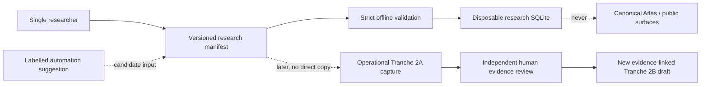

# Single-operator legal research track

Status: design and local workflow proposal on `design/single-operator-research-track`. The first-evidence operational pilot remains **NO-GO**. This track does not satisfy, replace, or weaken any independent-human, operational-evidence, review, publication, or separation-of-duty gate.

## Decision

One researcher may record reproducible **research candidates** before the D9 operational evidence pipeline is activated. The durable source of this work is a version-controlled, strictly validated JSON manifest. A generated SQLite database is a disposable local projection used for querying and quality checks; it is not the canonical Atlas database and is ignored by Git.

The track is useful for organizing leads and drafting atomic propositions, but none of its states means accepted evidence, verified authority, reviewed law, current law, legal advice, publication eligibility, or compliance. Automation may suggest content only when labelled. A service or AI cannot satisfy a human check or review.



## Closed research states

| State | Meaning | What it does not mean |
|---|---|---|
| `discovered_unverified` | A possible source landing location and metadata lead were recorded. | The location is official, authentic, current, complete, or legally relevant. |
| `metadata_checked_single_researcher` | The manifest asserts that the same researcher manually inspected the candidate metadata. | Authenticated proof of the operator, independent verification, accepted evidence, authority, officiality, or review. |
| `draft_proposition_unreviewed` | One normative-effect draft was written from the research lead. | Correct legal interpretation, atomicity approval, applicability, or current law. |
| `awaiting_independent_review` | The unreviewed draft is ready to be considered by another qualified human later. | Review has started, a reviewer exists, or any gate has passed. |

Source candidates use only the first two states. Proposition drafts use only the last two. There is deliberately no `verified`, `approved`, `current`, `binding`, `published`, or equivalent state.

## Manifest v1

The machine-readable contract is [`research-candidate-manifest-v1.schema.json`](../research/schema/research-candidate-manifest-v1.schema.json). Each `*.research.json` manifest contains exactly:

- format version, stable manifest code, explicit record time, synthetic-fixture marker, and a canonical SHA-256 over the manifest excluding only its digest field;
- the non-personal role attribution `single_operator_researcher` and a closed preparation mode;
- every automation suggestion's tool code/version, scope, and disposition;
- one source candidate: official landing **URL candidate**, expected identifiers, jurisdiction candidate, document family, canonical language tag, discovery date, notes, and limitations;
- zero or more atomic proposition drafts with one of the six approved normative effects, separate actor/action/subject fields, applicability notes, uncertainty, and an exact locator into the source candidate;
- separate unreviewed legal-interpretation, operational-recommendation, and beyond-compliance inclusion notes;
- amendment/freshness-monitor candidates with possible signals and explicit limitations.

The URL field records where the researcher believes an official landing page may be found. Validation can require credential-free HTTPS and safe shape, but it cannot establish that a domain or document is official. Expected identifiers and jurisdiction are likewise unverified candidates.

`prepared_by_role_code` is a committed attribution assertion, not authentication or authorization. The local tool cannot prove who invoked it; Git review and a future protected identity system are separate controls.

The committed [synthetic example](../research/candidates/synthetic-official-source.example.research.json) uses only the reserved `.invalid` domain and fictional content. It is not a legal claim or source recommendation.

### Canonical representation

The digest payload is UTF-8 JSON with object keys ordered by JavaScript/UTF-16 code-unit order, arrays preserved exactly, strings preserved without Unicode normalization, booleans and `null` represented by JSON literals, and no numbers permitted by manifest v1. Duplicate object keys are rejected before parsing. Whitespace, indentation and line endings in the source file do not affect the digest. Only the top-level `canonical_digest_sha256` field is excluded.

## Atomic drafts and editorial separation

Each draft has one normative effect: `obligation`, `prohibition`, `permission`, `right`, `exception`, or `defence`. Actor, normative action and subject are distinct. The draft must cite the manifest's source candidate through a locator such as article, paragraph, recital or page and must record applicability and uncertainty.

This structure supports atomic research; it does not prove atomicity or legal accuracy. Legal interpretation, operational recommendation and inclusion opportunity are different records in both the manifest and generated database. The closed schema has no source-text, excerpt, captured-byte or binary-artifact field, and common embedded-byte encodings are rejected. Automated checks cannot recognize every quotation, so the human committer must not paste source wording or document content into free-text notes.

## Disposable SQLite projection

Run:

```bash
npm run research:validate
npm run research:build
```

The fixed-function builder accepts no caller-selected paths. It reads regular, non-symlink `research/candidates/*.research.json` files and atomically creates `research/generated/research-candidates.sqlite`. That directory is ignored except for its placeholder. All tables are SQLite `STRICT`:

1. `research_builds`
2. `research_manifests`
3. `research_sources`
4. `research_expected_identifiers`
5. `research_proposition_drafts`
6. `research_proposition_citations`
7. `research_editorial_notes`
8. `research_monitoring_candidates`
9. `research_automation_suggestions`

The projection has no migrations, no `atlas_*` table, no public status and no application consumer. It contains only normalized manifest values plus deterministic manifest-set and logical-projection digests. Logical rows and digests are the portable reproducibility contract. The validator additionally proves byte-identical SQLite files across repeated builds with the same Node/SQLite runtime; file-byte identity is not promised across unpinned SQLite builds. Removing a candidate and rebuilding can only change this disposable database.

## Enforcement and limits

The offline validator and builder enforce:

- closed object shapes and state vocabularies;
- canonical dates, timestamps, language tags, stable codes and manifest hashes;
- credential-free HTTPS landing URLs, at least one expected identifier, and a source locator for every proposition;
- referential integrity and type-scoped unique stable codes (manifest, source, proposition, and secondary-record namespaces are distinct);
- separate proposition and editorial fields;
- labelled automation with no review-capable automation state;
- no schema fields for publication, verified authority, source payloads or excerpts; rejection of common credential and embedded-byte patterns; and no caller-selected database paths;
- manifest and output root confinement, regular files, and symlink rejection;
- exact generated table inventory and `STRICT` status, plus SQLite integrity and foreign-key checks; the manifest/logical projection—not the disposable physical layout—is the long-lived contract;
- no current backend/frontend reference to the research database, checked against every generated table name and database/path identifier.

The validator rejects an affirmative personal-data declaration and common email, phone, IP-address, credential and embedded-byte patterns. Pattern checks cannot prove that prose contains no personal data or secret; the human committer remains responsible for inspecting the diff. Git hooks and CI are safeguards, not authorization.

The application and API have no write or read path to these records. The legacy frontend remains backed exclusively by v1. The 13 canonical Atlas tables remain outside this workflow and empty until a separately authorized operational process changes that state.

## Future crosswalk—never direct promotion

A research candidate can inform later work only after all separately approved prerequisites exist:

1. A human selects the candidate under an attributable operational decision; the research manifest itself is not evidence.
2. The D9 collector independently retrieves exact bytes under an approved request profile and creates a new Tranche 2A bundle. No source bytes or evidence row are copied from the research database.
3. Operational custody, screening, manifest acceptance and independent technical artifact/projection verification complete, followed by the separately required human source-selection and official-source evidence review as applicable.
4. A human creates a new, unpublished Tranche 2B authority draft linked to exact accepted evidence. The research manifest code may be retained only as non-authoritative discovery provenance.
5. A new atomic proposition version is drafted; the exact new authority/proposition versions then undergo independent substantive legal, local, translation, editorial and publication gates as applicable.

Similarity of metadata never establishes identity. Failure or deletion anywhere in this research track cannot rewrite D9 journals, accepted evidence, authority drafts, reviews, publication decisions, or canonical history.

## Current boundary

This track does not resolve any first-evidence-pilot decision-register item. It does not approve a source, person, identity, credential, host, RPO/RTO, retention rule, backup medium, bootstrap, retrieval, import, legal proposition, or publication. Operational verdict: **NO-GO**.
