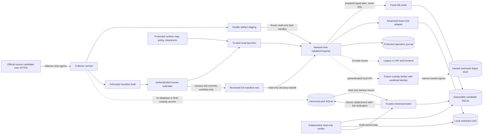

# Decision 9 — fixed-function Tranche 2A importer and pilot custody profile

Status: **approved at commit `ee3ccd777849c7ffcad1efe5d5d9170c15171a65`; not implemented or authorized for real evidence**. The approved version-1 manifest contract and the empty migration-005 schema are unchanged. This decision specifies the operational boundary required before either may be used. It does not authorize credentials, evidence acquisition, principal creation, an import, public exposure, or production use. The design-only [D9.0 contract freeze](d9-0-contract-freeze.md) was approved at commit `320b2d6969ede88796c44e652f6422f73e7fe4fe`; the explicit D9.0.1 least-privilege correction now proposed on this branch preserves that baseline in Git history and supersedes only its incomplete logical-handle contract if approved. The corrected set supplies closed machine-readable runtime, identity, handoff/seal, bootstrap/recovery, custody, clearance, journal, state-seal, result, classification, digest-profile, and field-provenance contracts. Their existence is not evidence that any operational safeguard has been implemented.

## Plain-language decision

Use a network-free, fixed-function importer behind a trusted local launcher. For the controlled pilot, keep reviewed manifests in Git and exact artifact bytes in a restricted local content-addressed store outside Git, with an independently verified encrypted backup. The importer accepts one root-confined version-1 manifest path and no SQL, URL, credential, database path, storage root, or arbitrary configuration from the caller.

The pilot uses two bundles:

1. An evidence-empty sequence-1 bundle performs the one-time principal-bootstrap ceremony.
2. A sequence-2 bundle pins sequence 1 and records one raw retained retrieval and one restricted-store custody placement. It has no processing run, candidate, authority draft, review, publication, API, export, or frontend effect.

“Official EU legal document” in the pilot brief describes the externally selected research target. Tranche 2A records only retrieval, byte identity, and custody evidence. It cannot establish the document's legal identity, issuer, officiality, currency, authority, or legal effect.

Repository custody is opt-in only after a separate per-artifact decision clears redistribution, sensitivity, size, derivatives, and effectively permanent Git history. Hosted restricted object storage is the production upgrade path, but it is accessed through a separate custody broker; the importer itself remains network-free and receives no storage credential.

## Existing contract reconciled

This approved decision depends on, and does not revise:

- migration `004_tranche_1a_foundations.sql`, including the reserved `system.bootstrap` bootstrap-identity contract and the attribution-only principal model;
- migration `005_tranche_2a_source_quarantine.sql`, with its nine empty `STRICT` tables, 27 indexes, and 27 triggers;
- format `jedi-atlas-evidence-bundle` version `1.0.0`, including its canonical JSON and digest profile;
- the evidence chain `retrieval location -> retrieval event -> artifact identity -> artifact custody -> processing run -> unverified candidate occurrence`;
- full semantic preflight before `BEGIN`, atomic SQLite insertion, complete nine-table projection comparison, and fail-closed replay rules;
- exact-byte identity and the backend-neutral reference `objects/sha256/<first-two-hex>/<sha256>`;
- the rule that manifest declarations and stored attribution are claims, not authentication, authorization, legal review, rights clearance, safety proof, or publication approval.

The manifest's bootstrap `runtime_role_code` is ceremony metadata and is not persisted as authorization. Version 1 has only `manifest_submitter`, `collector`, and `bundle_importer`; it has no processor bootstrap role or later principal-registration envelope. The initial pilot therefore permits no processing runs or candidate occurrences. Enabling processing later requires a separately approved, method-scoped runtime binding to an already bootstrapped principal or a versioned principal-registration/manifest change. This decision does not pretend that version 1 stores a distinct processor authorization.

## Trust boundary



The collector's staging tree and document contents are hostile inputs. The Git review step approves a bundle for technical import consideration, not as verified law. The importer, DB writer, adapter, independent verifier, launcher, protected configuration, and promotion procedure are the trusted computing base. A compromise of that entire boundary is not prevented by SQLite constraints.

## Identities and trusted runtime mapping

`atlas_principals` stores stable Atlas editorial/service attribution only. It contains no credentials, authentication state, permission, qualification, employment record, candidate, or client-company identity. Creation attribution does not confer any authority.

The active runtime map is integrity-protected, owned by the system administrator, held outside Git and the manifest, not writable by any collector or ordinary submitter, and opened without following symlinks. It binds:

| Participant | Trusted runtime evidence | Manifest/database attribution | Pilot authority |
|---|---|---|---|
| Human submitter | Kernel-authenticated local account or Unix peer identity accepted by the launcher | Human `submitter_principal_code` | May submit only reviewed paths allowed by policy; cannot choose another principal on the command line |
| Bundle importer | Dedicated service account plus exact release digest covering importer, runtime, dependency lock, and module set | Service `expected_importer_principal_code`, software code, and version | May validate and submit a typed plan; cannot fetch or receive generic SQL |
| Collector | Dedicated no-database service account plus approved immutable executable image/digest, version and collection profile | Service collector principal/software/version on each retrieval | May write only hostile staging and submit a hash-bound runner receipt to the handoff broker; cannot rewrite the registry, final custody or canonical database |
| Processor | No pilot binding or principal; a future sandbox/service account and method/build allowlist would be required | Processor principal/software/version on a future run | Deny-all in the initial pilot; a distinct principal needs an approved registration/manifest revision, while reuse of the collector identity as processor would require separate explicit approval |
| DB writer | Dedicated fixed service invoked over private local IPC | Same technical importer attribution in migration 005 | Accepts a typed, validated plan only; has no caller-selected table, column, SQL, or path |
| Cloner/promoter | Separate trusted executable/service with read-only canonical SQLite access and descriptor-relative control of the service-owned database directory | Operational only; no invented Atlas review record | Creates a candidate through the SQLite backup API and performs only sealed atomic generation replacement; no manifest interpretation or arbitrary SQL mutation |
| Verifier | Separate read-only executable and service identity | Operational only; no invented Atlas review record | Verifies candidate/schema/custody and emits an inode-bound one-use seal; cannot promote or write SQL |

Of the Atlas principals attributed by the manifest, the submitter and importer are checked live during import. The DB writer, cloner/promoter, verifier, handoff broker and future custody broker authenticate separately over local IPC but are not silently invented as Atlas principals. Each IPC endpoint has a filesystem ACL, closed protocol/version, bounded message size, operation nonce, peer allowlist and kernel peer-credential check. Collector or future processor attribution refers to earlier activity.

The D9.0 contract makes the pilot roster exact: 19 bindings, sorted by runtime role code, comprising seven humans (`human_submitter`, `operational_witness`, `bootstrap_authority`, `clearance_decider`, `clearance_checker`, `recovery_operator`, and the distinct `recovery_authority`) and twelve services (`collector`, `bundle_importer`, `database_writer`, `cloner_promoter`, `independent_verifier`, `custody_adapter`, `handoff_broker`, `trusted_launcher`, `clearance_broker`, `journal_broker`, `scanner`, and `backup_adapter`). There is still no processor binding. The runtime-domain, binding-set, executable, dependency-lock, operational-profile, permit-scope, and logical-handle commitments are contract inputs, not credentials or proof that those operating-system identities and isolation controls exist. Proposed D9.0.1 replaces the ambiguous slot unions with exact per-operation role/slot/access partitions, separates canonical-generation authority from the candidate database, and makes service-owned handoff writers visible. Those machine rules remain design: D9.1 must implement and adversarially verify descriptor/capability issuance, process-bound lifetime and revocation before runtime isolation can be claimed.

The collector submits an append-only runner receipt keyed to retrieval event, artifact hash/length, request/configuration and actual immutable runner-image digest. It need not know the final edited bundle digest. After human review, the trusted launcher creates a separate bundle seal binding that receipt to the final manifest path, Git commit, bundle code and canonical digest. The schema makes cardinality structural: the bootstrap-seal branch has zero handoffs and the single-document branch exactly one. Without both document records the historical producer tuple remains merely reported and the pilot rejects it. These records are operational attestations, not proof of officiality, accuracy, or legal effect.

Caller-supplied principal IDs, codes, environment variables, or manifest values never authenticate a person or service. Secrets and authentication tokens never enter the manifest, SQLite, Git, command arguments, or result log. The importer, writer, cloner/promoter, verifier and scanners run in a network namespace/seccomp profile that denies `AF_INET`, `AF_INET6`, DNS and HTTP while permitting only explicitly supplied `AF_UNIX` descriptors. Import performs no Git fetch, submodule operation, LFS smudge/filter, hook, package lookup, scanner update, remote backup or telemetry.

## One-time first-bundle bootstrap ceremony

The safest ceremony separates identity initialization from real evidence:

1. Start with a dedicated pilot database generated through migration 005. Require `atlas_principals` and all nine Tranche 2A tables, including the receipt ledger, to be empty; any partially initialized combination is `recovery_required`.
2. Prepare a reviewed, evidence-empty sequence-1 manifest with no dependencies and the explicit `principal_bootstrap` envelope.
3. The envelope contains exactly the fixed trust root `(id=1, system.bootstrap, service, self-created)` and exactly three operational pilot principals: the named human submitter, one service collector, and one distinct service bundle importer. IDs are explicit and greater than one; creators precede created principals and timestamps are causal.
4. A protected one-use bootstrap permit pins the target logical-state seal, manifest path, bundle code/digest, Git commit, importer release digest, human account, witness and operation nonce. Its lifetime is capped at 3,600,000 milliseconds. Before side effects it moves atomically from `ready` to `in_progress` for that exact operation, and a claim is accepted only when at least 60,000 milliseconds remain before its exclusive expiry; there is no automatic “empty table means permission” behavior. The semantic recorder and `occurred_at` are pinned separately from the `trusted_launcher` fixed-function append broker and protected `persisted_at`. Lifecycle projections are bounded by `persisted_at`, not a potentially backdated semantic occurrence time. Each consumer evaluates the projection at its own use time: journal work requires the claim to remain the visible head, while replay and bootstrap-completion authorities require their exact spent source to have become visible. A terminal is visible at equality with its `persisted_at`; that instant cannot also authorize claimed-state work. If a claimed permit reaches expiry, it derives a terminal recovery hold; an append at or after expiry is rejected even when its declared occurrence precedes expiry.
5. Show the deterministic dry-run plan to the authenticated human and an independent operational witness. Neither may replace the manifest's future legal-review gates.
6. Build and verify the candidate database, atomically promote it, create a consistent backup, and rerun the same bundle through the full no-op path.
7. Seal the permit as `spent` and have the independent verifier issue a protected replay certificate bound to the accepted sequence-1 digest/receipt, exact principal roster, concrete resulting logical-state seal, permit chain, and canonical-lineage identifier. The replay certificate is recovery evidence, not permission by itself. Any replay requires a separate exact-operation permit from the distinct human recovery authority, binding the incident/restore plan, disposable target database, accepted and empty target states, runtime/binding/importer commitments, operator, witness, nonce, and validity window. After a crash, an exact matching canonical receipt proves consumption and recovery completes the permitted state transition; if no receipt exists, only the pinned recovery path may proceed after proving the authorized target and state. Neither permit is reset or reusable for another bundle. Recovery can reconstruct only the exact bootstrap in the named disposable recovery database; it cannot authorize another canonical first acceptance or a changed envelope. An exact accepted-bundle no-op consumes neither a new permit nor the replay certificate. Every new, changed or later bootstrap envelope is rejected. Because version 1 has no later registration mechanism, the pilot principal roster is frozen. `revoked`, `spent`, `recovery_required`, and the derived expiry hold are terminal for bootstrap, reconstruction, and post-promotion-completion permits.

`system.bootstrap` creates principal identities only. Migration 004 and 005 guards prevent it from recording languages, jurisdictions, evidence receipts, or evidence rows. It is never a human, reviewer, qualified person, operational recorder, or fallback identity.

## Pilot write isolation and least privilege

SQLite has no table-level permissions, and the repository's current Node SQLite binding supplies no usable authorizer interface. Migration 005 cannot by itself enforce operating-system identity or prevent a program with an unrestricted writable database handle from targeting other tables. The pilot therefore uses both a narrow writer API and whole-database candidate promotion:

1. The collector and processor never receive the database path, final CAS root, Git write credential, API credential, or importer IPC endpoint.
2. The network-free validator/importer receives the reviewed manifest and staged bytes through pre-opened read-only roots. It emits an in-memory typed import plan, not SQL.
3. The fixed DB writer receives only that closed plan. Its compiled statement set permits `INSERT` into the nine migration-005 tables and the declared `atlas_principals` rows only under either (a) the unused exact sequence-1 ceremony permit against empty canonical lineage, or (b) a recovery permit plus matching replay certificate against the identified disposable recovery database. The recovery case can never target canonical directly or accept different principal content. The writer has no generic query/SQL endpoint and rejects update, delete, replace, DDL, `ATTACH`, extension loading, writable-schema operations, migration-ledger changes, or caller-selected identifiers. Writer connections assert `foreign_keys=ON`, `recursive_triggers=ON`, `synchronous=FULL`, bounded busy handling and a trusted-schema/defensive mode supported by the selected SQLite binding; inability to enable an approved control fails startup.
4. The cloner/promoter alone has canonical-directory and replacement authority. Under the exclusive lock it opens canonical SQLite read-only, creates the disposable candidate through the SQLite backup API, closes the canonical handle, and transfers a held candidate descriptor/ownership to the writer. The importer/verifier receive only launcher-supplied read-only database handles or an authenticated read-only query capability—never the canonical directory or path. The clone must preserve every schema object, migration-ledger row and prohibited-surface row exactly before the proposed bundle is applied.
5. The writer can modify only that disposable candidate in a service-owned temporary root. It has no canonical path/handle and cannot open, rename or replace canonical SQLite. Applying a bundle to the clone avoids incremental ingestion access to canonical SQLite and does not consume the bootstrap permit again.
6. The separate verifier checks migration checksums and schema, all legacy row/schema digests, the permitted principal set, the complete manifest projection, receipt sequence, live custody bytes, `integrity_check`, and `foreign_key_check`. Any future/unknown schema object causes profile mismatch until explicitly reviewed.
7. Only the cloner/promoter, while holding the exclusive operation lock and after a successful inode-bound seal, may replace the canonical pilot database by descriptor-relative same-filesystem atomic replacement. It never accepts a caller path, manifest, SQL statement or unsealed candidate.
8. Repository/application files, the legacy API database, frontend, exports, and any future Tranche 2B/review/publication stores are not writable or mounted into the importer processes.

During one-time pilot-database initialization, before it becomes canonical or has any Atlas rows, the initializer converts it to the approved single-file promotion-safe journal mode, closes it and verifies that no sidecar remains. Every promoted candidate is sealed in that same mode, so later canonical reads, clones and backups require no pre-promotion write. The current product frontend remains exclusively v1-backed. The pilot database is an operationally separate generated projection and is not placed on the application's read path. The reviewed binaries remain trusted code; this architecture limits their authority but does not claim protection from a compromised administrator or entire trusted computing base.

## Exact importer interface

This is a logical interface for later implementation, not a CLI that exists today.

### Caller-controlled input

The caller supplies exactly:

- `manifest_path`: one normalized relative path beneath the launcher-selected reviewed root;
- `mode`: one of `bootstrap`, `import`, `dry_run`, or the separately privileged `recovery` path described below.

All other inputs come from the trusted launcher or protected profile:

- operation-scoped read-only `reviewed_root` descriptors only for the importer and independent verifier when that scope requires manifest reopening; the launcher has its separate seal-creation-time read authority, and the opened manifest descriptor is held through parsing and digest verification;
- the read-only `staging_root` descriptor only to the custody adapter and only for ordinary document import;
- read-only `canonical_query` capabilities to only the roles named by the exact operation scope; `candidate_database` remains a disposable candidate capability, while the distinct `canonical_generation_directory/clone_fixed_source_and_atomic_target_generation` authority goes only to the cloner/promoter and only on a first-acceptance operation. That fixed-function authority may open only the protected canonical source read-only for cloning and install only the verified fixed-target generation; it exposes neither arbitrary paths nor a general query/SQL interface;
- the fixed-function custody, backup and journal client/store handles named by the exact operation scope; a journal handle goes only to the journal broker, and the backup client is not a hidden backup-storage descriptor;
- authenticated submitter identity and private local IPC endpoints;
- runtime principal/build mappings, the exact read-only handoff-registry handles needed by that scope, any applicable bootstrap/recovery/completion permit, importer release identity, allowed manifest/schema hashes, migration hashes, size/scanner policy, and per-artifact clearance records;
- expected logical-state seal comprising receipt head, migration/schema hashes, principal roster and prohibited-surface row digests; a closed-file digest may additionally bind one promotion operation but is not a reconstruction identity;
- operating profile code `pilot_local_restricted_v1`.

Paths, database names, roots, backend endpoints, principal IDs, executable paths, limits, scanner bypasses, or credentials are not accepted as ordinary command-line/environment overrides.

The proposed D9.0.1 operation-handle registry is the normative input-to-handle map. Its seven selectors distinguish bootstrap first acceptance, exact reconstruction, bootstrap and document post-promotion completion, ordinary document import, and accepted bootstrap/document no-op. The launcher derives the selector from verified operation mode, bundle kind, source authority, permit kind, and permit scope; a caller-supplied scope code is forbidden. Every selector carries exact required triples and the exact forbidden complement of the global 33-grant ceiling. `reviewed_root` is required only for first acceptance, reconstruction, ordinary import and accepted-receipt no-op. `handoff_registry` is required for bootstrap/document first-acceptance seal resolution and document completion source-seal resolution, but not for reconstruction, bootstrap completion or either accepted-receipt no-op. Handoff/seal append grants exist only for their separate pre-import broker/launcher steps and are forbidden in importer execution scopes. The clearance broker receives `append_prepromotion_authorization_only` during ordinary document import because that record is created only after candidate sealing; its separate clearance-decision append authority remains forbidden in the import execution.

`dry_run` completes input opening, manifest/runtime/reference preflight, private-snapshot byte verification, scanners and clearance checks, then abandons its temporary snapshot and returns `planned`; it performs no CAS publication, backup, SQL, candidate creation or promotion. `bootstrap` is accepted only with the exact one-use permit and sequence-1 empty canonical state. `import` accepts a bootstrap envelope only when canonical already has an identical sequence-1 receipt and routes it directly to the read-only no-op branch; it rejects every novel, changed or unreceipted bootstrap envelope. All other manifests follow the ordinary new-bundle or no-op path.

`recovery` is unavailable to the ordinary submitter path. It requires a separately authenticated recovery operator, independent witness, distinct human recovery authority, incident/restore plan, and exact-operation recovery permit. It may use the protected verifier-issued replay certificate to apply the exact accepted sequence-1 bootstrap into an identified disposable candidate/recovery database whose lineage is being reconstructed, never to create a second canonical lineage or accept a changed bundle. It also owns post-promotion completion recovery described below. Every recovery result is independently verified before any promotion.

### Manifest review and accepted-set resolution

Automation may create an untrusted draft manifest and staging tree or open a pull request, but cannot accept either. A human checks the diff, exact bundle digest, handoff, hostile-input declarations and sandboxed artifact rendering; a separate clearance decision covers retention/rights/privacy. Only the manifest is committed to the reviewed Git tree by default. The staged bytes remain outside Git and become eligible for CAS only after all checks.

The launcher materializes the reviewed commit into a fresh immutable snapshot with hooks, filters, LFS, submodules and network disabled. It opens the one requested manifest by descriptor and holds that descriptor through parsing/digest verification. Existing receipts identify prior accepted manifest paths/codes/digests; the verifier securely opens each corresponding file in the reviewed snapshot, recomputes its canonical bundle digest from the opened bytes, and verifies the complete accepted projection. This applies to every manifest used to resolve a conditional-request basis; a copied digest or later bundle's tuple cannot stand in for the manifest that owns the event. Extra files in Git are not accepted merely because they exist, and a missing or changed accepted manifest stops promotion. A backup inventory supplies the same explicit accepted set during restore.

### Accepted manifest

Only `jedi-atlas-evidence-bundle` / `1.0.0` is accepted. The importer enforces the already approved 2 MiB limit, strict UTF-8/JSON profile, exact JSON Schema, canonical serialization, bundle digest, deterministic references and insertion order, chronology, graph and custody rules, exact byte checks, full preflight, and full persisted projection verification. It never fetches a URL.

### Machine-readable result

Standard output is one bounded UTF-8 JSON object with this closed shape:

```json
{
  "result_format": "jedi-atlas-import-result",
  "result_version": "1.0.0",
  "outcome": "imported",
  "operation_mode_code": "document_import",
  "bundle_kind_code": "single_document",
  "bundle_id": "synthetic.bundle-002",
  "bundle_sequence": 2,
  "bundle_digest_sha256": "<64 lowercase hexadecimal characters>",
  "operation_id": "<launcher-generated opaque identifier>",
  "bootstrap_principals_inserted": 0,
  "rows_inserted": {
    "atlas_evidence_bundle_receipts": 1,
    "atlas_retrieval_locations": 1,
    "atlas_artifacts": 1,
    "atlas_retrieval_events": 1,
    "atlas_retrieval_redirects": 0,
    "atlas_artifact_custody_events": 1,
    "atlas_processing_runs": 0,
    "atlas_processing_outputs": 0,
    "atlas_unverified_candidate_occurrences": 0
  },
  "objects": { "prepared": 1, "reused": 0, "orphaned": 0 },
  "checks": {
    "manifest": "passed",
    "runtime_binding": "passed",
    "screening": "passed",
    "clearance": "passed",
    "projection": "passed",
    "integrity": "passed",
    "foreign_keys": "passed",
    "forbidden_surfaces": "passed",
    "live_custody": "passed"
  },
  "canonical_effect_code": "promoted_verified",
  "recovery_permit_record_digest_sha256": null,
  "recovery_terminal_transition_record_digest_sha256": null,
  "error": null
}
```

Every displayed key is required. `outcome` is one of `planned`, `imported`, `no_op`, `recovered`, `rejected`, or `recovery_required`; external caller mode `import` maps only to internal `operation_mode_code: document_import`, while the read-only replay branch uses `no_op_verification`. `operation_mode_code` and nullable `bundle_kind_code` make the allowed combination explicit rather than inferred. The three bundle fields are governed by a total per-error registry: each error code fixes its result outcome, canonical effect, object disposition, observed-state policy, and complete/absent bundle-reference policy. All three are null before trusted bundle identity exists, all three are present for later failures, and only `INTERNAL_CONTRACT_VIOLATION` permits either complete form because it may arise on either side of that boundary; a partial tuple is always invalid. `operation_id` is always present. When known, `bootstrap_principals_inserted`, every one of the nine fixed table counts, and every object count are nonnegative integers describing durable effects of this invocation; they are zero after a proven rollback or when nothing was inserted/prepared. Null counts are permitted only in the registered `recovery_required` ambiguity case, never as a shortcut for an ordinary result. Each check is exactly `passed`, `failed`, or `not_run`. The approved D9.0 contract replaces the ambiguous boolean `candidate_promoted` with `canonical_effect_code`: `none_verified`, `promoted_verified`, `possibly_promoted`, or `unknown`. The closed result registry, rather than outcome alone, fixes the complete outcome/mode/bundle/count/check/effect/error/exit matrix. Pilot-v1 `recovered` always has `none_verified`, known counts, no error, and the exact `recovery_verified` check profile: `manifest`, `runtime_binding`, `projection`, `integrity`, `foreign_keys`, and `forbidden_surfaces` are `passed`, while `screening`, `clearance`, and `live_custody` are `not_run`. It cannot be used to report a new promotion or pretend that unrelated checks reran. Its two recovery-reference fields are both null for every non-recovered result and, for `recovered`, pin the exact authorization permit and exact terminal permit transition. For `planned`, `imported`, `no_op`, and successfully classified `recovered` results, `error` is null. For either failure outcome it is exactly `{ "stage": <closed stage>, "code": <stable code>, "message": <redacted text of at most 512 UTF-8 bytes>, "retryable": <boolean>, "retryability_code": <closed code>, "recovery_class_code": <closed code> }`. Exit status is zero only for `planned`, `imported`, `no_op`, or `recovered`. D9.0 freezes a JSON Schema, total matrix, and independent golden vectors for this result; no implementation may add fields or values silently. Output never contains artifact/candidate text, response headers, credentials, absolute paths, full URLs/query strings, raw scanner output, or stack traces.

When an existing receipt has the same bundle code and digest, the importer branches immediately to the approved no-op verification path. It verifies runtime/dependencies, the complete persisted projection, and each required current custody leaf, but does not open historical staged paths, prepare/finalize objects, apply SQL, build/promote a candidate, create a backup or repair an earlier operation. Only the external append-intended operational attempt record may be added.

Post-promotion completion is a distinct `recovery` operation. It does **not** run the complete accepted-bundle no-op: it verifies the already pinned receipt/logical-state/source authority needed to classify the prior promotion, then may finish or repair only that prior operation's noncanonical journal and backup inventory. Document completion resolves the exact source bundle seal through read-only `handoff_registry`; bootstrap completion instead resolves the spent bootstrap transition through `permit_control_store`. Neither path receives `reviewed_root`, custody/clearance, candidate, canonical-generation, or recovery-database authority. It never changes Atlas rows or artifact custody and returns `recovered`, not `no_op`. Ambiguous canonical state remains `recovery_required`. Complete accepted-bundle projection/no-op verification, including manifest reopening and current document custody, remains D9.2 work.

Canonical database rows contain only manifest-defined deterministic values. `operation_id`, local wall-clock time, OS identity evidence, build digest, scan/clearance references, recovery state, and promotion metadata remain noncanonical operational records.

### Side effects on success

For a newly imported bundle, the only permitted effects are:

- immutable content-addressed objects prepared or reused in the configured custody namespace;
- a candidate database containing the exact prior state plus canonical manifest projection;
- atomic promotion of that verified candidate to the separate pilot database;
- a redacted append-intended operational journal entry and backup/checkpoint records.

There is no authoritative legal-model, review, publication, API, search, export, or frontend effect.

## Pilot content-addressed custody adapter

The manifest never chooses a filesystem root, bucket, endpoint, access-control policy, or credential. Its `backend_code` is looked up in the trusted custody profile. For the pilot, the only writable mapping is:

- `custody_class_code`: `restricted_store`;
- manifest `backend_code`: exactly `pilot_local_cas_v1`, mapped only by protected runtime policy;
- reference: the migration-005 value `objects/sha256/<first-two>/<sha256>`;
- physical root: dedicated persistent encrypted local filesystem outside the Git worktree and application tree;
- object mode: service-owned, least-readable, immutable/no-overwrite after finalization;
- durability: local `fsync` boundary plus a separately verified encrypted backup in another failure domain.

`restricted_store` is a custody class, not a restricted state. A current `placed`, `relocated`, or `restored` copy may be opened only through a purpose allowed by the active operational profile; approved D9.0 permits exactly `integrity` in pilot v1. Current `restricted` or `quarantined` copies remain unavailable to the importer-facing adapter except through a later separately approved administrative control path, and processing access is disabled. A current `tombstoned` copy has no backend reference and is unavailable.

### Storage-neutral adapter contract

The importer-facing adapter is deliberately smaller than an administrative custody service:

| Operation | Contract |
|---|---|
| `openStaged(relativePath)` | Securely open one regular file beneath the supplied staging descriptor; return a held descriptor/stream, never a resolved pathname |
| `prepare(layer, sha256, length, source, operationId)` | Copy exact bytes to a private same-filesystem temporary object with exclusive creation and return a digest-bound preparation capability |
| `verifyPrepared(capability)` | Stream and return recomputed SHA-256 and length after flush; no caller-supplied result is trusted |
| `publishNoReplace(capability, reference)` | Atomically install the verified object without overwrite and return a durability receipt; an existing key is reopened and verified or treated as corruption |
| `sealCustodyAccess(copyRequest, clearance)` | At the adapter-produced issuance time, resolve the current accepted-bundle sequence, active exact clearance and current custody leaf; return a short-lived capability whose protected issuance pins those adapter-selected facts. Caller-selected historical evaluation coordinates are forbidden. |
| `openCustody(copyRequest, sealedCapability)` | Re-evaluate the active exact clearance and current copy leaf at the adapter-produced response time and current accepted-bundle sequence. Return a descriptor only when they still match the sealed scope and pilot-v1 purpose exactly `integrity`; caller fields are requests, not authority. Processing access remains disabled until a later approved profile. |
| `abandonTemp(capability)` | Safely remove only the adapter-owned unfinished temporary object |

Each capability argument is a minimized envelope whose digest resolves an exact immutable issuance in protected short-lived state. That issuance, not the message carrier, identifies the semantic issuer and exact request/clearance/custody scope. The store also preserves the append-only current-leaf transition chain through expiry or reconciliation. The adapter verifies the issuance digest and envelope projection, authenticated requester/adapter identities, operation nonce, exact bytes, scope, current state, expiry, and the operation-specific consume/verify/publish/abandon edge. A source grant additionally pins and resolves the trusted launcher's exact single-document bundle seal and matching collector handoff, including operation ID/nonce, runtime/bindings, submitter/importer/launcher, artifact, validity, and handoff state at issuance and use. A source or sealed capability is atomically consumed when its one allowed request is accepted; a preparation capability follows only `ready → verified → consumed` or `ready|verified → abandoned`. Possession alone is never sufficient. D9.1/D9.3 must implement this protected store; D9.0 only freezes its record schema and transition matrix.

Listing, deletion, access-policy changes, restriction, tombstone execution, and broad reconciliation are held by a separate custody operator. The importer cannot request an arbitrary object key or delete/list a namespace.

### Local filesystem rules

The Linux pilot binds roots to directory descriptors and opens descendants with `openat2` using `RESOLVE_BENEATH`, `RESOLVE_NO_SYMLINKS`, `RESOLVE_NO_MAGICLINKS`, and `RESOLVE_NO_XDEV`. A reviewed descriptor-by-descriptor `openat` fallback may be approved only if it provides equivalent fail-closed semantics. The dedicated staging mount is handed from collector to launcher by revoking collector write access or taking an immutable filesystem snapshot. If the platform cannot prove that handoff and mount boundary, the pilot profile refuses to run. Production code must not validate with `realpath` and then reopen by pathname.

Reject absolute, empty, dot, dot-dot, duplicate-separator, backslash, NUL, and overlong paths; symlinks or magic links at any component; directories and non-regular files; mount crossing; unexpected owner/mode; and any staging inode whose link count is not exactly one. Open the frozen source once, stream it once into an adapter-owned private pending file while checking source metadata, hash and length, then close the writer and transfer the pending inode to immutable/read-only adapter ownership. All scanners and human-view derivatives use that exact private snapshot. Re-`fstat` the source before/after as an anomaly check, but never trust a mutable source after the private copy exists. Final object keys are recomputed from the expected digest, not accepted as arbitrary manifest paths. Publication uses exclusive/no-follow, no-overwrite behavior; the implementation flushes file data and parent directories, reopens the canonical object, and rehashes it before SQLite begins.

Logical artifact-identity reuse requires byte layer, SHA-256 and length to agree. Physical CAS reuse at the SHA-256 key may span distinct byte-layer identities only after the stored bytes and length reverify; it never merges logical artifact rows, collapses events, or broadens custody access. Physical bytes are not hard-linked or shared across custody/access domains in a way that gives a less privileged copy access to a restricted one.

## Storage options and tradeoffs

| Option | Strengths | Costs and risks | Decision 9 use |
|---|---|---|---|
| Local content-addressed filesystem | Smallest network-free implementation; exact-byte verification; offline operation; restrictable local access; straightforward hosted migration | Depends on OS/filesystem ACLs and honest `fsync`; single-host failure risk; needs an independent encrypted backup, lock, audit, quota and restore drill | **Recommended primary pilot custody**, outside Git and the application database |
| Repository-held artifacts | Reviewable alongside manifests; easiest pristine-clone offline rebuild; no runtime storage credential | Git growth; broad clone access; removal from current tree does not erase history/clones; copyright, redistribution, sensitivity and permanent-retention risk | Optional only per exact digest after independent clearance and all four authenticated repository declarations; not the first-document default |
| Hosted restricted object storage | Stronger scalable durability, ACLs, audit, versioning, lifecycle and separation of duties | Provider selection, cost, network, workload identity, key management, broker, backup and incident complexity | Future production profile through a separate narrow custody broker; not selected or implemented now |

The smallest safe path is therefore a hybrid: Git stores the approved manifests, a restricted local CAS stores exact bytes, and an encrypted verified backup protects the CAS. Repository bytes are exceptional. The storage-neutral key and adapter semantics allow later relocation to a hosted backend without changing artifact identity.

## Artifact screening and admission

All retrieved documents and extracted text are hostile. Manifest declarations are necessary but never sufficient. Before object publication/finalization or `BEGIN`, the pilot admission pipeline must:

1. Verify the manifest/handoff and securely open the exact staged descriptor.
2. Enforce the approved 2 MiB manifest limit and, for the real document bundle, exactly one artifact, one HTTP-200 retained retrieval, at most five redirect hops, and one restricted-store placement. Only the location/redirect rows required by that retrieval are also permitted; there are no additional artifacts, retrieval events, custody events, processing runs, outputs or candidates. The artifact and bundle byte maximum is 25 MiB (26,214,400 bytes). Any different format or larger/multiple artifact set requires a revised profile and approval; a bundle cannot raise limits.
3. Stream the frozen source once into the private pending inode while checking size and SHA-256; reject sparse-file/resource anomalies and type-sniff/declared-media mismatches.
4. Reject archive/container input formats, HTTP `Content-Encoding`, encrypted/password-protected documents, embedded-file attachments, polyglots, active content, JavaScript, macros, launch actions, external entities, and PDF features outside a separately pinned passive-PDF admission profile. The first artifact requests `Accept-Encoding: identity`, records no response `Content-Encoding`, and needs no decompression or processing.
5. Run malware, secret/credential, and personal-data screening against that private immutable snapshot in a network-disabled, resource-bounded sandbox with pinned engine, rules and signature digests. Invoke fixed binaries without a shell, with a sanitized environment, fixed plugin/configuration roots, core dumps disabled and bounded CPU, memory, file, output and time. Scanner output is hostile and bounded. Scanner unavailable, stale, timed out, crashed, or uncertain means reject.
6. Require an independent human privacy/secret review of a no-network sandboxed rendering derivative tied to the exact SHA-256 and byte length; never open the hostile original in an ordinary desktop viewer that may execute actions or resolve links. Any suspected or confirmed personal data is rejected. Manifest version 1 does not permit personal-data-bearing artifacts, even in restricted custody.
7. Treat document instructions, prompts, links, markup and candidate strings as inert bytes. No `eval`, shell, macro, script, plugin, agent tool call, or external resource resolution is allowed.

Automated scans and human declarations reduce risk; they do not prove the absence of personal data, secrets, malware, prompt injection, or copyright restrictions. Raw scanner output may itself contain detected secrets or personal data and is encrypted, access-limited, minimized and retained only under the separate operational policy; it never enters migration-005 evidence tables.

## Per-artifact rights and repository eligibility

An external immutable-versioned and authenticated clearance register, protected outside Git and keyed to `(byte_layer, sha256, byte_length)`, records:

- decision `restricted_store_only`, `repository_eligible`, or `do_not_retain`;
- source and capture context;
- internal retention, redistribution and derivative-use conclusion plus a hash-bound supporting license/source snapshot reference;
- privacy/sensitivity, size, Git-permanence and access assessment;
- named authenticated decision maker, independent checker, decision/expiry times, scope, conditions and limitations;
- exact scanner-policy/result references.

The importer checks immediately before promotion that a current, unrevoked, unexpired matching clearance and operation seal exist; it does not create or infer them. D9.0 makes this check an immutable `prepromotion_authorization` record: the independent verifier semantically authorizes one exact operation ID/nonce and pins the launcher bundle seal, collector handoff, candidate-file seal, current clearance and scope, artifact, current custody leaf, knowledge sequence, runtime profile, and identity bindings. The clearance broker only persists the verifier-authorized record through a fixed-function register; persistence is not semantic approval. Its broker-produced `persisted_at` is the protected knowledge boundary, must follow `evaluated_at`, and must precede both promotion occurrence and protected journal append. A later backdated insertion cannot authorize an earlier promotion. Promotion must reference that exact digest, and any revoked, expired, wrong-operation, wrong-artifact, wrong-candidate, wrong-custody, or substituted prerequisite blocks it. `repository_eligible` additionally requires the version-1 manifest's four repository declarations to be exactly true and attributable to its authenticated human submitter. Those booleans remain declarations, not a rights opinion. An official-looking URL or public accessibility is not redistribution permission. The first document defaults to `restricted_store_only`. Later clearance expiry/revocation denies non-integrity access and requires a reviewed restriction or tombstone bundle; restricted custody is not a rights bypass.

No artifact containing personal data is eligible under manifest version 1. `do_not_retain` cannot create an artifact; the evidence may only be represented by an allowed non-artifact observation if the approved manifest contract supports that occurrence.

## Import, commit and promotion sequence

1. **Authorize and lock.** The launcher authenticates the human, loads protected policy and runtime bindings, takes the single-writer/reconciler lock, verifies the canonical logical-state seal, and appends/fsyncs an operational `started` record.
2. **Open reviewed input.** Without hooks, filters, submodules, LFS or network, the launcher materializes an immutable snapshot of the pinned clean Git commit. It opens the reviewed and frozen staging roots as descriptors, securely opens the caller's one relative manifest, and requires its declared `manifest_path` to byte-match the opened path.
3. **Validate without mutation.** Parse the exact v1 format; verify canonical digest, dependency/sequence, runtime identities and handoffs, all semantic/SQL mirror checks, safety declarations, static admission policy, rights record and complete graph. No database transaction or CAS finalization has begun.
4. **Branch for an accepted replay.** If an existing receipt has the same code/digest, route the approved no-op checks through the authenticated read-only verifier/query capability against canonical state and current custody, append only the operational completion attempt, release the lock and return. Any identity conflict fails closed here. Do not open historical staged paths or continue to object/candidate work.
5. **Create and screen a private snapshot.** Securely open each staged occurrence, stream it once into a private adapter-owned pending inode while checking hash/length, freeze it, and run all scanners and human-clearance checks against that exact snapshot. Recheck handoff, clearance revocation/expiry and runtime/config generation immediately before publication.
6. **Finalize and back up bytes.** Flush, publish-no-replace or safely reuse, reopen and rehash every required primary CAS object. Before any database transaction, require every required object—new, orphan-reused or cross-layer byte-reused—to have a current encrypted-backup durability receipt in the separate failure domain. Create or repair that backup when absent, then decrypt/stream-verify it against the same plaintext artifact identity. Record both durability receipts in the protected journal. Backup encryption keys and ciphertext identity remain operational; the migration-005 SHA-256 continues to identify the exact plaintext byte layer.
7. **Clone and apply.** The cloner opens canonical SQLite read-only, creates a disposable candidate with the SQLite backup API, closes canonical, and transfers only the candidate to the writer. Prove exact pre-apply schema, migration ledger, principal roster and prohibited-surface equality. Through the fixed writer, recheck concurrency-sensitive state and apply only the proposed bundle using one `BEGIN IMMEDIATE`, approved deterministic insertion order, complete projection comparison, FK/integrity checks and commit.
8. **Finalize, independently verify and seal the candidate.** Close the writer; the cloner performs only the fixed checkpoint plus conversion to the approved single-file promotion journal mode. Close every candidate handle, require no live `-wal`, `-shm` or `-journal`, flush the file/directory, revoke writer access and transfer ownership to the verifier. On a read-only connection, verify exact migrations/schema, every legacy/prohibited digest, receipts/dependencies, principal roster, complete nine-table projection, and every current non-tombstone backend reference—including restricted/quarantined copies through integrity-only access. Only a tombstoned current leaf may lack bytes. Hold candidate and parent-directory descriptors; seal the candidate digest, device/inode/size/link count, expected prior logical-state seal and operation nonce.
9. **Prepare promotion safely.** Stop every pilot reader. Using read-only access, verify that canonical remains in the approved single-file promotion-safe journal mode with no `-wal`, `-shm` or `-journal` sidecar, then create/fsync/verify the prior canonical backup through the SQLite backup API. Do not checkpoint, change a pragma, or otherwise mutate canonical before replacement. Immediately before promotion, re-`fstat` and rehash the held candidate inode and use `fstatat` on its service-owned directory entry to prove it names that same sealed inode with unchanged owner/mode/size/link count. The independent verifier then emits the exact pre-promotion authorization described above and the clearance broker persists it; the promotion-start journal record pins its digest. Recheck every pinned seal, handoff, candidate, clearance, custody, runtime, binding, knowledge-sequence, and expiry fact. Then use descriptor-relative atomic replacement (`renameat2` with replacement semantics, not `RENAME_NOREPLACE`); never resolve the candidate again from caller-controlled text. The directory and canonical target are fixed by protected configuration. Ensure stale canonical sidecars cannot attach to the promoted file.
10. **Promote and verify.** Atomically promote within the same filesystem, flush the parent directory, and have the cloner pass a newly opened read-only handle—not its directory authority—to the verifier. Repeat the logical-head, schema, integrity, FK, projection and live-custody checks.
11. **Finish.** Append/fsync `db_committed`/`promoted` and completion records, finish the database/inventory portion of the consistent backup set, release the lock, and return the sanitized result.

Storage finalization and its independent byte backup intentionally precede SQLite commit. A rollback may leave an unreachable CAS orphan. SQLite must never commit a live custody reference to an object that has not crossed both pilot durability boundaries. Failure to fsync the intent journal or prior backup before promotion stops with no canonical change. If promotion succeeds but completion journaling or the post-promotion backup inventory fails, the canonical receipt governs: keep the write profile locked in `recovery_required`, verify the new canonical head/bytes, and finish or retry only the noncanonical records—never report an ordinary rejection or restore the old database automatically.

D9.0 closes post-promotion completion as its own one-use permit and four-edge transition graph (`ready → in_progress`, `ready → revoked`, `in_progress → spent`, or `in_progress → recovery_required`). It pins bundle kind/tuple, current terminal source-journal head, verified canonical receipt/state, and exact source authority. A document path names its exact launcher bundle seal and therefore needs read-only handoff resolution; a bootstrap path names the exact bootstrap issuance and ordinary spent transition and does not. Neither completion path reopens manifests or reruns custody. `PROMOTION_STATE_AMBIGUOUS` can source this completion permit only for a document, while final-backup or journal-completion failure can source either bundle kind only after `promoted_verified`. The completion permit grants no canonical write and ends in independently verified `no_effect_verified` or a terminal recovery hold.

## Failure and recovery sequence

| Failure point | Durable state | Required recovery |
|---|---|---|
| Authentication, parsing, preflight, scan or clearance | Canonical DB/CAS unchanged | Return redacted rejection; retain only bounded audit fact; no retry side effect |
| Adapter temporary object before finalization | Adapter-owned temp only | Abandon under lock or identify through journal after grace |
| CAS finalization before candidate transaction | Verified but unreachable CAS object | Mark orphan candidate; exact rerun may verify/reuse it; reconciler may remove only after proof and grace |
| During candidate SQLite transaction | Transaction rolled back; possible CAS orphan | Verify rollback and candidate disposal; never repair by ad hoc SQL |
| Candidate commit before independent seal/promotion | Canonical DB unchanged; disposable candidate exists | Re-verify or discard candidate; never expose it |
| Checkpoint, sidecar removal, prior-backup or pre-promotion journal failure | Canonical DB unchanged | Stop promotion, retain/discard the candidate by journaled state, and repair the prerequisite under lock |
| During canonical atomic rename | Old or new complete single-file generation, never a partial SQL merge | Use held inode/directory descriptors, seals and journal under lock; select only a fully sealed candidate or verified prior backup; stale sidecar or ambiguity freezes writes |
| Canonical promotion before result/audit/backup-inventory completion | New receipt and rows are canonical | Return/retain `recovery_required`; a privileged recovery operation first runs read-only no-op verification, then repairs only noncanonical completion/backup records and returns `recovered` |
| Restriction after access denial but before DB event | Access remains fail-closed | Keep denial, record recovery-required, append event only through a new valid bundle |
| Relocation destination durable but DB event fails | Destination is an orphan, old copy remains authoritative | Retry exact bundle or reconcile destination; never delete old copy first |
| Tombstone committed before physical removal | Logical copy unavailable; ordinary adapter opens denied even if bytes remain | Privileged deletion worker retries lower-level revocation/deletion and records outcome; never mark the custody row restored silently |

The approved D9.0 registry closes the stages as `startup`, `authorization`, `operation_lock`, `input_open`, `manifest_parse`, `manifest_contract`, `runtime_binding`, `handoff_validation`, `preflight`, `staging_snapshot`, `screening`, `clearance`, `custody_prepare`, `custody_backup`, `candidate_build`, `database_transaction`, `projection`, `independent_verification`, `prior_backup`, `promotion`, `post_promotion_verification`, `final_backup`, `reconciliation`, `recovery`, and `completion`. Each stable error code maps to exactly one of those stages, one retryability class, and one recovery class.

## Operational audit and orphan reconciliation

The external operation journal is append-intended, hash-chained/tamper-evident, service-owned, mode-restricted, flushed at phase boundaries, backed up, and outside Git and canonical SQLite. A separately privileged append broker or OS append control is required before calling it append-only, and its chain head is periodically anchored to the independent backup/witness. Each event distinguishes its semantically responsible component/build and semantic `event_at` from the `journal_broker` that performs the fixed-function append and supplies protected `persisted_at`; the broker cannot impersonate the origin, and a caller cannot backdate an append around a terminal permit state. Both chronologies are strictly ordered and every event requires `event_at <= persisted_at`. It records only operation/bundle IDs and digests, manifest commit/path, target logical-state seal, minimized authenticated runtime-principal pseudonyms, importer/config/scanner/clearance versions, expected object references, phase transitions, candidate/backup digests, counts, dispositions, stable error codes, and noncanonical local UTC timestamps. It does not record raw evidence/candidate values, response headers, full URLs, credentials, unrestricted paths or raw scanner output.

D9.0 validates whole histories against closed mode/result/permit templates, not merely valid-looking individual events. Successful bootstrap and document paths require candidate commit, candidate seal, prior backup, promotion start/observation, final backup, and completion in the registered order; document import additionally requires durable custody. Recovery paths have their own smaller no-canonical-write histories. Ambiguity, final-backup failure, and journal-completion failure have distinct terminal `recovery_required` histories. An error-bearing history rule may contain at most one penultimate `stage_failed`; it must be followed immediately by the matching rejected `operation_completed` or `recovery_required` terminal record with the same complete error/effect context. D9.0 freezes one rejected dry-run/manifest-contract selector and does not infer unregistered rejected paths. Terminal counts must match the result rule. Candidate hash, backup-inventory commitment, candidate logical state, physical candidate seal, and pre-promotion authorization remain continuous across their milestones, and each exact structured reference must have been produced no later than the journal event time. The version-1 journal does not yet carry direct custody-response or primary/backup durability-receipt references. D9.3 must introduce and validate those links through a separately versioned, separately reviewed and approved contract extension; it must not mutate the frozen D9.0 version-1 artifacts. These exact templates live in the classification registry; prose cannot add an alternate path.

The journal, clearance register and protected scanner records are a separate restricted operational system and may contain personnel/security metadata or discovered sensitive material. They require minimization, encryption, access logging, retention and deletion rules distinct from the legal atlas. A hash chain detects damage but is not cryptographic nonrepudiation; production requires stronger durable audit controls.

Under the same exclusive lock, reconciliation verifies schema and receipt continuity, every accepted manifest digest/projection, the journal, and each primary/backup object by streaming/decrypting bytes. It classifies primary and encrypted-backup objects as current referenced, part of a live operation, partial preparation, never-accepted failed-import orphan, superseded-placement cleanup, restriction/tombstone deletion work, or ambiguous. Grace deletion applies only to an object never reached by an accepted receipt/custody event and only after proving that no accepted manifest, custody copy, primary/backup hold, or live operation requires its exact identity/reference. Former relocation targets and tombstoned-predecessor bytes follow their specific retention/hold/certificate workflow, not generic orphan cleanup. Ambiguity stops automation.

## Restriction, relocation and tombstones

- **Restriction/quarantine:** for a cross-domain move, prepare and verify the restricted destination first. Drain existing opens and deny new consumer/processing access; integrity-only access may remain. Then append the reviewed manifest custody event. If the SQLite step fails, access remains fail-closed; exact retry of the same bundle is allowed, while changed facts require a new bundle.
- **Restoration:** verify bytes while hidden, append the valid `restored` successor, then grant the explicitly authorized use.
- **Relocation:** prepare and verify the destination first, append the custody event second, and clean the former object only after checking all copies, references, holds, and backup duties. Migration 005 permits `relocated` only from an available `placed`, `relocated`, or `restored` leaf. Moving a currently `restricted` or `quarantined` copy uses another successor of that same state at the new restricted-store reference; a tombstoned copy must be explicitly `restored`, not relocated. Moving backend does not change artifact identity.
- **Tombstone:** obtain separate removal authority, drain existing access and block new ordinary opens under the custody lock, then append/commit the immutable `tombstoned` state. From that commit, every adapter open is denied from database state even if bytes remain. A privileged deletion worker then revokes lower-level ACL/key access and deletes or crypto-shreds eligible physical copies/backups after global reference and hold checks. It records a deletion certificate outside migration 005. A tombstone records logical unavailability; it is not proof of physical erasure.

Deduplicated storage cannot broaden access or justify deletion. Before deletion, account for every current logical copy and custody domain that may share exact bytes. Repository-held bytes cannot credibly be erased from Git history or existing clones; their tombstone is logical only.

## Backup, restore and deletion-aware reconstruction

Backups run under the writer/reconciler lock. Checkpoint WAL and use the SQLite backup API or `VACUUM INTO`, never an uncoordinated raw copy of a live WAL database. Create an encrypted object copy in a separate failure domain indexed by the plaintext artifact identity; after restore/decryption, stream-verify the plaintext hash and length. This ciphertext is a restricted operational recovery asset, not an independently usable migration-005 custody copy; it cannot be opened for processing and does not create a second custody event. Ciphertext hashes, nonces and key-generation references remain operational metadata. Then write a checksummed inventory that pins:

- a self-contained authenticated Git bundle or exact accepted manifest blobs plus migrations/schema assets, together with the originating Git commit and ordered manifest code/sequence/digest set;
- migration checksums and canonical DB backup digest;
- receipt head and complete projection digest;
- each live object key, byte layer, SHA-256, length, custody-state bound, and backup presence;
- authorized tombstones and excluded destroyed objects;
- runtime/config/clearance/audit versions needed to interpret the set.

Restore into new roots while offline. First verify the retained Git bundle or exact manifest/migration/schema bytes against the authenticated inventory, pinned commit and receipt digests; an inventory pointer alone is insufficient. Then verify migration/schema checksums, `integrity_check`, `foreign_key_check`, receipt/dependency continuity, complete manifest-to-database projection, forbidden-surface/legacy digests, and every non-tombstoned current object's streamed hash/length. Run the application only after a separate promotion decision; the pilot frontend still does not consume these records.

Ordinary empty-database replay requires the exact bytes staged for every artifact-introduction and retained/output occurrence. When the bytes still exist, a replay-only adapter materializes an ephemeral read-only staging layout at each manifest's exact content-addressed path—or streams the same verified CAS object through an equivalent path-bound interface—and independently rehashes every required occurrence. It cannot substitute a database hash for bytes or bypass current custody authorization. Missing historical bytes stop from-zero replay.

A hash plus tombstone cannot reconstruct destroyed bytes. Before any legally authorized destruction, create a post-tombstone SQLite checkpoint, manifest inventory and deletion register authenticated by a separately protected recovery trust anchor such as an offline signature or immutable backup-system attestation; private material remains outside Git and the importer. Back up and restore-test that set while simulating the tombstoned bytes as absent. A deletion-aware restore starts at a checkpoint at or after every relevant deletion, proves that absent bytes have valid current tombstones and authenticated deletion certificates, then replays only later bundles. It must never resurrect destroyed bytes. If all qualifying checkpoints are lost, reconstruction is incomplete and the system reports that fact rather than fabricating evidence. This exception to from-zero replay requires separate approval before any destructible pilot material is admitted.

The one-use bootstrap permit authorizes only first acceptance into the canonical lineage. Deterministic from-zero recovery uses its protected replay certificate and is permitted only while every historical byte prerequisite remains available. After deletion-aware mode begins, recovery must start from a qualifying authenticated checkpoint; it never silently falls back to hash-only replay.

## Pilot and future production profiles

| Concern | Controlled pilot: `pilot_local_restricted_v1` | Future production profile |
|---|---|---|
| Scope | One bootstrap bundle plus one raw document bundle; no processing/candidates | Multiple collectors, processing and governed operational workflows after separate approvals |
| Database | Dedicated generated pilot DB; each change applies to an independently verified clone and is atomically promoted; from-zero reconstruction is tested separately while bytes exist | Durable service database/write broker with reviewed schema-aware permissions and HA controls |
| Custody | Local encrypted restricted CAS outside Git/application; one logical copy per artifact/backend | Hosted restricted object storage through a custody broker; versioning, KMS, lifecycle, legal hold and multi-region backup as approved |
| Identity | Local OS authentication, dedicated service accounts, protected maps/handoffs | Federated human identity and short-lived workload identity; central policy and revocation |
| Network | Collector-only controlled Internet egress; importer/writer/cloner/promoter/verifier/scanners deny Internet/DNS and accept only named local IPC | Importer remains Internet-network-free; custody/backup broker egress allowlisted to fixed object endpoint |
| Audit | Protected fsynced local journal plus independent backup | Durable append-only centralized audit, alerting and missed-run heartbeat |
| Availability | Manual maintenance window and single-writer lock | Coordinated concurrency, HA, tested failover and operational SLOs |
| Exposure | No API, frontend, search, export, public or production use | Still none until separate authority/review/publication/API approvals |

The hosted broker owns workload credentials and enforces put-if-absent/get/head on a fixed namespace. The importer talks over authenticated local IPC and receives neither endpoint URLs nor credentials. Listing, deletion, legal holds, reconciliation and administration use different narrowly authorized identities. The canonical migration-005 `backend_reference` remains the fixed CAS key; provider generation/version IDs remain in protected operational audit. Deny overwrite for every role. Versioning, retention and object-lock/legal-hold capabilities are selected by policy rather than enabled blindly: a permanence setting that defeats the approved deletion model requires explicit acceptance. No cloud provider is selected by this decision.

## Configuration and prohibited secrets

### Protected runtime configuration

The approved implementation will define a closed, versioned profile held outside Git. It contains nonsecret references or values for:

- allowed manifest format/schema hash and importer release/build hash;
- migrations 001–005 hashes and exact schema inventory;
- reviewed/staging/CAS/database/journal directory handles and fixed backend-code mapping;
- OS identity-to-principal mappings and collector handoff registry;
- bootstrap permit, verifier-issued replay certificate, exact-operation reconstruction and post-promotion-completion permits, incident/restore commitments, canonical-lineage references, maximum permit lifetimes, minimum claim lifetime, and append-only transition state with distinct semantic occurrence and protected persistence times;
- exact launcher bundle seals, custody-capability state, clearance decisions, and verifier-authorized pre-promotion records in their protected fixed-function registers;
- byte/count/time/resource limits, accepted media profile, scanner engine/rule/signature digests;
- clearance-register and audit/backup adapter references;
- lock, orphan grace, backup and restore policy;
- exact forbidden/allowed write surfaces and expected legacy/Tranche 1A state.

### Never in Git, manifest, SQLite, arguments or logs

- passwords, API keys, private/signing keys, bearer/access/refresh/session tokens, cookies, authorization headers or client secrets;
- cloud credentials, service-account credential files, database credentials or encryption keys;
- transient signed URLs, secret-bearing query strings or private endpoints;
- unrestricted absolute paths, raw environment dumps, scanner dumps, document/candidate content or undisclosed personal data.

Secret handles may refer to an OS keystore or future workload-identity mechanism, but the secret value is injected only into the separate component that needs it. The network-free importer needs none.

## Security threat model

| Threat | Required control | Residual truth |
|---|---|---|
| Manifest/document prompt injection or active content | Treat as inert bytes; closed parser; no agent/tool/shell execution; active-content rejection; sandbox scans | Content can still be malicious or misleading; no semantic trust is granted |
| SSRF, redirects or network credential leakage | Collector-only network profile with HTTPS, DNS/IP re-evaluation, private/link-local/loopback denial, redirect/size limits; importer has no network | Collector controls require separate implementation/security review |
| Path traversal, symlink/magic-link or TOCTOU swap | Descriptor-relative beneath/no-symlink opens; immutable roots; same descriptor for scan/hash/copy | Requires supported Linux/filesystem primitives; fail closed otherwise |
| Archive/decompression bomb or parser escape | Pilot rejects archive/container inputs and processing; passive-PDF checks/scanners are resource-bound and network-disabled | Future parsers require their own sandbox profile |
| Secret or personal-data admission | Schema declarations, automated scans, independent human review; uncertainty rejects | Neither scan nor declaration proves absence |
| Artifact substitution/corrupt CAS | Stream hash/length, no-replace CAS, flush, reopen/reverify, periodic full scan | SHA-256 and storage/hardware integrity remain assumptions |
| Principal spoofing | Kernel identity, service/build binding, protected handoff; ignore caller IDs | Historical producer identity is no stronger than the protected handoff chain |
| Unauthorized SQL or legacy/2B mutation | No canonical handle; typed writer; disposable clone; independent full-schema/nonpermitted digest verifier | Writer/verifier/administrator are trusted computing base |
| Replay or partial import | Bundle sequence/digest dependencies, full preflight, one transaction, complete projection, exact no-op verification | Operational journal/backup availability remains external |
| Cross-domain dedup/access leak | Copy-aware adapter policy and separate roots/namespaces; no hardlink sharing | Misconfigured adapter can still violate custody |
| Crash between CAS and SQLite | Object-first ordering, durable journal, conservative orphan reconciliation | Atomicity is coordinated, not a cross-system transaction |
| Accidental or unlawful deletion | Separate authority, tombstone-first, hold/reference checks, deletion certificate and restore test | Git clones and lost pre-deletion evidence cannot be recalled |
| Audit/log leakage or injection | Structured bounded fields, encoding, redaction, no raw content/headers/URLs/secrets | Local journal is not independently immutable production audit |
| Resource exhaustion/concurrent import | Fixed limits/quotas/timeouts, single-writer lock, bounded busy handling and disk reserve | Pilot is intentionally not highly available |

## Idempotency, replay and error behavior

- The identical bundle code and digest is `no_op` only after runtime/dependency validation, complete nine-table persisted-column/relationship comparison, and re-verification of every current non-tombstone custody leaf for each artifact referenced by that manifest. Restricted/quarantined leaves require integrity-only authorization; a current tombstoned leaf is exempt.
- Same code with another digest, same digest with another code, manifest-path reuse, sequence/head conflict, stable-code collision, natural-identity drift, missing dependency, schema/profile drift, or altered persisted projection is `rejected`; no automatic repair or overwrite occurs.
- A crash after canonical commit is classified by read-only no-op verification and completed only through the privileged `recovery` path. A crash whose state cannot be classified remains `recovery_required`, takes the database out of the write path, and requires the runbook.
- Retryable operational failures create new operation-journal attempts, not new retrieval or processing evidence unless a later manifest explicitly records a new event/run.
- Logs use stable stage/error codes and redact hostile values. Operator guidance distinguishes safe retry, reconciliation, rollback/promotion recovery, capacity incident, security incident, and human decision required.

## Test and adversarial mutation matrix

Implementation is not eligible for real bytes until automated tests independently exercise at least:

| Area | Positive cases | Adversarial mutations/failures |
|---|---|---|
| Manifest contract | Approved v1 golden vectors; clean sequence/dependencies; complete dry run | Oversize/BOM/invalid UTF-8, duplicate keys, lone surrogate, forbidden numbers/fields/version, every digest-covered leaf mutation, manifest-path mismatch |
| Runtime identity | Bound human/importer; valid collector handoff/structurally typed bundle seal; bootstrap witness/permit | CLI/env principal spoof, unknown UID, release/runtime/lock digest mismatch, missing or wrong-artifact handoff, zero/one-handoff cardinality violation, mutable runner image, importer equals collector/processor, reused or overlong permit, permit claim with less than 60,000 ms remaining, protected transition append at/after expiry despite a backdated semantic occurrence, changed binding, unsupported active-generation/revocation selection |
| Bootstrap | Empty sequence-1 bundle, atomic principals/receipt, complete journal milestones, backup, exact no-op | Nonempty/partial state, repeated envelope, wrong trust root, reserved collision, missing roles, noncausal order, wrong permit semantic recorder or append broker, ambiguous-bootstrap completion attempt, injected failure after every insert |
| File boundary | Regular files opened beneath immutable roots and copied once to a private snapshot | Absolute/traversal/backslash/dot/NUL paths; symlink/magic link at each component; mount crossing; directory/FIFO/device/socket; hardlink; root/source mutation while descriptor held; sparse/oversize input |
| Content admission | Exact raw artifact, clean pinned scan, matching clearance | EICAR, token/key/signed-URL corpora, personal-data corpus, polyglot, encrypted/active PDF, embedded file/action/script, archive/bomb, timeout/OOM/stale scanner, media mismatch, bytes changed after snapshot; scanner output/core-dump leakage |
| Rights/custody | Current exact-digest restricted clearance; source capability pins exact launcher seal/handoff; verifier-authorized pre-promotion record pins exact candidate and custody state; local placed copy; verified same-hash cross-layer handling | Missing/expired/wrong-digest/scope clearance, clearance revoked between dry run and promotion, missing/wrong/cross-operation seal/handoff/candidate/preauthorization/custody leaf, forged semantic authorizer or persistence broker, repository without independent clearance/four declarations, arbitrary backend/path, cross-layer/access-domain dedup leak, existing CAS key with wrong bytes, overwrite attempt |
| SQL isolation | Typed permitted plan; complete candidate verification | SQL/table/column injection, `ATTACH`, DDL, pragma/extension, update/delete/replace, writes to migration ledger, legacy, Tranche 1A after bootstrap, unknown future/2B/review/publication tables |
| Evidence semantics | Existing standalone Tranche 2A adversarial suite | Every approved NULL/state, chronology, collision, graph, lineage, candidate/custody history, index/schema and projection mutation remains failing |
| Transaction | All rows/projected relationships commit together | Disk full/I/O/busy/injected failure after each table; rollback returns principals/receipt/all evidence and forbidden digests to baseline |
| Replay | Identical accepted bundle full no-op | Same code/different digest, same digest/different code, changed field/edge/byte, missing object, wrong sequence, stale canonical head |
| Crash recovery | Kill/restart after every durable phase; deterministic complete-history recovery for bootstrap and document completion | Ambiguous/corrupt/reordered/incomplete journal, dangling `stage_failed`, mismatched candidate/backup/state lineage, temp/object orphan, commit before response, candidate inode/seal swap, stale WAL/SHM/journal, atomic-promotion interruption, concurrent imports, journal-full or backup-full before/after promotion |
| Restrict/relocate/tombstone | Destination-first relocation; deny-first restriction; tombstone-first deletion | DB failure after deny/publish, shared-byte deletion, active hold, delete-before-tombstone, tombstoned byte resurrected, Git-erasure claim |
| Backup/restore | Offline full restore and streamed object verification; deletion-aware drill with tombstoned bytes physically absent | Corrupt/truncated DB/object/inventory, missing live/historical replay object, stale pre-tombstone checkpoint, wrong config generation, failed integrity/FK/projection, absent/unauthenticated deletion certificate, tombstoned byte resurrection |
| Network/process isolation | Importer/writer/cloner/promoter/verifier/scanners cannot open Internet sockets or perform DNS; only launcher-supplied authenticated local IPC descriptors are allowed | `AF_INET`/`AF_INET6`, DNS, unauthorized Unix socket/replay/oversize message, Git hook/filter/LFS/submodule/network operation, command/plugin execution, hosted endpoint substitution, writable application mount |
| Output/audit | Bounded sanitized result and phase journal | Newline/control/log injection, content/header/URL/path/secret leakage, scanner-output leak, audit write/full failure before/after DB promotion |

Tests must distinguish SQLite guarantees, importer behavior, adapter/platform behavior, and operational-policy assertions. Fault injection must cover each preparation, `fsync`, no-replace publish, transaction insert, projection, commit, verification, rename, journal and backup boundary. Security review includes dependency/build provenance and an attempt to bypass the fixed writer API.

## Separately reviewed implementation tranches

Decision 9 approves the architecture and sequence below only. No D9 executable tranche is implemented or authorized by that approval. The design-only [D9.0 contract freeze](d9-0-contract-freeze.md) was approved at commit `320b2d6969ede88796c44e652f6422f73e7fe4fe`; proposed D9.0.1 is an explicit, separately reviewable least-privilege successor rather than an in-place silent rewrite. Each implementation tranche still ends with synthetic-only tests and its own approval boundary.

1. **D9.0/D9.0.1 — contract freeze and explicit correction:** versioned runtime, identity-binding, handoff/bundle-seal, bootstrap/recovery, custody, clearance, journal, logical-state-seal and result schemas; total transition/outcome matrices; exact digest/field registries and deterministic ordering; exact file/path/IPC/resource/scanner/time limits; synthetic fixtures; and the proposed corrected operation-handle partitions. The original approved revision remains in Git history. No executable control, credentials or real data.
2. **D9.1 — launcher and bootstrap control:** OS identity binding, service/build attestation, protected handoff registry, authenticated transition append broker, one-use permit state, active-generation selection, exact operation/permit-scoped logical-handle issuance/revocation, empty-state checks, and a synthetic control-plane bootstrap dry-run/rollback/no-effect test. That test does not perform or claim accepted-bundle projection/no-op verification. Runtime isolation must be tested here. Do not execute the real ceremony.
3. **D9.2 — importer and isolated DB writer:** secure manifest opening, approved v1 parser/canonicalizer, complete preflight, typed plan, fixed statements, disposable candidate cloning, full projection and independent promotion verifier; complete accepted-bundle no-op verification for both bundle kinds; separately exercise from-zero reconstruction while all bytes exist.
4. **D9.3 — local custody and recovery:** restricted CAS adapter, no-replace durability, copy-aware access, operation journal, lock, crash recovery and conservative orphan reconciliation.
5. **D9.4 — security and clearance controls:** sandboxed scanners, file/media limits, personal-data/secret policy, rights register, repository opt-in procedure, restriction/relocation/tombstone workers.
6. **D9.5 — backup and restore:** consistent inventories, encrypted second copy, full offline recovery drills, and separate approval of deletion-aware checkpoints before destructible material.
7. **D9.6 — synthetic acceptance:** complete mutation/fault matrix, independent security review, reproducible build verification and operating runbook rehearsal.
8. **D9.7 — one-document authorization:** separately approve and execute the evidence-empty bootstrap bundle, then separately review and authorize one sequence-2 raw document bundle.
9. **D9.8 — hosted production profile:** select/provider-review a custody broker, workload identity, KMS, access/audit/lifecycle/backup/heartbeat controls, migration drill and separate production authorization.

No tranche may silently widen the approved manifest, evidence schema, corpus, processor role, public surface, or legal claims.

## Conditions before importing real evidence

All of the following are mandatory:

- Decision 9 remains the approved architecture; the applicable D9 contract revision (including D9.0.1 if approved) and each relevant later implementation tranche have been separately approved, implemented, independently reviewed, and committed; migration 005 remains unchanged and its existing standalone validator passes.
- The exact importer/runtime/dependency build is reproducible and pinned; the fixed writer and promotion verifier pass the full synthetic/adversarial/fault suite.
- A dedicated clean pilot database through migration 005 is separate from the API database; schema/checksums, empty Atlas state, integrity and FKs are verified.
- Local restricted CAS, secure descriptor path helper, protected runtime map/handoff, audit journal, scanners, clearance register, lock, reconciler, restriction/tombstone worker and encrypted backup are operational with least-privilege filesystem identities.
- Offline backup/restore and crash-recovery drills succeed. No destructible material is admitted until the deletion-aware checkpoint protocol is separately approved and restore-tested.
- The sequence-1 bootstrap manifest/permit has independent review and witness approval; the real ceremony has its own explicit authorization and maintenance window.
- The sequence-2 bundle pins sequence 1 and contains only one credential-free HTTPS retrieval, one exact raw artifact and one local restricted placement; it requests `Accept-Encoding: identity`, records no response `Content-Encoding`, captures bytes before any transformation, and has no processing, candidates, personal data, credentials or repository custody.
- The controlled collector demonstrates exact pre-content-decoding capture and supplies a valid hash-bound handoff; the human submitter reviews the manifest and exact artifact.
- Current exact-digest malware/secret/privacy scans and independent human review are negative. A per-artifact `restricted_store_only` retention/rights decision is current and documented.
- No collector/importer process has unrestricted canonical DB or application access; no API, export, search, frontend, Tranche 2B, review or publication path consumes the pilot database.
- Incident, recovery, orphan, restriction, tombstone and rollback runbooks have named operators, escalation paths and a second-person check.
- A final go/no-go record explicitly authorizes only this one bundle and states that Tranche 2A establishes no officiality or legal conclusion.

Until the Decision 9 implementation tranches and the separately authorized sequence-1 ceremony are completed, all Atlas tables remain empty. D9.0 does not execute the ceremony or import evidence. The bootstrap ceremony would add the four principal identities and one technical receipt while leaving the other eight Tranche 2A tables empty. It still would not import real evidence. Only the separately authorized sequence-2 bundle would add the one document's quarantine evidence.

## Approved recommendation and next boundary

Decision 9 approves the two-bundle controlled-pilot profile: reviewed Git manifests, exact bytes in a restricted local content-addressed filesystem outside Git, an encrypted verified backup, a network-free importer, typed fixed DB writer, disposable candidate clone and independent atomic promotion. Repository artifact custody remains deferred unless separately cleared, and hosted object storage remains deferred to a broker-based production profile.

This is the smallest route that preserves exact evidence, a constrained and independently verified write path, deterministic replay while evidence exists, deletion-aware recovery boundaries, crash recovery, restrictable local access with separately governed tombstone/deletion handling, and a clean hosted-storage transition without implying legal verification or public readiness.

Decision 9 and the approved historical D9.0 baseline fix design contracts only; proposed D9.0.1 remains subject to separate approval. No importer, bootstrap ceremony, credential, runtime component, custody object, principal creation, or evidence import is authorized yet. Any D9.3 durability-receipt extension requires its own version, review, and approval.
